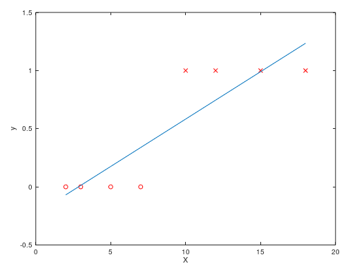
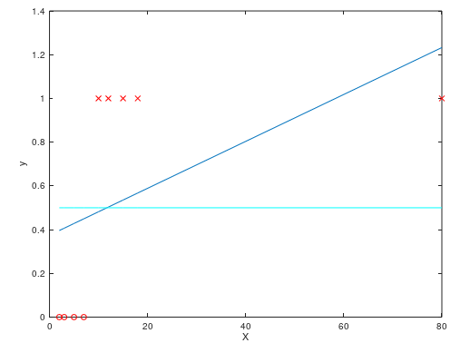
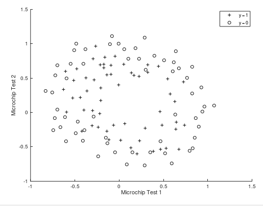
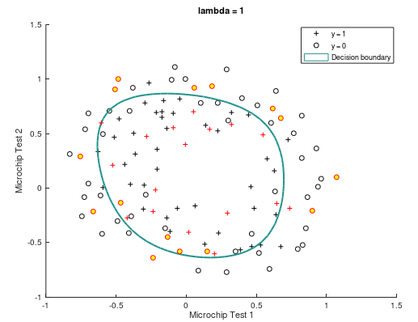

逻辑回归问题总结
==============

## 目录
+ 摘要
+ 逻辑回归概述
	- 逻辑回归的假设函数
		+ 假设函数的意义
		+ 决策边界
	- 损失函数
		+ 为什么对数似然函数
		+ 对数似然函数是凸函数
	- 多分类问题
+ 过拟合
	- 正则化的损失函数

## 逻辑回归概述

在 [线性回归总结](../linear_regression/linear_regression.md) 中，简单介绍了线性回归问题，这里将要阐述的逻辑回归，却并不是回归问题，而是一个分类问题(`classification problem`)。分类问题与回归问题的主要界限，在于分类问题的输出是离散值，而回归问题的输出是连续的。根据分类问题输出取值数量的不同，又可以分为**二分类问题**和**多分类问题**，这里主要阐述二分类问题。

二分类问题的输出一般为0或者1，表示某一特定的事件不发生或者发生，比如辅助诊断系统判断患者患病或者不患病，邮件分类系统判断邮件是否是垃圾邮件，都是典型的二分类问题。

为了训练二分类问题，一种直觉上的方法是直接套用此前的线性回归模型，这样就可以得到模型的假设函数为

$$
h_\theta(x) = \theta^Tx
$$

仍然使用此前的平方损失函数以及梯度下降法（或者规范方程法）来对模型进行求解，对于某个简单的数据集，可以得到下面的结果

此时$h_\theta(x)$的输出值仍然是连续值，而二分类问题要求模型的输出是0或者1，因此需要对假设函数的输出进行进一步处理。这里可以简单地令$\hat{y} = 1$当且仅当$h_\theta(x) >= 0.5$，令$\hat{y} = 0$当且仅当$h_\theta(x) < 0.5$。可以看到，采用这种策略时，对上图的数据具有很高的预测正确率。

然而这种方法却也有局限性，考虑在训练集中增加一个样本点$X = 80, y = 1$，此时线性回归模型的结果如下图所示：

可以看到，此时回归直线相对此前向右偏移，模型对训练集的预测能力下降了不少。可以想象，如果训练集中还有更多这样的极端数据，回归的直线将继续向右偏移，模型的预测能力将继续下降。

此外，线性回归模型的假设函数，其值域是$(-\infty, +\infty)$，而分类问题的输出$y$无非是0或者1而已，当$h_\theta(x) > 1$或者$h_\theta(x) < 0$时不具有意义。可见，简单套用线性回归的方法来解决分类问题是行不通的。

### 逻辑回归的假设函数

可以做一些简单的修改，使得假设函数的值域限制在$[0, 1]$。这里引入**sigmoid函数**，它的表达式$g(z)$满足

$$
g(z) = \frac{1}{1 + e^{-z}}
$$

可以看出，它的取值范围恰好在$(0, 1)$之间，实际上，它的图像如下所示：

因此，可以把 sigmoid 函数作用到此前的线性回归模型上，就得到了新的假设函数

$$
h_\theta(x) = sigmoid(\theta^Tx)
$$

此时，它的函数值，就可以被理解成在输入为$x$的条件下，$y = 1$的概率，即

$$
P(y = 1| x) = sigmoid(\theta x)
$$

> 决策边界

以下对 sigmoid 函数进行进一步的讨论。前面已经指出，假设函数的返回值，表示的是预测样本为正(`positive`)的概率。一般地，当$h_\theta(x) >= 0.5$时，预测$\hat{y} = 1$；当$h_\theta(y) < 0.5$时，预测$\hat{y} = 0$。这样，$h_\theta(x) = 0.5$就成为正负样本的边界，称为**决策边界**(`decision boundary`)。

由

$$
h_\theta(x) = sigmoid(\theta^Tx) = 0.5
$$

根据 sigmoid 函数的图像，恰好可以得到

$$
\theta^Tx = \theta_0x_0 + \theta_1x_1 + \theta_2x_2 + \cdots + \theta_nx_n = 0
$$

容易看出，这是一个（高维）平面的方程，预测为正负的样本，分别分布在该平面的两侧。因此，逻辑回归的假设函数，本质上就是找到这样一个高维平面对样本点进行划分，达到尽可能高的划分正确率。

利用**多项式回归**，可以得到更加复杂的决策边界。比如令

$$
h_\theta(x) = sigmoid(\theta_0 + \theta_1x_1 + \theta_2x_2 + \theta_3x_1^2 + \theta_4x_2^2)
$$

则得到的决策边界为

$$
\theta_0 + \theta_1x_1 + \theta_2x_2 + \theta_3x_1^2 + \theta_4x_2^2 = 0
$$

容易看出，这是一个圆锥曲线的方程。因此，通过构造更高阶的多项式，可以得到相当复杂的决策边界，从而将逻辑回归应用到更加复杂的分类问题当中。

### 逻辑回归的损失函数

在线性回归当中，是使用平方损失函数来作为损失函数，逻辑回归也可以沿用这种方式，即定义$J(\theta)$满足

$$
J(\theta) = \frac{1}{2m}\Sigma_{i = 1}^m(h_\theta(x^{(i)}) - y^{(i)})^2
$$

为了找到一组最优的$\theta$，应该使平方损失函数具有最小值，这里仍然沿用**梯度下降法**来求解。然而，在逻辑回归中，上面的平方损失函数却并非一个凸函数，使用梯度下降法无法确保收敛到全局最优点，等以后我变强了可以考虑给个证明。

因此，实际上并不是使用平方损失函数，而是**对数损失函数**，来作为逻辑回归的损失函数。此时，单个样本的损失函数$cost(h_\theta(x), y)$满足

$$
cost(h_\theta(x), y) = \left\{
	\begin{aligned}
	-log(h_\theta(x))&, y = 1\\\\
	-log(1 - h_\theta(x))&, y = 0
	\end{aligned}
\right.
$$

可以分别画出$y = 0$与$y = 1$的损失函数的图像，以获得一个比较直观的理解。容易看到，当$y = 1$时，对输出的预测值$h_\theta(x)$越接近一，则损失函数的值越小；预测值越接近零，则损失函数的值越大。并且当$h_\theta(x) = 1$时，$cost(h_\theta(x), 1) = 0$，当$h_\theta(x) = 0$时，$cost(h_\theta(x), 1) = +\infty$。该性质是容易理解的，即预测值与真值越接近，则相应的损失就越小。$y = 0$时也有类似的性质。

可以用一种更加简单的方法来表示$cost(h_\theta(x), y)$，即

$$
cost(h_\theta(x), y) = -ylog(h_\theta(x)) - (1-y)log(1 - logh_\theta(x))
$$

因此，整个样本的损失函数为

$$
J(\theta) = \frac{1}{m}\Sigma_{i = 1}^mcost(h_\theta(x^{(i)}), y^{(i)}) = -\frac{1}{m}[\Sigma_{i = 1}^my^{(i)}log(h_\theta(x^{(i)})) + (1-y^{(i)})log(1 - logh_\theta(x^{(i)}))]
$$

> 为什么使用对数似然函数？

使用对数似然函数并非偶然，而是由**最大似然估计**推导而出的。下面给出推导过程：

假设函数$h_\theta(x)$满足

$$
h_\theta(x) = sigmoid(\theta^T \cdot x)
$$

它的意义是在输入为$x$的条件下，输出$y = 1$的概率，即

$$
P(y = 1| x) = sigmoid(\theta^T x)
$$

因此$y | x$服从这样一个两点分布，其中

$$
\begin{aligned}
&P(y = 1| x) = sigmoid(\theta^T x)\\\\
&P(y = 0| x) = 1 - sigmoid(\theta^T x)
\end{aligned}
$$

设样本容量为$m$，其中$y = 1$的样本有$k$个，所以可以写出似然函数

$$
L(\theta) = \Pi_{y^{(i)} = 1}sigmoid(\theta x^{(i)}) \cdot \Pi_{y^{(j) } = 0}(1 - sigmoid(\theta x^{(j)}))
$$

对似然函数进行一些化简

$$
L(\theta) = \Pi_{i = 1}^m \{[h_\theta(x^{(i)})]^{y^{(i)}} \cdot [(1 - h\theta(x^{(i)}))]^{1-y^{(i)}}\}
$$

从而可以得到

$$
lnL(\theta) = \Sigma_{i = 1}^m [y^{(i)}lnh_\theta(x^{(i)}) + (1 - y^{(i)})ln(1 - h_\theta(x^{(i)})]
$$

这样，求似然函数的最大值，就等价于求

$$
J(\theta) = -\frac{1}{m}[\Sigma_{i = 1}^my^{(i)}log(h_\theta(x^{(i)})) + (1-y^{(i)})log(1 - logh_\theta(x^{(i)}))]
$$

的最小值。可见，对数损失函数，实际上与最大似然估计是一脉相承的。

> 对数损失函数是凸函数

相较于平方损失函数，对数似然函数还具有一个优良性质，即它是一个凸函数。证明如下：

再次给出$J(\theta)$的表达式：

$$
J(\theta) = -\frac{1}{m}[\Sigma_{i = 1}^my^{(i)}log(h_\theta(x^{(i)})) + (1-y^{(i)})log(1 - logh_\theta(x^{(i)}))]
$$

所以

$$
\frac{\partial}{\partial \theta_j}J(\theta) = \frac{1}{m}\Sigma_{i = 1}^m(h_\theta(x^{(i)}) - y^{(i)})x_j^{(i)}
$$

这里应该看到，对数损失函数以及平方损失函数的一阶偏导的形式是完全相同的（尽管其中的$h_\theta(x)$不同），据说这并不是巧合，而是存在一些深层次的原因，有机会我会回来说明一下。

因此可以给出二阶偏导的表达式

$$
\frac{\partial^2}{\partial \theta_j \partial \theta_k}J(\theta) = \frac{1}{m}\Sigma_{i = 1}^mx_j^{(i)}\frac{e^{-z}}{(1 + e^{-z})^2}x_k^{(i)},\ z = \theta^Tx^{(i)}
$$

可以看出，$\frac{e^{-z}}{(1 + e^{-z})^2}$一定是大于零的。不妨设$g(x)$为

$$
g(x) = \sqrt{\frac{e^{-\theta^Tx}}{(1 + e^{-\theta^Tx})^2}}
$$

构造矩阵$G$为

$$
G = \left[
\begin{matrix}
g(x^{(1)}) & & &\\\\
& g(x^{(2)}) & &\\\\
& & \ddots & \\\\
& & & g(x^{(m)})
\end{matrix}
\right]
$$

所以对数损失函数的 Hessian 矩阵为

$$
H = \frac{1}{m}\left[
\begin{matrix}
\frac{\partial^2}{\partial \theta_0^2}J(\theta) & \frac{\partial^2}{\partial \theta_0 \partial \theta_1}J(\theta) & \cdots & \frac{\partial^2}{\partial \theta_0 \partial \theta_n}J(\theta)\\\\
\frac{\partial^2}{\partial \theta_1 \partial \theta_0}J(\theta) & \frac{\partial^2}{\partial \theta_1^2}J(\theta)
 & \cdots & \frac{\partial^2}{\partial \theta_1 \partial \theta_n}J(\theta)\\\\
\vdots & \vdots & & \vdots\\\\
\frac{\partial^2}{\partial \theta_n \partial \theta_0}J(\theta) & \frac{\partial^2}{\partial \theta_n \partial \theta_1}J(\theta) & \cdots & \frac{\partial^2}{\partial \theta_n^2}J(\theta)
\end{matrix}
\right]
$$

容易看出（？

$$
H = \frac{1}{m}(GX)^TGX
$$

因此，Hessian 矩阵是一个半正定矩阵，从而对数损失函数确实是一个凸函数，得证。同理可得，规范化后的对数损失函数也是一个凸函数，这里不再赘述。这样，利用梯度下降法求解对数损失函数的最小值，一定可以收敛到全局最优点。

### 多分类问题

顾名思义，多分类问题中预测的结果可以有多个（多于两个）取值，比如给定一个图片集，将每张图片划分为行人，车辆，道路，树木四个类别。为了求解多分类问题，可以简单地套用二分类问题的方法。

具体说来，假设多分类问题中一共有$k(k \ge 3)$个类别，因此预测值$y$有$k$个不同的取值。套用二分类问题的方法是，对于每一个类别$c$，定义输出为$c$时$y = 1$，输出不为$c$时$y = 0$，这样就把问题转化为了一个二分类问题。可见，对于任一个类别，都需要训练一个二分类器，最终一共需要训练$k$个二分类器，即

$$
h_\theta^{(i)}(x) = P(y = i | x)\ (i = 1, 2, 3, ..., k)
$$

对模型进行预测时，分别使用$k$个二分类器对模型进行预测，可以得到$k$个概率，分别表示在当前输入的条件下，输出为某个类别的可能性。最后，简单选择可能性最大的一个类别，作为多分类问题的输出，即

$$
max_i h_\theta^{(i)}(x)
$$

## 过拟合

在此前的 [线性回归总结](../linear_regression/linear_regression.md) 中，已经对过拟合问题进行了一些探讨，这里主要是结合实例，直观地说明过拟合问题及其解决方案。

为了解决过拟合，仍然可以对此前的对数损失函数添加**正则化项**，正则化后的损失函数$J(\theta)$

$$
J(\theta) = -\frac{1}{m}[\Sigma_{i = 1}^my^{(i)}log(h_\theta(x^{(i)})) + (1-y^{(i)})log(1 - logh_\theta(x^{(i)}))] + \frac{\lambda}{2m}\Sigma_{j = 1}^n\theta_j^2
$$

下面以一个具体实例，直观地展示过拟合现象以及正则化对过拟合的影响。这个实例是一个二类分类问题，输入$x$是一个二维向量，即具有两个特征$x_1, x_2$。首先对原始数据进行可视化，如下图所示：

其中用圆圈标识$y = 0$的实例，用十字标识$y = 1$的实例，容易看出，原始数据并不服从线性分布，因此考虑添加高次项，利用多项式回归对该模型进行拟合。这里是添加了$x_1, x_2$的所有二次项与三次项，再加上$x_0$，处理后的输入具有28个特征。

之后，我手动将这些数据划分成了训练集和测试集，其中测试集占所有数据的20%。然后分别使用未正则化的损失函数与正则化的损失函数($\lambda = 1$)，利用梯度下降法对模型进行训练。结果如下：

 

图中黑色的圆圈或者十字，是表示训练集的实例；而红色边界的圆圈或者十字，表示的是测试集实例。可以看到，未经过正则化的损失函数，训练出来的模型决策边界相对复杂，具有许多高次项，同时对于训练集有更高的预测准确率（87.21%）；而正则化后的损失函数，利用梯度下降法训练出的决策边界则要简单很多，比较规则，对训练集的准确率也要低一些（80.23%）。

尽管如此，未正则化的模型，对于测试集数据的预测正确率则要低了不少（81.25%），而正则化的模型，则对测试集有更高的预测准确率（84.375%）。这说明没有正则化虽然可以获得更高的训练集预测准确率，却难以将训练得到的模型**泛化**到其他输入数据当中，因此发生了过拟合。而引入正则化则可以使训练的模型具有更好的**泛化能力**。
