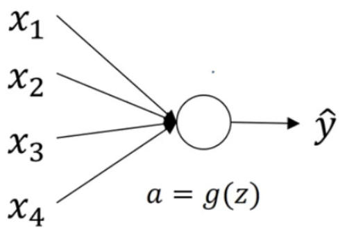
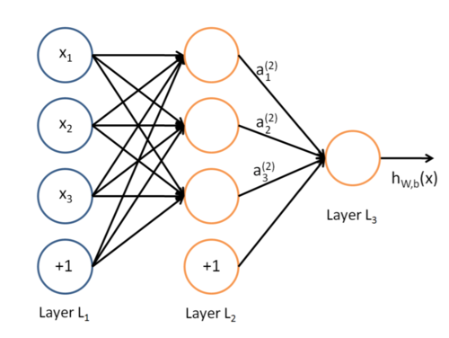
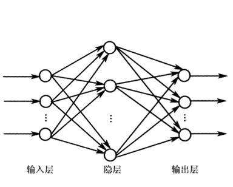

神经网络算法总结
==============

## 目录
+ 摘要
+ 前向传播算法
	- 模拟大脑
	- 模型表示
	- 为什么使用神经网络
	- 多分类问题
+ 后向传播算法
	- 损失函数
	- 梯度的推导
	- 后向传播
	- 实际应用	
		+ 梯度检查
		+ 向量化
		+ 随机初始化
+ 总结

## 摘要

这篇文章介绍**神经网络算法**的基本原理以及实现方法。对原理的阐述仍然从三个方面来进行，即模型，策略与算法。这里的模型对应了**前向传播算法**(`forward propagation`，策略与算法则对应了**后向传播算法**(`backward propagation`)，分别在文章的两段进行说明。最后，会将这两部分串联起来，给出实现神经网络的完整步骤。

## 前向传播算法

### 模拟大脑

让机器具有智能一直是计算机科学家的梦想，然而任何传统的算法都没能做到这一点。一种想法是，让机器模拟人类大脑的行为，从而使机器可以作出和人类相似的决策。

人类认知世界的过程可以作出以下抽象：我们的感觉器官，如眼睛、耳朵，获得了来自外界的光学信号与空气振动信号，通过大脑皮层相应位置的处理，转化为了我们可以辨识的物体以及语音的含义。大脑皮层的基本组成单位是神经元细胞，视觉皮层或者听觉皮层都是由许多个神经元细胞相互连接组成的。神经元细胞有两个重要的结构，即树突(`dentrite`)与轴突(`axon`)，树突的功能是接受来自其他神经元传递来的信号，是输入单元；轴突则传递信号给其他的神经元，是输出单元。正是我们的感觉器官收到的信号引起的刺激，使得信号在不同神经元之间层层传递，才使得我们能够理解看到和听到的事物。

神经元之间传递信号的模式并不是先天决定或是一层不变的，比如刚出生的婴儿显然不能理解大人对它呢喃的话语，不同文化的人们看到同一事物也会产生不同的反映。因此，可以通过后天的训练与学习来改变神经元之间传递信号的模式，实际上，这也是人类学习和认识世界的机理所在。

同时，相关研究也指出，不同功能皮层的神经元之间也不存在差异。实验人员将视觉皮层损坏的小白鼠的视觉神经接到了听觉皮层，经过一段时间后，小白鼠就可以用听觉皮层来看到事物了，类似的实验在其他功能皮层也得到了成功。这说明，不同功能皮层的神经元本来是没有差异的，是后天的训练使得它们具有了自己特殊的信号传递方式。

可以看到，一个个简单的神经元，竟然使人类拥有了认识复杂世界的能力。造物主似乎偏爱这样的模式，即『复杂源于简单』，DNA 和蛋白质都是相关的例子。神经网络算法就是采用这样思路，即建立若干神经元，通过这些神经元的相互连接，来模拟人类大脑的行为。

### 模型表示

> 单个神经元模型

每一个神经元都是一个**逻辑回归单元**(`logistic regression unit`)，它接受多个输入信号，产生一个输出信号，如下图所示：

不妨设

$$
x = \left[
\begin{matrix}
x_0\\\\
x_1\\\\
x_2\\\\
x_3
\end{matrix}
\right],\ 
\theta = \left[
\begin{matrix}
\theta_0\\\\
\theta_1\\\\
\theta_2\\\\
\theta_3
\end{matrix}
\right]
$$

这里仍然有$x_0 = 1$，是手动添加的偏置单元。这样，$\hat{y}$满足逻辑回归的假设函数

$$
\hat{y} = h_\theta(x) = sigmoid(\theta^T x)
$$

> 神经网络模型

神经网络是由多个层次的神经元组成的，每个层次含有数量可以是不相同的神经元，一个简单的神经网络结构如下图所示：

可以看到，任何一个神经网络，都包含一个**输入层**，一个**输出层**，以及若干数量不确定的**隐含层**(`hidden layer`)。输入层一般用$x$或者$a^{(1)}$来表示，其中$x_j$或者$a_j^{(1)}$表示第$j$个特征的值；第一个隐含层用$a^{(2)}$来表示，$a_j^{(2)}$表示第一个隐含层的第$j$个神经元的值，后面的隐含层以此类推；用$L$表示神经网络含有的层次数量，这样输出层就可以用$y$或者$a^{(L)}$来表示了。

由于不同层次含有的神经元数量未必相同，通常使用$S_l$来表示第$l$层所包含的神经元数量，上图中，有$S_1 = 3， S_2 = 3, S_3 = 1$。

根据上面的神经元模型，相邻层次的神经元之间具有一定的信号传递关系，该传递关系实际上是对上一层次的全部神经元（加上偏置单元）的加权和做逻辑函数`sigmoid function`，各个神经元的权重可以理解为相邻两层神经元之间的练线上的数值，权重越大说明该神经元对于下一个层次的神经元的影响越大。相邻层次间神经元信号传递的权重可以构成一个矩阵，用$\Theta$表示，其中第$l$层和第$l + 1$层的权重矩阵可以表示为$\Theta^{(l)}$，它的每一个行向量都对应了第$l + 1$层的一个神经元的全部权重信息，因此该行向量的维度为$S_l + 1$，而$\Theta^{(l)}$一共具有$S_{l + 1}$行，一般地有

$$
\begin{aligned}
a_1^{(2)} = sigmoid(\Theta_{10}^{(1)}x_0 + \Theta_{11}^{(1)}x_1 +\Theta_{12}^{(1)}x_2 + \Theta_{13}^{(1)}x_3)\\\\
a_2^{(2)} = sigmoid(\Theta_{20}^{(1)}x_0 + \Theta_{21}^{(1)}x_1 +\Theta_{22}^{(1)}x_2 + \Theta_{23}^{(1)}x_3)\\\\
a_3^{(2)} = sigmoid(\Theta_{30}^{(1)}x_0 + \Theta_{31}^{(1)}x_1 +\Theta_{32}^{(1)}x_2 + \Theta_{33}^{(1)}x_3)
\end{aligned}
$$

这就是相邻层次间神经元信号传递的模型。

> 前向传播算法

实际上，通过上面的公式已经可以窥见前向传播算法的大概了，将其写成矩阵形式，有

$$
a^{(2)} = \left[
\begin{matrix}
a_1^{(2)}\\\\
a_2^{(2)}\\\\
a_3^{(2)}
\end{matrix}
\right] = sigmod(\Theta^{(1)} a^{(1)})
$$

通过给$a^{(2)}$添加偏置项$a_0^{(2)} = 1$，可以写出输出$y$的表达式

$$
y = a^{(3)} = sigmoid(\Theta_{10}^{(2)}a_0^{(2)} + \Theta_{11}^{(2)}a_1^{(2)} +\Theta_{12}^{(2)}a_2^{(2)} + \Theta_{13}^{(2)}a_3^{(2)})
$$

同理，也可以把它写作矩阵形式

$$
y = sigmoid(\Theta^{(2)}a^{(2)})
$$

实际上，对于任意复杂结构神经网络，都可以定义以下前向传播算法

$$
\begin{aligned}
&a^{(1)} = x\\\\
&z^{(2)} = \Theta^{(1)}a^{(1)}, a^{(2)} = sigmoid(z^{(2)})\\\\
&z^{(3)} = \Theta^{(2)}a^{(2)}, a^{(3)} = sigmoid(z^{(3)})\\\\
&\cdots\\\\
&z^{(L)} = \Theta^{(L - 1)}a^{(L - 1)}, h_\Theta(x) = a^{(L)} = sigmoid(z^{L})
\end{aligned}
$$

顾名思义，为了计算神经网络的输出，需要首先计算$a^{(2)}, a^{(3)}, \cdots$，最终才能计算出$h_\Theta(x)$，因此称为前向传播算法。训练神经网络的过程，其实就是训练这里的权重矩阵$\Theta$，这将在后面具体阐述。

> 为什么要使用神经网络？

神经网络是用于解决分类问题，而在此前的 [逻辑回归总结](../logistic_regression/logistic_regression.md) 中已经指出，借助**多项式回归**，逻辑回归模型理论上可以表示任意复杂的函数。既然如此，那为什么还要引入神经网络模型呢？

设想一种具体的应用场景，现在需要对一张`20x20`像素的图片进行分类，模型采用逻辑回归模型。图片分类问题显然不是一个线性划分问题，因此需要使用多项式回归，考虑使用所有的低于四次（含）的项，容易看出其实这并不是一个相当复杂的模型，但是仅考虑四次项就已经有$C_{400}^4$，即大约有10亿项。需要指出的是，这里使用的图片还只是`20x20`像素的，对于实际中常见分辨率的图片，如`480*360`，将具有更高维的特征向量，这是现有的计算能力不能满足的。

而使用神经网络模型则不然，因为不需要手工指定特征向量的形式，只将初始的400个像素点作为输入即可。这是因为，神经网络的多个隐藏层，足以形成足够复杂的模型，而无需手动引入多项式。

实际上，神经网络的一个主要优势在于，**神经网络可以自行学习特征**，而不需要像线性回归或者逻辑回归那样手工给定特征向量。对于上面图中的简单神经网络，如果只看隐藏层以及输出层，容易发现这就是一个逻辑回归模型，而此前的层次的功能，则可以理解为对特征的学习，隐藏层的值就是学到的特征向量。由于`sigmoid`函数是一个非线性函数，再加上多个隐藏层，神经网络模型足以学习到相当复杂的特征，而无需像逻辑回归那样手工指定高次多项式。

> 多分类问题。

如逻辑回归一样，神经网络也可以被推广到解决多分类问题，两者的方法如出一辙。对于逻辑回归而言，为了解决$n(n \ge 3)$分类问题，只需要训练$n$个二类分类问题的分类器即可；而对于神经网络模型，则只需要将输出层的神经元增加到$n$个，由于前面已经指出，神经网络的最后两个层次本质上就是逻辑回归模型，因此该方法本质上也是训练了$n$个二类分类器，与逻辑回归一致。多分类的神经网络结构如下所示：

但是两者在实现的细节上也有一些差异。对于$n$类分类问题，逻辑回归的输出的取值往往是$\{1, 2, \cdots, n\}$，而神经网络则要沿用向量表示法，例如当$n = 3$时，神经网络的输出应该表示为

$$
y \in \{\left[
\begin{matrix}
1\\\\
0\\\\
0
\end{matrix}
\right],\ 
\left[
\begin{matrix}
0\\\\
1\\\\
0
\end{matrix}
\right],\ 
\left[
\begin{matrix}
0\\\\
0\\\\
1
\end{matrix}
\right]\}
$$
