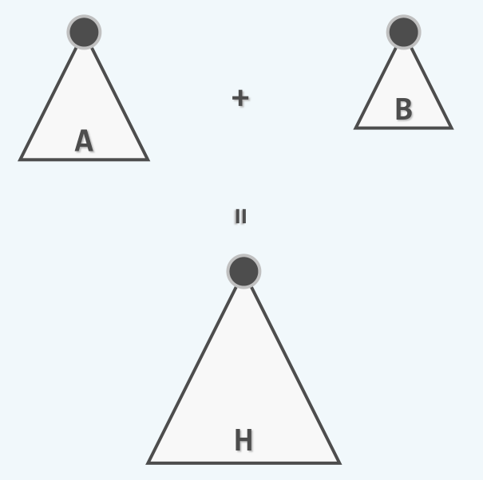

左式堆知识总结
============

## 堆合并

堆合并是指，对于任意两个堆，将其合并为一个更大的堆，如下图所示：



为了解决这个问题，我们可以首先进行一些初步的尝试。

> 简明的插入策略

最简明的思路，无非是将一个堆中的元素，逐个删除并且依次插入到另一个堆中。不妨设两个堆的规模分别为`m`和`n`，则这种策略的时间复杂度为`O(m * (logm + log(m + n))) = O(m * log(m + n))`。

> `Floyd`批量建堆算法

简明的插入策略的时间复杂度是在是太差，实际上，我们可以将这`m + n`个元素组织成一个向量，使用`Floyd`建堆算法，其时间复杂度为`O(m +n )`。

实际上，`Floyd`建堆算法对于任意一组输入数据都可以达到线性的时间复杂度，但是这里的输入并非是【任意】的输入，而是两个堆，它们在内部都是满足`堆序性质`的。因此我们期望这种预先满足的`堆序性质`得到利用，从而在一定程度上得到一个更高效率的堆合并算法。

> 一种递归策略

下面给出一种递归地进行堆合并的策略——设两个堆分别为`A`和`B`，并且保证`A`堆的堆顶大于`B`堆的堆顶，为了将`A`，`B`两个堆合并，只需要取出`A`的右子树，将`A`的右子树与`B`进行合并，并且将合并后的堆重新作为`A`的右子树。而为了将`A`的右子树与`B`合并，只需要递归地进行上述的策略即可。

这种策略的正确性是显然的，一次这样的操作后，合并后的堆，其`堆序性质`仍然得到满足。通过不断地取堆的右子树，递归问题的规模不断减小，直到平凡的情况，即`A`的右子树为空，此时直接将`B`堆连接到`A`的右子树即可，因此该算法是有穷的。

对该算法进行进一步分析，在最坏的情况下，需要不断穷举`A`和`B`的右子树，直到两个堆的规模都只有1，因此在最坏情况下， 该算法需要进行`rh1 + rh2`次递归，其中`rh1`和`rh2`分别表示两个堆的最右侧路径长度。

为了快速地取出堆的右子树，以及将某棵树连接到一个节点上，这里应该抛弃前面在完全二叉堆采用的向量结构，而是采用二叉树来作为堆的底层结构，此时每次递归的时间复杂度都是`O(1)`，因此整体的时间复杂度为`O(rh1 + rh2)`。可见，为了获得更好的性能，就应该尽量减少堆的最右侧路径长度，左式堆就是这样的一种结构。

## 左式堆的概念

首先需要引入`空节点路径长度`的概念——对任意一棵二叉树，引入所有的外部节点，则任意节点的空节点路径长度(npl, null path length)，定义为该节点到外部节点的最短距离，外部节点的`npl`定义为零，即`npl(null) = 0`。

因此，任意内部节点`x`的空节点路径长度，取决于其左右节点中`npl`的更小者，即

```c
npl(x) = MIN(npl(lc(x)), npl(rc(x))) + 1;
```

对于左式堆中的任一节点，都满足其左孩子的`npl`值，不小于右孩子的`npl`值，即`左倾性`：

```c
npl(lc(x)) >= npl(rc(x));
```

根据`npl`的定义，左式堆中的任一节点的`npl`都唯一地取决于它的右孩子，即

```c
npl(x) = npl(rc(x)) + 1;
```

这样，对于左式堆的根节点，其`npl`等于其右子树的`npl`加一，而它的右子树的`npl`，又等于它的右子树的右子树的`npl`加一，即

```c
npl(root) = npl(rc(root)) + 1 = npl(rc(rc(root))) + 2 = ... = right path length
``` 

因此，根节点的外部路径长度`npl`，就等于最右侧路径长度。左式堆的一个实例如下图所示：


而让我们再回顾一下`npl`的定义，即任一节点到外部节点路径的最短距离，因此根节点到外部节点的最短路径，就是左式堆的最右侧路径。设最右侧路径的长度为`d`，左式堆中一定包含了以`d`为高度的一棵满子树，因此左式堆的全部节点数量（包括外部节点）`n`一定满足

$$
n \ge 2^{d + 1} - 1
$$

反过来，即`d`一定满足

$$
d \le log_2^{n + 1} = O(logn)
$$

左式堆的该性质如下图所示：


在这样的条件下，我们上面给出的合并算法，其时间复杂度就只有`O(logm + logn)`了，这无疑是对性能的一次极大改进。但是需要注意的是，左式堆只是保证最右侧路径的长度最小，并非左子堆的规模和高度一定会大于右子堆。

## 左式堆的实现

左式堆仍然是优先级队列的一种实现方式，因此要实现左式堆，仍然只需要实现优先级队列的几个抽象函数接口，即`getMax`，`insert`和`delMax`。其中`getMax`的实现只需取出左式堆的根节点即可，与完全二叉堆的实现相同，在这里不再赘述。

需要指出的是，左式堆的`insert`接口与`delMax`接口，都可以借助左式堆的`merge`算法快速的实现。对于`insert`接口，无非将一个规模为1的左式堆，与当前的左式堆进行合并，其代码如下：

```cpp
template <typename K, typename V>
void LeftHeap<K, V>::insert(entry<K, V> e){
	BinNodePosi(T) newNode = new BinNode<T>(e);
	newNode->npl = 1;
	__root = merge(__root, newNode);
	__root->parent = nullptr;
	++__size;
}
```

而左式堆的`delMax`函数，无非是在删除了根节点以后，将根节点的两个左子堆进行合并，利用`merge`也可以方便地实现：

```cpp
template <typename K, typename V>
entry<K, V> LeftHeap<K, V>::delMax(){
	entry<K, V> res = getMax();
	__root = merge(__root->leftChild, __root->rightChild);
	if (__root) __root->parent = nullptr;
	--__size;
	return res;
}
```

因此，问题的关键就在于左式堆的`merge`函数，该函数基本按照我们上面提到过的策略进行，只是需要做一些细节上的修改。无论是在`insert`还是`delMax`操作的过程中，都需要动态地维护左式堆的结构，即每次将合并后的堆作为右子树插入到当前节点后，都需要对当前节点的`左倾性`进行检查，一旦发现左子树的`npl`小于右子树，则将左右子树交换。`merge`函数的实现如下：

```cpp
#define T entry<K, V>

template<typename K, typename V>
BinNodePosi(T) merge(BinNodePosi(T) a, BinNodePosi(T) b){
	if (a == nullptr) return b;
	if (b == nullptr) return a;
	BinNodePosi(T) temp;
	if (a->data < b->data){//swap a and b
		temp = a;
		a = b;
		b = temp;
	}
	if (a->rightChild == nullptr) a->rightChild = b;
	else a->rightChild = merge(a->rightChild, b);
	a->rightChild->parent = a;

	if (NPL(a->leftChild) < NPL(a->rightChild)) {// swap the right chlid and left child of a
		temp = a->leftChild;
		a->leftChild = a->rightChild;
		a->rightChild = temp;
	}
	a->npl = NPL(a->rightChild) + 1;
	return a;
}
```

根据前面的分析，`merge`的时间复杂度为`O(logn)`，无论是在`insert`还是`delMax`中，调用`merge`函数以外的操作都可以在`O(1)`时间内完成，因此两个操作的性能都是`O(logn)`。
