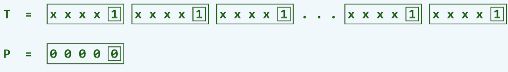
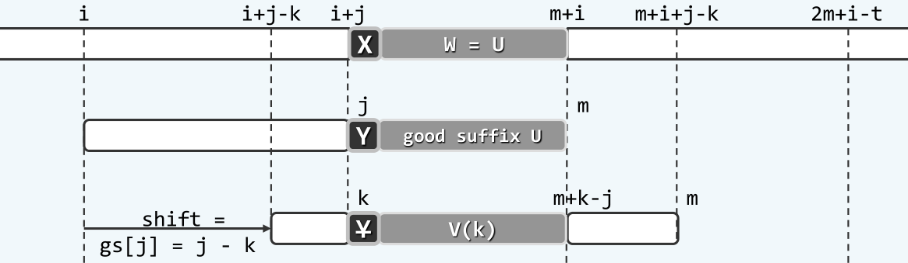
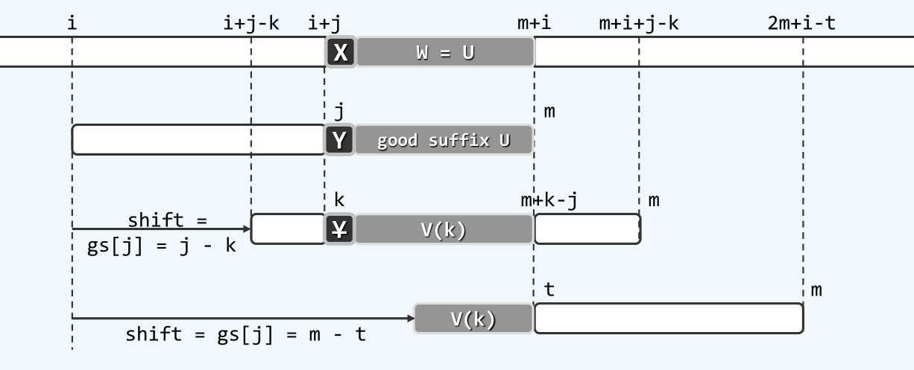
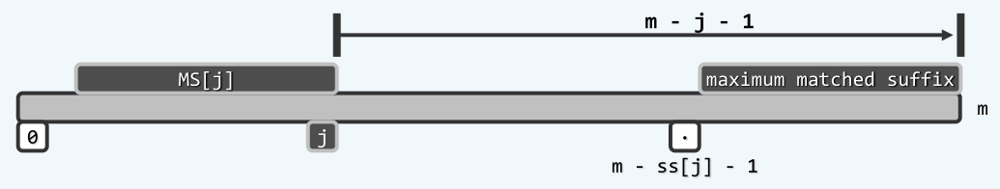
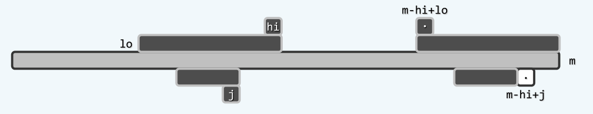

串匹配之bm算法
=============

## 以终为始

在[串匹配之kmp算法](kmp.md)中，已经简单介绍了`kmp`算法的基本原理与实现。`kmp`算法的基本思想，是利用已经成功匹配的字符的信息，快速跳过无意义的对齐位置，从而实现更高的效率。下面，我们首先对这样的思想进行更深入的研究。

在实际的串匹配问题中，字符集的规模往往是挺大的，比如说英文字符集，就至少有52个字符，更不要提ASCII码，还有中文字符集了。这样，在随机的情况下，一次比对成功的概率只有`1/52`，并且多次比对成功的概率以指数的速率减小，比对的次数服从几何分布，期望的比对次数仅有一次。在这种情况下，即使是蛮力算法，其时间复杂度也只有`O(n + m)`。

在一般的串匹配问题中，模式串的规模较小而文本串的规模往往极大，比如在一篇论文中查找某个英文单词的情形，在这种情况下，文本串中往往具有大量模式串中不会出现的字符。设想如果在任意一个对齐位置，模式串与文本串是从后往前比对，此时一旦在文本串中出现模式串中不存在的字符，就可以将整个模式串移出这个字符，从而跳过大量无意义的对齐位置。如下图所示：


如我们前面指出的那样，这种情况在头几次比对中出现的概率是极高的，因此相对于自左向右的比对，将比对的方向变成自右向左，的确可以极大地提高串匹配的效率。

## bm-bc策略

坏字符(bad character, bc)策略是一种非常简明的策略。它的基本思想是，在自后向前的某次匹配中，一旦在某个位置`k`比对失败，则将模式串整体右移，并且重新从右至左开始新一轮的比对，将比对失败的字符称为坏字符。而要使下一个对齐位置能够匹配，则至少要在坏字符处能够匹配才行，如下图所示：


因此，坏字符策略实现的关键，就在于找到模式串中，位于坏字符`Y`左侧，并且与字符`X`能够匹配的下一个字符。应该指出的是，这样的字符能够有多个，也就对应了多个移动距离，所有这些移动距离都是值得对齐的。因此，为了不错过其中的任意一个字符，应该取移动距离最小的那一个，使之与文本串中的`X`对齐。

为了快速地确定下一个对齐位置，可以仿照`kmp`算法的思路，对于模式串中出现过的所有字符，保存每个字符出现的最后位置，构成`bc`表，以便在字符匹配时迅速更新对齐位置。因此，`bc`表就有$\left|\Sigma\right| + 1$项，其中$\Sigma$为模式串的字符集大小，并且将额外的一项用来代表所有没有在模式串中出现过的字符，此时直接将模式串整体移过该字符。

这样，`bm-bc`策略就可以利用`bc`数组来快捷地实现了。在一次匹配失败后，比如失败位置`j`处文本串字符为`X`，查询`bc`表会有三种情况：

一是`bc[X]`的确存在，并且`bc[X] < j`，此时直接将`bc[X]`处的字符平移到与文本串中的`X`对齐，即可开始新一轮的比对，此时模式串移动的距离应该是`j - bc[X]`；另一种情况是`X`没有出现在模式串的字符集中，此时应该将模式串整体移动字符过`X`，即移动的距离的`j + 1`，为了与上面的情况统一，可以令`bc[*] = -1`，其中`*`表示所有没有出现在模式串中的字符，另一种理解方法是认为在模式串的左侧`P[-1]`存在一个通配符可以与`X`匹配。这两种情况如下图所示：


最后一种情况是`bc[X]`存在，但是`bc[X] > j`，即`P[bc[X]]`出现在`P[j]`的右侧，此时显然是不可以将`P[bc[X]]`与文本串中的`X`对齐的，因为此时将造成模式串的左移。实际上，这种对齐早在之前的比对中就已经被排除掉了。这种情况下，不妨简单地让模式串右移一个单位，然后从右至左开始新一轮的比对。该情况如下图所示：


这样，可以形成下面基于`bm-bc`策略的串匹配代码：

```c
int match(char* text, char* pattern){
	int *bc;
	makeBC(text, &bc);
	int m = strlen(pattern), n = strlen(text);

	int i, j;
	for(i = 0, j = m - 1;i + j < n;){
		while((j >= 0) && (pattern[j] == pattern[i + j])) --j;
		if(j < 0) break;
		//else
		i += (bc[text[i + j]] < j? j - bc[text[i + j]]: 1);
		j = m - 1;
	}
	delete [] bc;
	return i;
}
```

### `bc`表的构建

实际上，在前面的讨论中，已经涉及到了如何构造`bc`表的问题，这里做一个统一的总结。为了构造`bc`表，需要遍历模式串中的每一个字符，并且把每个字符`X`最后出现的位置保存在`bc[X]`中。为了简单起见，这里的`bc`表包含全部字符集，比如整个ASCII码字符集，这样便于判断某个字符是否出现在模式串当中，否则还需要额外建立一个散列表或者位图，还是需要消耗同样的空间，因此这里的`bc`表兼具了给出移动位置以及散列表的作用。

在`bc`表的构建中采用`画家算法`(painter's algorithm)，即从左至右遍历模式串，对于其中每一个出现的字符，都将其位置（或者秩）更新到其在`bc`表中对应的项中，这样，遍历结束时`bc`表保存的就是所有字符最后出现过的位置了，因为`bc`表中各项的值，只取决于该字符最后一次出现的位置，类似于画家作画时，画布上的某处最终的颜色，仅取决于画家在该处的最后一笔，因此称之为画家算法。`bc`构造的算法如下：

```c
void makeBC(char* const pattern, int* bc){
	bc = new int[256];
	for(int ix = 0; ix != 256; ++ix)
		bc[ix] = -1;                             //initialize to -1
	for(int ix = 0; pattern[ix] != '\0'; ++ix)
		bc[pattern[ix]] = ix;                    //painter's algorithm
}
```

使用`bc`策略时，最好可以达到`O(n/m)`的时间复杂度，对应了每次都在最右一个字符匹配失败，然后整体右移`m`个单位的情况，如下图所示：



这固然是一个非常好的结论，但是`bc`策略在最坏情况下却会达到`O(mn)`的时间复杂度，与蛮力策略相当，该情况如下图所示：


可以看到，在这种情况下，每次都需要进行`m - 1`次比对，才能在最左侧一次比对中失败，而该次失败只能让模式串右移一个单位。这种情况正与蛮力策略的最好情况相一致。一般地，单次匹配成功的概率越大，即字符集越小，就越接近于这种最坏的情况；单次匹配成功的概率越小，即字符集越大，就越接近于最好的情况。

### bm-gs策略

对上述`bc`策略低效的原因进行分析，可以发现这是因为`bc`策略中只利用到了匹配失败的`坏字符`，而在坏字符之前的那多次成功比对却直接被`bc`策略忽略了。在上面的这种情形中，如果注意到最左侧的`1`与其右侧四个字符均不相等，一次比对失败后可以直接跳过这四个无意义的对齐位置，从而规避了这种低效的情况。

基于上面的考虑，我们这里提出好后缀(good suffix, gs)策略。顾名思义，好后缀策略就是要将某次比对失败前的成功比对信息加以利用，因此它的思想和`kmp`算法是一致的。具体说来，就是要利用这些成功比对的信息，将模式串直接移动到下一个值得对齐的位置，那么这里的值得对齐的位置和`kmp`算法是否存在异同呢？

设某次比对失败于模式串的位置`j`，因此`P[j+1, m)`与文本串中的对应字符依次相等。一般地，如果这`m - j -2`个字符在模式串中左侧的另一位置再次出现，则显然是一个值得的对齐位置，如下图所示：



但是如果这`m - j - 2`字符没有在模式串中重复出现，是否就不存在值得的对齐位置了呢？答案是否定的，因为此时的情形就类似`kmp`的情形了啊，一般地，如果模式串存在一个前缀，与子串`P[j+1, m)`的后缀相互匹配，那么这也是一个值得的对齐位置，如下图所示：



和`bc`算法和`kmp`算法一样，如果这样的对齐位置有多个，应该取出其中移动距离最短的一个，从而不会错过其他的对齐位置。并且仿照`bc`策略和`kmp`算法的思想，可以预先构造一个`gs`表，其中`gs[i]`表示在第`i`个位置比对失败后，按照`好后缀策略`应该采取的位移量。这样，就可以通过`bc`表和`gs`表把两个策略结合起来，具体说来，由于两个策略都是给出可能匹配的必要条件，因此值得对齐的位置一定同时满足这两个必要条件，在一次匹配失败后，可以同时查询`gs[i]`和`bc[i]`，并且选择它们给出的移动距离的最大值，来作为最终的移动距离，具体的代码如下：

```c
int match(char* text, char* pattern){
	int *bc, *gs;
	makeBC(text, &bc);
	gs = buildGS(pattern);
	int m = strlen(pattern), n = strlen(text);

	int i, j;
	for(i = 0, j = m - 1;i + j < n;){
		while((j >= 0) && (pattern[j] == pattern[i + j])) --j;
		if(j < 0) break;
		//else
		i += MAX(gs[j], j - bc[text[i + j]]);
		j = m - 1;
	}
	delete [] bc;
	return i;
}
```

需要指出的是，`gs`表是只依赖于模式串`P`本身的，这是因为和`kmp`类似，文本串的相关字符已经全部和模式串匹配了。以下就主要讨论如何高效地构造`gs`表，而这个问题非常复杂，我只能尽量......

### gs表的构造

还是首先考虑蛮力策略吧，为了找到`gs`表中的任意一项，如`gs[i]`，根据`gs`表的语义，应该从位置`i`往前遍历整个模式串，直到出现上面讨论过的两种情况位置，其最坏情况下的时间复杂度为`O(m^2)`，因此蛮力算法构造`gs`表的时间复杂度为`O(m^3)`。而这里要介绍的一种`O(m)`构造`gs`表的策略，你就知道它有多难了。

> ss表

为了构造`gs`表，首先引入`ss`表的概念——`ss[i]`是表示在`P[0, i]`的所有后缀中，与`P`的某一后缀匹配的最长长度，即最长匹配后缀(maximum matched suffix)的长度。如下图所示：


如果可以成功地构造出`ss`表的话，就可以用`ss`表快捷地构造出`gs`表，因为`ss`表中包含了`gs`表中的全部信息。

> ss -> gs

这里先讨论如何通过`ss`表构造出`gs`表。

实际上，对应于上面提到的好后缀的两种情形，由`ss`表构造`gs`表也无非两种情况。第一种情况是`ss[j]`对应的最长匹配后缀延伸到了`P`的最左侧，此时有

```c
ss[j] == j + 1;
```

如下图所示：


此时，对于模式串中所有的秩为`i`的字符，如果有`i < m - j - 1`，则`MS[j]`都是在该处匹配失败的一个候选对齐位置，对应了上面好后缀的第二种情形，此时它们的移动距离距离都是`m - j - 1`，即`m - j -1`必然是`gs[i]`的一个候选。需要指出的是，这种情形并不适用于`i >= m - j - 1`的情形，因为首位两个子串完全匹配，在该位置对齐后的下一次匹配必然会失败。

第二种情形是`ss[j]`是`P[0, j]`的一个真后缀，此时有

```c
ss[j] < j + 1;
```

如下图所示：



在这种情况下，`MS[j]`只能作为在位置`m - ss[j] - 1`处比对失败的候选对齐位置。这是因为，假如`i > m - ss[j] - 1`，这里的情形与上面讨论的一致，两个子串完全匹配，在该位置对齐后的下一次匹配必然会失败；而假如`i < m - ss[j] - 1`，由于`ss[j]`的最值性，`MS[j]`的前一个字符必然与`P[m - ss[j] - 2]`不相等，因此这并不是一个有意义的对齐位置。综上，此时`m - j - 1`是`gs[m - ss[j] - 1]`的一个候选。

将上述两种情况进行综合，可以得到下面的通过`ss`表构造`gs`表的算法：

```c
int* buildGS(char* P){
	int* ss = buildSS(P);
	int m = strlen(P);
	int* gs = new int[m];

	//initialize
	for(int j = 0; j < m; ++j) gs[j] = m;

	for(int i = 0, j = m - 1; j >= 0; --j)
		if(ss[j] == j + 1)
			while(i < m - j - 1)              //double loop?
				gs[i++] = m - j - 1;

	for(int j = 0; j < m - 1; ++j)            //painter's algorithm
		gs[m - ss[j] - 1] = m - j - 1;

	delete []ss;
	return gs;
}
```

需要对上面的算法做一些说明。可以看到，在构造`gs`表时，是使用画家算法，优先对`ss`的第一种情形进行判断，再使用第二种情形的结果来覆盖第一种情形。实际上，`ss`的第二种情形的确是优先于第一种情形的，可以证明，对于同一位置`i`，`ss`的第二种情形对应的位移量一定小于第一种情形，可以画个图自己看看（留作习题答案略，读者自证不难

然后对两种情形的两次循环，其方向是不一致的。第二个`for`循环（第一种情形的循环），对于每个位置`i`，是直接写入它的最短移动距离，因此是从右到左的循环。而第三个`for`循环（第二种情形的循环）由于是使用画家算法，需要不断覆盖之前的结果，所以是从左到右的循环，这样后写入的结果才是移动距离更短的。容易看出，由`ss`表构造`gs`表的算法，其时间复杂度只有`O(m)`，可以注意到其中是有一个二重循环的，但是由于`gs`表中的每个位置至多写入一次，因此该循环还是至多只会被执行`O(m)`次。

那么接下里的问题，就是如何构造`ss`表了！

> ss表的构造

首先还是先考虑一下如何通过蛮力来构造`ss`表，对于`ss`表中的每一项`ss[i]`，需要从该位置向前遍历，来找到一个最长匹配后缀，最坏情况下的时间复杂度为`O(m)`，因此蛮力算法的总体时间复杂度为`O(m^2)`。

下面介绍一种在`O(m)`时间内构造`ss`表的策略，这个策略连我邓公没有讲清楚，我就瞎写点东西......

这种策略的基本思路是，对于`ss[j]`，应该利用此前的构造`ss`的匹配信息，从而快速的更新当前的`ss[j]`。简单说来有两种情形：

第一种情形如下图所示：



在构造`ss`表的过程中，动态地保存和更新之前的极大匹配后缀，分别用`lo`和`hi`来表示它的范围，即`P(lo, hi]`。此时`j`位于`lo`和`hi`之间，因此就可以找到这样一个位置`m - hi + j - 1`，以这两个位置为后缀的子串，至少拥有`j - lo`个完全匹配的字符。第一种情形是

```c
ss[m - hi + j - 1] <= j - lo
```

此时，得益于`ss`的最值性，`P`的长度为`ss[m - hi + j - 1]`的后缀，必然是与`P[0, j]`匹配的最长匹配后缀，因此`ss[m - hi + j - 1`必然是`ss[j]`的最大取值，因此可以直接更新

```
ss[j] = s[m - hi + j - 1];
```

倘若不满足第一种情形的条件，即

```c
ss[m - hi + j - 1] > j - lo
```

则对应了这里的第二种情形，如下图所示：


在这种情况下，根据已有的信息，只能知道`P(lo, j]`与`P(m - hi + lo - 1, m - hi + j - 1]`是相互匹配的，因此`P(lo, j]`与`P(m + lo - j - 1, m - 1]`是相互匹配的，故`ss[j]`至少为`j - lo`。此时，`MS[j]`有可能继续向左侧扩展，因此需要依次对接下来的字符进行比对。此时将更新`hi = j`，并在一次比对成功后更新`lo`的值，即`--lo`，直到这样的比对失败，即可确定当前的`ss[j]`。

从这里也可以看出，`lo`和`hi`的更新是为了保证对接下来要进行确定字符，进行一个尽可能大的覆盖，而并非只是单纯地维护匹配后缀的最大值，以保证后面要遍历到位置，尽可能地处于`lo`和`hi`的包围中，从而可以应用这里的两种情形。

因此，可以形成下面构造`ss`表的代码：

```c
int* buildSS(char* P){
	int m = strlen(P);
	int* ss = new int[m];
	ss[m - 1] = m;
	for(int lo = m -1, hi = m - 1, j = lo - 1; j >= 0; --j){
		if((lo < j) && (ss[m - hi + j - 1] <= j - lo)){//case one
			ss[j] = ss[m - hi + j - 1];
		}
		else{
			hi = j; lo = __min(lo, hi);
			while(( 0 <= lo) && (P[lo] == P[m - hi + lo - 1]))
				--lo;
			ss[j] = hi - lo;
		}
	}
	return ss;
}
```

可以注意到，上面的代码中也是含有两重循环，但是由于`lo`和`j`都至多减少到零，而每一次循环都会执行`--j`或者`--lo`，因此循环至多执行`O(m)`次，其时间复杂度仍然是`O(m)`。

