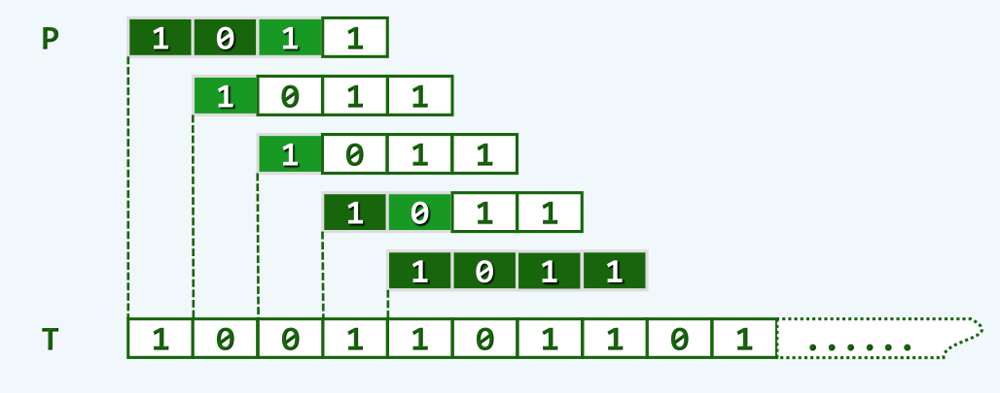
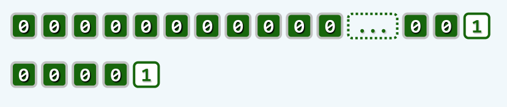
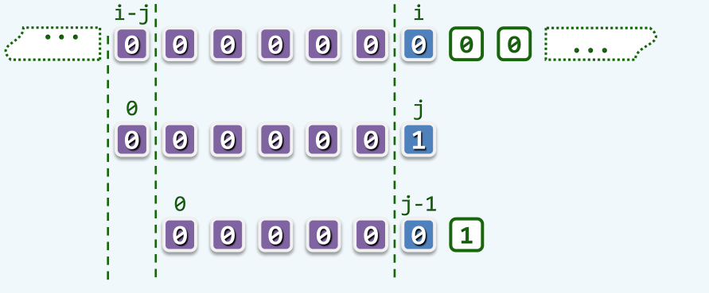

kmp conclusion
==============

字符串匹配问题是算法中的常见问题，即对于一个较长的文本串`T`，以及一个较短的模式串`P`，返回模式串`P`在文本串`T`中是否出现，或者首先出现的位置，或者所有出现的位置。实际上，在实际生活中，具有大量的字符匹配问题的应用场景，例如一般的编辑器软件，都具有的查找替换功能，还有像是`google`这种软件，本质上就是从整个因特网的文本数据中，去查找用户搜索的字符串。

以下主要讨论如何实现串匹配问题。

## 一种简明的策略

为了查找模式串`P`在文本串`T`中出现的位置，最简单的思路就是对于每一个可能的对齐位置，依次去比对两个串中的字符是否相等，如果完全匹配，则返回匹配成功；否则就在下一个对其位置开始新的匹配。该策略执行的流程如下图所示：



容易看出，这种策略在最坏情况下，在每个对齐位置都需要进行`m`次比对，其中`m`为模式串的长度，设文本串的长度为`n`，则最坏情况下的时间复杂度为`O(mn)`。一种最坏情况的实例如下图所示：



## kmp

对上面的蛮力策略进行分析，可以发现其时间性能较差是因为在该策略中做了大量无意义的比对。比如上图中的这种情况，在每一个对齐位置都首先进行`m - 1`次成功的比对，其中每个字符都是`'0'`，然后失败于最后的一次比对。每次移动到新的对齐位置后，此前比对过的字符，将再次参与比对。如下图所示：



正是这些重复的比对，拉低了该策略的时间性能。因此，就应该从避免这些重复工作的角度，来对该算法进行改进。

具体的做法是，如果在一次比对中，失败于模式串`P`中第`k`各字符，则此前已经进行了`k - 1`次成功的比对，因此此时我们已经获悉了文本串`T`中对之对齐的`k - 1`个字符的全部信息，因此就可以将模式串快速移动，直到移动到下一个“值得”对齐的位置。这里的“值得”对齐的位置，其实就是移动后模式串的前缀，要与文本串中这`k - 1`个字符的后缀相匹配。这就是`kmp`算法的基本思路。

应该注意到，采用`kmp`策略时，每次移动的距离只与模式串`P`有关，而与文本串`T`无关。这是因为在第`k`个位置失配后，文本串中的这`k - 1`个字符和模式串长度为`k - 1`的前缀完全相同。因此所谓“值得”对齐的位置，其实就是这`k - 1`字符构成的串，前缀和后缀自相匹配的位置。

需要指出的是，这样的位置可能有多个，所有的这些位置都是“值得”的对齐位置，因此，为了不错过其中的任意一个对齐位置，移动距离应该取所有这些自匹配位置移动距离中最小的，也就是自匹配长度最长的。为了在`kmp`算法运行过程中，迅速更新串的对齐位置，可以对模式串`P`做预处理，将在第`k`个字符处匹配失败的最长自匹配长度，保存在`next[k]`中，以便于查询。这样，就可以实现`kmp`算法了：

```cpp
int match(char* text, char* pattern){
	int* next = makeNext(pattern);
	int i = 0, j = 0, m = strlen(text), n = strlen(pattern);
	while(i < m && j < n){
		if(j < 0 || text[i] == pattern[j]){
			++i;
			++j;
		}
		else j = next[j];
	}
	return i - j;
}
```

可以看到，如果匹配成功，则同时移动文本串和模式串的指针；一旦匹配失败，就将模式串的指针移动到`next[j]`，即实现上面所说的快速移动。需要注意的是对`j < 0`情况的处理，此时相当于在模式串的左边具有一通配符，即`pattern[-1] = *;`，它可以匹配任何的字符，这样就可以将该情况与匹配成功做相同的处理。

这样，现在的主要问题就是如何构造这样一个`next`数组，即实现上面的`makeNext`函数。

## next的构造

在前面已经指出了`next`数组的语意，即对于其中的第`i`项，`next[i]`表示模式串在第`i`个位置失配时，模式串的下一个对齐位置。设子串`K = P[0, i-1]`，该位置应该满足：

```c
K[0, next[i] - 1] = K[i - next[i] ,i - 1]
```

所以`next[i]`的值也等于字符串`K`的最长自匹配长度。因此，构造任意一个`next[i]`，其实就是找到`P`的一个子串`P[0, i-1]`的最长自匹配长度

为了高效地构造出`next[i]`，不难注意到`next[i]`的值其实在一定程度上依赖于`next[i-1]`的，这是因为如果`P[i-1] = P[next[i-1]]`，即在子串`P[0, i-2]`的最长自匹配，可以直接延伸到子串`P[0, i-1]`，所以有

```c
next[i] = next[i - 1] + 1;
```

可是如果不满足`P[i-1] = P[next[i-1]]`，则上一个位置的最长自匹配长度将在新的位置断裂，此时必有`next[i] <= next[i-1]`，所以只能到子串`P[0, next[i-1]]`中去寻找新的最长自匹配长度。由于`P[0, next[i-1]] = P[i-2-next[i-1] ,i-2]`，因此`next[next[i-1]] + 1`是`next[i]`的下一个候选值，如果有

```c
P[i-1] == P[next[next[i-1]]];
```

则有

```c
next[i] = next[next[i - 1]] + 1;
```

否则应该重复上述过程，直到条件的确满足，或者不存在这样的一个自匹配。此时应该令`next[i] = -1`，表示与模式串左边假想的通配符`P[-1] = *`是自匹配的。因此，构造`next`表的代码如下：

```c
int* makeNext(char* str){
	int* next;
	int len, i = 0, j = -1;
	for (len = 0; str[len] != '\0'; ++len);
	next = new int[len];
	next[0] = -1;
	while(i < len - 1){
		if(j < 0 || str[i] == str[j]) next[++i] = ++j;
		else						  j = next[j];
	}
	return next;
}
```

应该看到，`next`表的构造的代码非常类似于`kmp`算法，这是因为`next`的构造本质上就是模式串的自我匹配，这个过程就是利用`kmp`的思想实现的。

可以证明，`kmp`算法的时间复杂度是`O(m + n)`。证明如下：令`k = 2i - j`，在每一次迭代中，要么执行`i++, j++`，要么执行`j = next[j]`，其中`next[j] < j`，因此每次迭代中`k`都至少增加1，而`k`的最大值不过为`2n`，即循环至多进行`O(n)`次，每一次的时间复杂度都是`O(1)`，故总的时间复杂度为`O(n)`。

## kmp的改进

上面的`kmp`算法还存在一些缺陷，例如下面的这种情况：


可以注意到，在文本串的`1`这个位置，统共需要进行四次比对，然而后面的三次比对都是无意义的，因为模式串的四个字符都是`0`，而在第一次失败的比对中我们就可以知道，文本串的该字符并不是`0`，因此聪明的做法应该是直接跳过这三个不可能会成功的比对。

对上述的问题进行总结，目前的`kmp`算法的确充分利用了先前成功比对的`经验`，来快速移动到下一个值得的对齐位置；而它的问题在于忽略了比对失败的`教训`，而这就是它在这里低效的原因。

为了对`kmp`进行改进，可以在构造`next`数组时，就将这种失败的负面信息纳入考虑。一般地，对于此前的`next[i]`，必然有

```c
P[0, next[i] - 1] == P[i-next[i] ,i-1]
```

但是如果

```c
P[next[i]] == P[i]
```

那么这里的`next[i]`就是没有意义的，因为将模式串的对齐位置到`next[i]`后，下一次比对一定是失败的。因此，为了解决这个问题，只需在构造`next`数组时，对这种情况加以判断，具体的代码如下：

```c
int* makeNext(char* str){
	int* next;
	int len, i = 0, j = -1;
	for (len = 0; str[len] != '\0'; ++len);
	next = new int[len];
	next[0] = -1;
	while(i < len - 1){
		if(j < 0 || str[i] == str[j]){
			++i, ++j;
			next[i] = (str[i] == str[j]? next[j]: j);
		}
		else
			j = next[j];
	}
	return next;
}
```

需要注意的是，之所以在`P[next[i]] == P[i]`时，可以直接将`next[i]`更新为`next[next[i]]`，而不需要做额外的比对以确定是否满足

```
P[i] == P[next[next[i]]
```

是因为在此前的循环中，已经判断过`P[next[i]] != P[next[next[i]]]`了。
