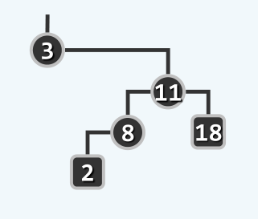
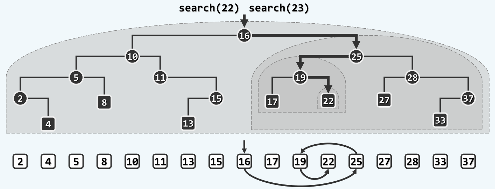

Conclusion on BST
================

## 什么是二叉搜索树(BST, Binary Search Tree)

> 为什么要有BST，它有哪些优势吗？

从名字就可以看出，BST是为了搜索而生的，是为了实现高效的搜索算法。

对比此前的数据结构，有序的`Vector`虽然可以实现$O(logn)$的搜索算法，但是为了维护这种有序性，对`Vector`本身的修改则需要线性的$O(n)$时间，这种性能多少有点糟糕。

再对比此前的`List`，无论是有序抑或是无序的`List`，搜索算法都需要$O(n)$的时间复杂度。但是，与之相应的，`List`具有比较好的动态性能，插入和删除算法只需要$O(1)$的时间。

这样，我们希望可以有这样一种结构，可以同时支持高效的查找算法的同时，还可以轻易地维护它的这种性质，即也支持高效的插入和删除算法。

> BST的思想。

通过上面的分析，其实我们想要的是这样一种数据结构，它可以同时具有`Vector`高效的静态性能以及`List`高效的动态性能。

实际上，BST正是这种数据结构。概括地说，就是形似`List`，神似`Vector`。

所谓形似`List`，是指BST在结构上与`List`相似。例如都通过指针来索引相邻的数据。实际上，退化的BST本身就是一个`List`。

而神似`Vector`，是指BST的搜索算法与`Vector`的二分查找有异曲同工之妙，这个我们会在后面看到。

> 什么是BST？

BST的定义是，对于树中的每一个结点，都满足顺序性，即任意结点w的左子树中，所有结点不大于w；w的右子树中，所有结点不小于w。

关于这个定义，要注意的是这里必须强调是左右子树的所有顶点都要满足顺序性，而不是<左孩子不大于w，右孩子不小于w>。例如，下面这棵树就不是一个BST。



> BST的整体单调性。

我们说，任何一棵BST，都是满足整体单调性的，即中序遍历序列必然单调非降。也就是说，BST的局部有序性可以推出整体单调性。如下面这张图所示：


这个性质可以证明如下：

+ 先考虑平凡的情况。例如一棵BST只包含三个结点，分别是根节点r以及左右子树l和r。显然，通过根节点的局部有序性可以直接退出整棵树中序遍历序列的单调性
+ 对于任意一棵树T，可以将其划分为根节点r，左子树$T_left$，以及右子树$T_right$，假定左子树以及右子树都满足单调性。考虑整棵树的中序遍历序列，必然是`[left-nodes, root, right-nodes]`这样一个序列，其中子序列`[left-nodes]`以及`[right-nodes]`都是单调非降的。由于左子树的所有顶点不大于`root`，右子树的所有顶点不小于`root`，因此整个`[left-nodes, root, right-nodes]`序列仍然是单调非降的。因此树T也满足单调性

这样，就证明了BST的局部有序性可以推导出整体的单调性。

通过这种性质，我们可以快速地判断一棵树是否是BST，即得到它的中序遍历序列（将所有结点往树低方向投影就可以得到），如果中序遍历序列有序，那么该树就是一棵BST。实际上，中序遍历序列单调非降也是BST的充要条件。

## BST的实现

和各种数据结构一样，BST的实现主要包括两部分，一是高效的查找算法，还有就是对原树的修改，比如插入和删除算法。需要注意的是，插入和删除算法中，比如维护BST的这种局部有序性，这是BST算法的核心。

> BST的查找算法。

与此前的`Vector`以及`List`不一样，BST的访问方式既不是循秩访问(call by rank)，也是循位置访问(call py position)，而是循关键码访问(call by key)，这是因为数据在BST中的存储位置只与数据的关键码有关。这已经有点类似于`python`的`dict`类型或者`cpp`的`map`类型，实际上，这些数据结构的底层就是BST，不过是平衡的二叉搜索树(BBST, Balanced BST)。

利用BST的局部有序性，可以高效地实现对目标算法的查找。这个问题这里就不讲了，毕竟太基础。但是我们可以看一下这个算法的运行过程，如下图所示：



可以看到，BST的整个搜索过程是在仿照有序向量的二分查找，只不过这里的有序向量就是BST的中序遍历序列。这也是前面说BST神似`Vector`的原因。

从这个过程也可以看出，BST的查找其实也不是真正的<二分查找>，这取决于整棵树是否平衡。在退化为`List`的情况下，BST的查找其实就是`List`的元素遍历，这也是BST的局限性。

与`Vector`一样，BST的查找算法也是需要服务于后续的插入、删除等操作，因此其接口语义的定义非常重要。为了方便地实现后续的插入操作，这里以引用的方式来传递树的结点，具体的代码如下：

```cpp
BinNodePosi(T)& BST<T>::searchIn(BinNodePosi(T) &x, T const &key, BinNodePosi(T) &hot){
	if(!x || x->data == key) return x;
	hot = x;
	return searchIn(key < x->data? x->leftChild: x->rightChild, key, hot);
}

BinNodePosi(T)& BST<T>::search(T const &key){
	searchIn(__root, key, __hot);
}
```

这里的技巧主要在于利用`__hot`内部变量来保存被查找结点的父结点，即使被查找结点为`nullptr`，`__hot`仍然会指向它的父结点，从而后续的插入和删除操作就可以方便地进行。

> BST的插入算法

BST的插入算法主要要考虑的问题是不能破坏BST的局部有序性，为此可以先通过调用一次查找算法来找到被插入结点应该存在的位置，随后利用被返回的结点以及`__hot`变量，可以方便地实现插入操作，代码如下：

```cpp
BinNodePosi(T) BST<T>::insert(T const &key){
	BinNodePosi(T) &pos = search(key);
	if(pos) return pos;								//key already existss
	//else
	pos = new BinNode(key, __hot);
	++__size;
	updateHeightAbove(__hot);
	return pos;
}
```

需要注意的是，由于这里的`pos`以及`search`函数的返回值都是引用，因此这里的`pos`直接就是原树中的指针变量。利用这种方法可以使得相关操作更加便捷，例如插入根结点和插入普通结点并没有什么区别，同时也不需要修改从父结点指向当前结点的指针。但我觉得这种做法得不偿失，使得整个代码非常难以维护，同时很容易出错，正常地返回值然后手动修改指针我觉得也没有麻烦多少。

>  BST的删除算法。

和BST的查找一样，BST的删除算法也需要保证不改变BST的局部有序性，为此需要对删除了当前结点的树做一些调整，使之重新成为一棵BST。具体的调整方法如下：

+ 如果被删除结点没有左子树或者没有右子树，那么就可以直接用它的右子树或者左子树来替代它，就可以在删除结点的同时保持了BST的性质。
+ 如果被删除结点既有左子树，又有右子树，可以找到它的直接后继`succ()`，用直接后继的数据来替代当前结点的数据，随后删除直接后继结点，而这里的直接后继是一定没有左子树的。

具体的代码如下：

```cpp
BinNodePosi(T) BST<T>::removeAt(BinNodePosi(T) &x, BinNodePosi(T) &hot){
	BinNodePosi(T) succ;
	if     (!x->leftChild)  succ = x = x->rightChild;
	else if(!x->rightChild) succ = x = x->leftChild;
	else{
		succ = x->succ();
		x->data = succ->data;
		if(succ == succ->parent->leftChild) succ->parent->leftChild = succ->rightChild;
		else succ->parent->rightChild = succ->rightChild;
		hot = succ->parent; 						//update hot
		succ = succ->rightChild;
	}
	if(succ) succ->parent = hot;
	return succ;
}

bool BST<T>::remove(T const &key){
	BinNodePosi(T) x = search(key);
	if(!x) return false;							//key doesn't exist
	//else
	removeAt(x, __hot);
	--__size;
	updateHeightAbove(__hot);
	return true;
}
```

这里同样使用了树结点指针的引用，来方便地修改一些连接关系，同时`__hot`在调用了`remove`后，指向被实际删除结点的父结点。
