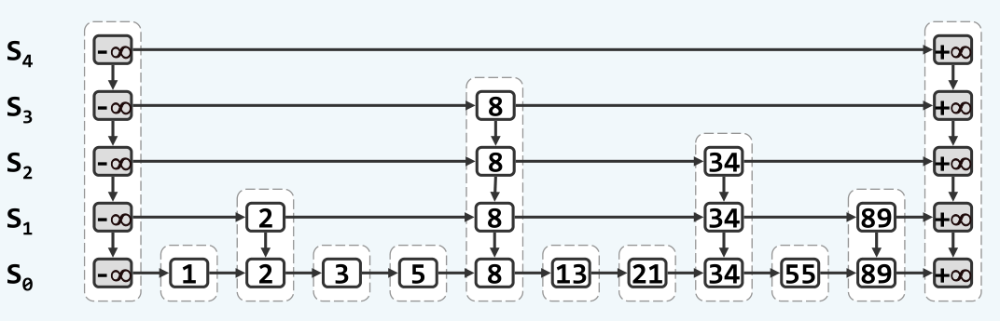

跳转表知识总结
============

## 跳转表的基本概念

跳转表是一个基于列表`list`的数据结构，从结构上来说，它是由多个列表组成的。各个列表在纵向形成多层，其中第一层（最底层）拥有跳转表中的所有数据节点，以上各层列表中的数据都是其底层列表的一个子集，特别地，最顶层的列表不包含任何数据，仅含有两个头尾哨兵。跳转表的结构如图所示：



用地铁站对跳转表打一个比方，设想有一个城市的地铁分为多层，其中最底层的地铁要经过该城市的所有站台；所有这些站台中，有一些人流量很密集的站台，为它们在上一层设立一条新的地铁线路，因为该线路只经过这些大站台，因此运行速度可以更快。当人们乘坐地铁的时候，为了到了某一个小站台，最快捷的方案显然是先做大站车到距离小站台最近的大站台，然后再乘坐最底层的慢车到达某个小站。跳转表就是这样一种思路，通过在上层列表节点间的快速跳转，来迅速查找到某个数据。

从上面的图中也可以看到，跳转表的结构就类似于一棵搜索树，上层列表对应了搜索树中高度较高的节点，而底层列表对应了搜索树中的叶节点。实际上，根据跳转表发明者的定义，跳转表是基于概率实现的对平衡二叉树的一种替代方案，它使用概率来实现平衡，而非强制的平衡，因而对于插入和删除节点比传统平衡树更为高效。

## 跳转表的结构

从宏观上来看，跳转表是由多层的列表组成的，为了实现不同层之间列表的跳转，列表中的每个节点除了要有前向后向的指针以外，还需要同时具有上下的指针，来表示不同层次地铁的“换乘路径”。为此，需要修改`list`的实现中关于`ListNode`的定义，为其增加上下的指针，即形成下面的`QuadNode`类型：

```cpp
template <typename T>
class QuadNode{
public:
	T entry;
	QuadNodePosi(T) prev;
	QuadNodePosi(T) next;
	QuadNodePosi(T) above;
	QuadNodePosi(T) below;

	QuadNode() = default;
	QuadNode(T entry) :entry(entry) {}
};
```

基于`QuadNode`可以实现四联表`QuadList`类型，使用`QuadList`来作为跳转表的底层列表：

```cpp
#define QuadNodePosi(T) QuadNode<T>*

template <typename T>
class QuadList{
private:
	QuadNodePosi(T) __head;
	QuadNodePosi(T) __tail;
	int             __size;

public:
	......
```

需要指出，每一层的列表都要是有序的，这就仿佛你在坐地铁的时候，对于任意站台，需要知道它的前一站是什么、后一站是什么，这样你才可以规划路线，并且决定在哪里下车。否则，地铁就是在各个站台之间随机运行，也就不存在我们上面所说的先坐大站车再坐小站车的策略了。为了简化操作，在初始化时应该首位哨兵的值分别为`MIN`和`MAX`，如下所示：

```cpp
#define MAXINT (int)(0x7fffffff)
#define MININT (int)(0x80000000)
```

跳转表的多层次结构是通过`生长概率逐层减半`来实现的，具体说来，就是说在第`k`层出现的元素，在第`k + 1`层也出现的概率为`p = 1 / 2`。这样，如果最底层的节点数量为`n`，则它的上一层的期望节点数量就是`n / 2`，再上一层就是`n / 4`，`n / 8, ......, 2, 1`，从结构上就非常类似一棵二叉树了。并且可以看出，跳转表的期望总节点数量为

```
n + n / 2 + n / 4 + ...... + 2 + 1 < 2n = O(n)
```

可见，跳转表的空间复杂度并没有因为层次的原因而得到显著增长。

## 跳转表的实现

跳转表的基本操作主要有三个，即搜索，插入和删除。以下就讨论如何实现这三个基本操作。

### 跳转表的搜索算法

实际上，在上面地铁那里已经叙述过跳转表的搜索算法了，即首先坐上层的大站车快速到达距离小站最近的位置，然后换乘底层的小站车。用算法的语言描述，即自上而下，自左而右地搜索，对于每一层的列表，从左至右遍历它的每一个元素，直到发现第一个大于搜索值`key`的元素，然后后退一步，如果当前节点的`key`值等于搜索值，则成功返回，否则表示应该在这里下车换乘了。如果当前列表还不是最底层，则切换到下一层的列表，并且重复上面的操作，直到查找成功，或者因为不存在该`key`值而查找失败。
这里的搜索算法将基于遵循前面列表的约定，即总是返回不大于`key`值节点中的最靠右者。跳转表的搜索算法实现如下：

```cpp
template <typename K, typename V>
QuadNode<entry<K, V>>* SkipList<K, V>::skipSearch(K key) {
	QuadNode<entry<K, V>>* qnode = last()->val->first();			//the first quadlist node of the last quadlist
	while (1) {	
		while (qnode->entry.key < key) qnode = qnode->next;
		if (qnode->entry.key == key) return qnode;
		//else
		qnode = qnode->prev;
		if (qnode->below == nullptr) return qnode;
		//else
		qnode = qnode->below;
	}
}
```

跳转表的搜索算法仅需要`O(logn)`的时间复杂度，对该结论可以定性地来理解。由于`生长概率逐层减半`，跳转表的期望层数只有`h = logn`，所以搜索算法中至多进行`O(logn)`次层间跳转；类比于二叉树，每进行一次层间跳转，就相当于排除了最底层一半的节点，因此搜索过程中，横向跳转次数的期望就等于跳转表的层数`O(h)`，所以所有的层间跳转和横向跳转至多进行`O(h) = O(logn)`次，每次跳转都只需要常数的时间，即整体的时间复杂度为`O(logn)`。

下面可以严格地证明横向跳转的次数的期望等于跳转表的层数`O(h)`。

考虑搜索过程的逆过程，即从底层列表向右向上移动，该移动过程可以描述为：在某一层不断向右移动，直到发现了第一个向上生长的节点，或者直到到达第一个可以换乘的大站。设某一层横向移动的次数为`K`，有

$$
\begin{aligned}
P(K = 0) = p\\
P(K = 1) = (1 - p)p\\
...\\
P(K = k) = (1 - p)^{k - 1}p, k = 1, 2, ...
\end{aligned}
$$

即随机变量`K`服从几何分布，其期望`EK = 1`，即在每一层的期望移动次数仅为`1`，这样一次搜索过程中的横向跳转次数不超过`h`。故得证。

基于搜索算法，可以快捷地实现跳转表的插入和删除算法。

## 跳转表的插入算法

为了将一个新的词条插入到跳转表中，首先需要调用一次搜索算法来找到正确的插入位置，得益于搜索算法的语义，如果的确查找到了要新插入的关键码，则返回的位置必然是相同关键码的词条中最左侧的一个，应该将新的词条插入到它的左侧；如果没有找到新的关键码，则返回的是不大于该关键码词条中最右侧的一个，此时应该将新的词条插入到它的右侧。

在定位了插入位置后，为了将新的词条插入，首先需要将插入位置指针强制转移到底层，从最底层开始插入，完成实质性的插入操作只需要修改前后词条的指针即可。此后，还需要保证`生长概率逐层减半`，可以通过一个随机数来实现，如果生成的随机数是奇数（或偶数），则继续在上一层插入，这个过程不断重复，直到生成的随机数表示不继续插入。

为了将新的词条在上一层插入，需要找到该词条在上一层的前驱或者后继节点。一种策略是遍历上一层的全部节点，直到找到新词条的前驱或者后继，其时间复杂度为`O(n)`，毋庸置疑，这种策略的开销太高了。为了快速地找到新词条的后继，可以沿用搜索过程中的跳转策略，具体说来就是在当前层次继续向后遍历，直到发现第一个向上生长的节点，在这里向上层跳转，就是新词条的后继节点了。在前面也已经证明过了，这种遍历进行次数的期望仅为`O(1)`，因此插入的时间复杂度，主要是消耗在了`search`过程中，其总体的时间复杂度也是`O(logn)`。插入过程的具体代码如下：

```cpp
template <typename K, typename V>
bool SkipList<K, V>::put(K key, V value){
	QuadNode<entry<K, V>>* qnode = skipSearch(key);
	QuadNode<entry<K, V>>* belowNode;
	ListNode<QuadList<entry<K, V>>*> *qlist = first();
	QuadList<entry<K, V>> *newlist;

	while (qnode->below != nullptr) qnode = qnode->below;
	if (qnode->entry.key != key) qnode = qnode->next;
	qlist->val->insert_before_above(qnode, entry<K, V>(key, value));
	if (next(qlist) == nullptr) {
		newlist = new QuadList<entry<K, V>>();
		newlist->sethead(entry<K, V>(MININT, 0));
		newlist->settail(entry<K, V>(MAXINT, 0));
		newlist->connectTo(qlist->val);
		push_back(newlist);
	}

	while(rand() % 2 == 0){
		belowNode = qnode->prev;
		qlist = next(qlist);
		while (qnode->above == nullptr) qnode = qnode->next;
		qnode = qnode->above;
		qlist->val->insert_before_above(qnode, entry<K, V>(key, value), belowNode);
		if (next(qlist) == nullptr) {
			newlist = new QuadList<entry<K, V>>();
			newlist->sethead(entry<K, V>(MININT, 0));
			newlist->settail(entry<K, V>(MAXINT, 0));
			newlist->connectTo(qlist->val);
			push_back(newlist);
		}
	}
	return true;
}
```

需要注意的是，在插入过程中，如果在最顶层的列表中进行了插入，则需要新创建一个为空的顶层列表，实际上，这也是跳转表层次增长的唯一原因。

## 跳转表的删除算法

跳转表的删除策略基本是类似于插入的策略的，而且还要更加简单，因为不需要寻找被删除词条的前驱或者后继节点。具体的算法是，首先调用一次`search`对被删除的词条进行定位，随后即可自上而下依次对各层次中的该词条进行删除，由于这种删除至多会进行`h`次，因此删除操作的时间复杂度也仍然是`O(h) = O(logn)`。删除操作的具体代码如下：

```cpp
template <typename K, typename V>
bool SkipList<K, V>::remove(K key){
	QuadNode<entry<K, V>>* qnode = skipSearch(key);
	QuadNode<entry<K, V>>* tempNode;
	ListNode<QuadList<entry<K, V>>*>* qlist = first();
	if (qnode->entry.key != key) return false;
	//else
	while (qnode->below) qnode = qnode->below;
	
	while(qnode){
		tempNode = qnode;
		qlist->val->remove(qnode);
		qnode = qnode->above;
		qlist = next(qlist);
		delete tempNode;
	}

	//remove level if empty
	qlist = prev(last());
	while(qlist && qlist->val->empty()){
		pop_back();
		qlist = prev(qlist);
	}

	return true;
}
```

需要注意的是，删除操作中也涉及到某一层次列表的删除。即在一次删除操作以后，如果该层次列表为空，则应该对该层次的列表进行删除。这也是跳转表层次降低的唯一原因。
