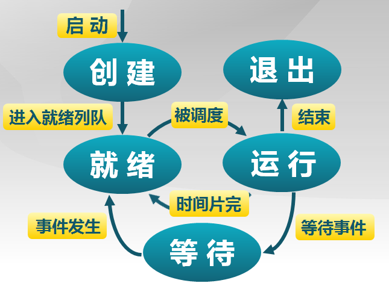
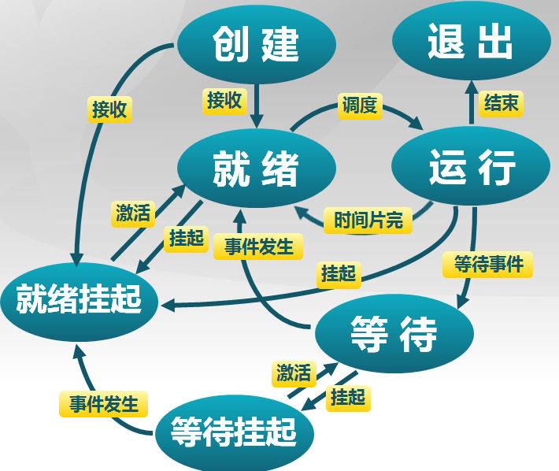
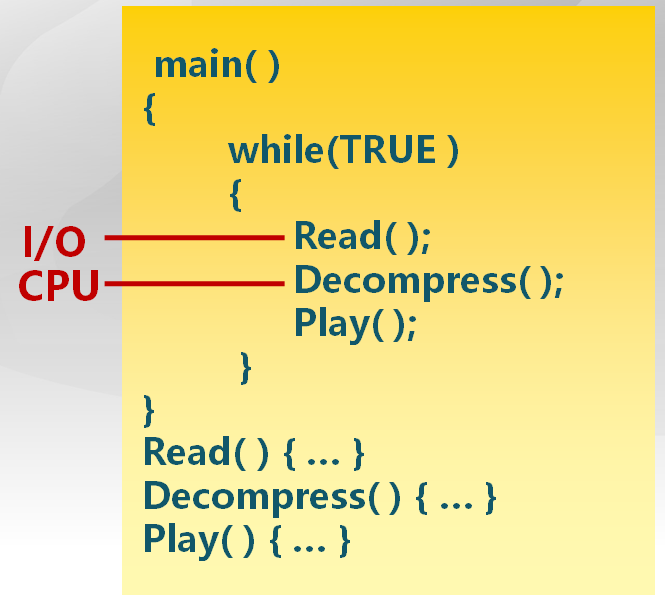
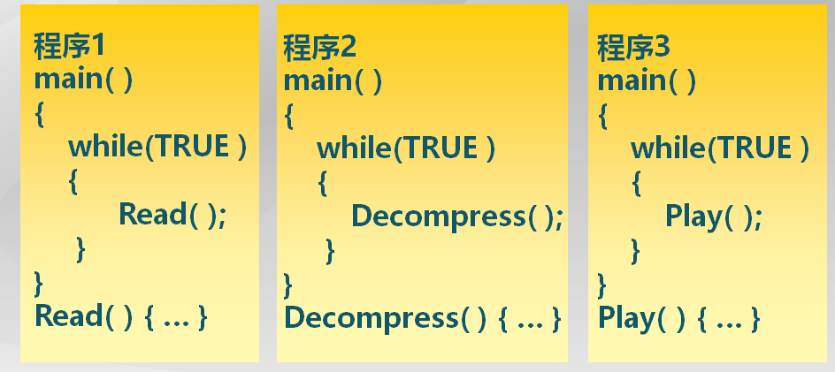
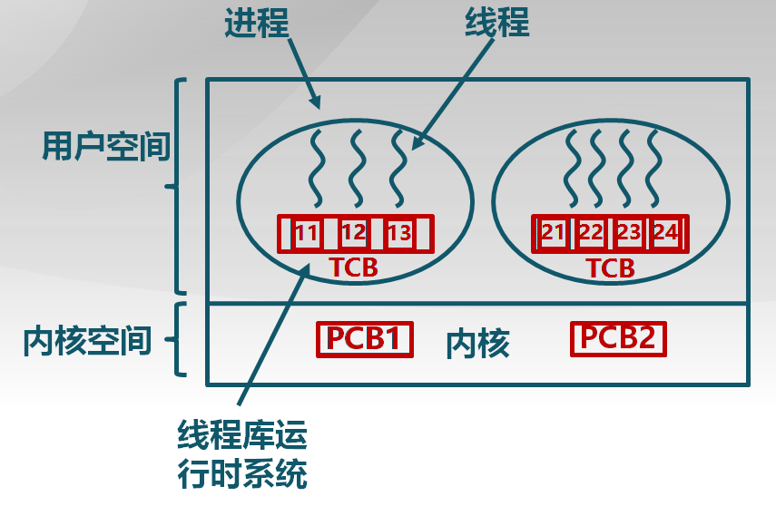

进程管理（1）：进程和线程的概念
============================

## 进程产生的背景

首先需要回答一个问题，为什么要引入进程的概念？

前面在物理内存管理部分，我有提到物理内存管理的一切目的，都是为了多任务的系统，否则对于单道程序的操作系统，直接让那单道程序独占内存和CPU就可以了，自然不需要内存管理，显然也不需要进程的管理。所以，进程概念的产生，其实还是处在多道程序的背景下的。

正是因为操作系统希望同时运行多道程序，而我们都知道程序运行需要资源，因此操作系统需要合理地把自己的资源组织管理起来，在程序运行的时候分配相应的资源，在程序退出的时候回收那部分资源。那么问题来了？操作系统怎么知道把资源分配给了谁？怎么知道资源的占有者什么时候退出？又怎么知道应该从哪里回收分配出去的资源？因此，需要对每一个运行的任务进行抽象。对每一个运行的程序的抽象，就是这里进程的概念。这样，进程就成了操作系统资源分配的基本单位。

## 进程与程序的区别

我们都知道，程序其实就是编译后的代码，机器码，驻留在外存或者内存当中。那么进程呢？其实上面已经提出了，进程本质上就是运行的程序。这句话涵盖了它们之间的全部区别。

一方面，进程必然是包含程序的，毕竟它需要运行这个程序，但是程序只是进程的一部分。【进程是运行的程序】，这里的【运行】，就体现了它们之间的区别——既然程序要运行，就必然在代码以外还需要一定的数据，就必然需要占用一定的资源，比如代码和数据驻留的内存资源，就会涉及到程序当前的执行状态，比如一些上下文的信息，还有寄存器的信息。因此，可以概括出，进程是由代码，数据，各个寄存器以及占用的资源所组成的。

从上面的讨论中，已经可以总结出进程和程序的区别了：

+ 首先，程序是静态的，进程是动态的。程序其实是静态的可执行文件，是可以永久保存的；但是进程由于其运行的性质，不可避免地具有各个生命周期，比如创建，运行，等待，退出等，它是动态变化的，有始有终的。由此也可以得出结论，同一个程序的多次执行过程是对应了不同的进程。
+ 其次就是两者的组成成分不同，进程是包含了程序的，除此以外进程还含有数据，状态信息等。

现在，我们可以给出一个更加严谨的进程的定义了：

> 进程是指一个具有一定独立功能的程序在一个数据集合上的一次动态执行过程。

它具有以下特点：

+ 动态性
+ 并发性：进程就是为了多任务并发运行而产生的
+ 独立性：指不同的进程，它们的工作互不影响
+ 制约性：操作系统的资源是有限的，所有进程共享这些有限的资源，不可避免地会因为资源的分配或者进程间同步而产生制约

## 进程控制块

> 进程管理是进行什么管理呢？

这就好比你在烟花巷开了一家青楼，对于每一个客人，有的要先喝个酒，你得给他分配一瓶酒；有的客人直接带姑娘上楼了，那你得知道它带的是哪个姑娘，别的客人请求这个姑娘的时候他们就只能等着；然后这个客人带着这个姑娘，你得知道他什么时候完事儿了，你总不能让他就把姑娘给你带走了，你得把姑娘进行回收，然后再把姑娘分配给等着的那些客人。

进程管理也是出于同样的目的。进程管理其实只在意资源的分配和回收。但是为了管理资源，还需要同时管理进程的状态，这样操作系统才知道什么时候应该分配资源，什么时候又应该回收资源。

进程控制块(PCB, Process Control Block)就是操作系统用于完成进程管理的数据结构。操作系统用PCB来描述进程的基本情况以及运行变化的过程，每加入一个进程，操作系统就为它管理一个PCB，一旦进程退出运行，就随即销毁它的PCB，因此，PCB是进程存在的唯一标志。

> 进程控制块的具体结构是什么？

进程控制块的功能其实就是完成对一个进程的管理工作，它的结构必然是与它要完成的功能相适应的。为了完成这样的管理工作，进程控制块至少要保存：

+ 进程的状态信息：比如进程如果刚被创建，就需要为它分配必要的资源。如果它执行完成退出了，那么需要去回收分配给它的资源。
+ 进程的资源占用信息。进程当前占用了哪些资源，比如占用了哪些内存资源，方便在退出的时候回收到操作系统。

当然，这里的状态信息和资源占用信息都只是从一个相当概括的角度来谈的。

具体说来，状态信息不仅包含进程当前所处的是就绪态，创建态还是运行态，还包括进程切换时保存的上下文信息，进程的中断帧信息，还有用于调度算法一些信息，比如当前运行的时间，或者所处调度队列的一个链接等。此外，资源占用信息也可以更加细化，比方说，内存资源占用包括用户内存空间和内核堆栈，除此以外，还有打开的文件，等等。

除此以外，还需要进程的标志信息，即pid(Process id)，来唯一地标识一个进程。在pid以外，进程还有一个名字，它们共同构成进程的身份信息。

> 进程控制块的组织

为了管理所有进程，操作系统需要将代表所有进程的进程控制块组织起来。具体组织的方式有链表和索引表。

这里的链表其实就是把所有的进程的PCB都添加到一个链表上。此外，根据进程状态的不同，多个状态可以对应多个链表，这样就可以形成就绪链表，阻塞链表等。索引表的思路和链表其实也差不多，就是数据结构的实现不同而已，同样将同一状态的进程归入一个索引表，多个状态可以对应多个索引表，这样形成就绪索引表，阻塞索引表等。PCB链表和索引表的组织，可以看一下下图：

## 进程的状态

前面已经提到，进程是动态执行的，在进程的执行过程中涉及进程状态的切换。目前我们已经看到进程具有创建态，运行态，就绪态，此外还有等待态和退出态。

进程各个状态的切换以及相关的时间都如下面这张图所示：

+ 进程的创建。在系统刚启动时，或者一个应用进程要求创建另一个子进程时，都会产生创建态的进程。进程的创建态实际上标志了进程还没有完全准备就绪，操作系统在进行进程的初始化工作。
+ 进程的就绪。进程创建完成之后，就进入了就绪状态。此外，正在运行的进程也可能因为时间片用完或者被更高优先级的进程抢占而进入就绪态。处于等待状态的进程可以因为等待的事件发生而进入就绪态。
+ 进程的运行。处理机每次都会从就绪进程中挑选一个进程，让它实际上得到CPU资源，使该进程实际上投入运行。
+ 进程的等待。正在运行的进程，可能因为等待某个被占用的资源，或者等待某个时间的发生而不能继续运行，此时应该让该进程进入等待状态，从而让出CPU资源让其它进程运行。
+ 进程的退出。进程执行完毕，或者出现错误，会进入退出状态。退出状态是指该进程还没有完全消失，此时操作系统正在回收它的资源，并且等待该进程的父进程的处理结果。

可以看到，在进程的整个生命周期内，主要都是在就绪，运行，等待三个状态中来回进行切换，在另外两个状态创建和退出的时间很少。因此，将这里的就绪，运行和等待称为三状态进程模型。

> 挂起进程模型

在出现虚拟内存管理后，进程还会出现一个新的状态，挂起。相应的，这种进程模型也称为挂起进程模型。挂起，是指在虚拟内存管理中，一个进程从内存中被换出到外存中的状态。会发生挂起的现象是因为物理内存资源是有限的，当内存空间不足时，操作系统需要对内存中的进程进行合理的安排，有些进程会被暂时调出内存，当条件允许时，再将这些进程调回到内存中。

处于挂起状态的进程映像在磁盘上。将挂起状态与三状态进程模型综合一下，就产生了等待挂起状态和就绪挂起状态，因为显然在运行态的进程必须驻留在内存中，不可能换出到外存。

等待挂起状态是指进程在外存中，并且等待某个事件出现的情况；就绪挂起状态是指进程在外存中，但是一旦进入内存，就可以运行。挂起进程模型的切换和相关的时间如下图所示：

引入了挂起状态后，状态的切换也相应的增加了，下面分别做具体的说明。

+ 等待到等待挂起。如果当前运行的进程需要更多内存空间时，或者没有进程处于就绪状态时，会发生这种切换。
+ 就绪到就绪挂起。当有高优先级进程处于等待状态，并且系统认为很快就绪时，会将低优先级的就绪进程换出到外存中，以获得更多内存资源。
+ 运行到就绪挂起。对抢占式系统，高优先级的等待挂起进程因为事件发生到进入就绪挂起时，会抢占低优先级的运行进程。
+ 等待挂起到就绪挂起。等待事件发生时产生。
+ 就绪挂起到就绪。没有就绪进程或挂起就绪进程优先级高于就绪进程时，产生这种切换。
+ 等待挂起到等待。当一个进程释放了足够多的内存资源时，有可能将高优先级的等待挂起进程移入内存中。

> 状态队列的概念

前面已经提过，操作系统会为不同状态的进程分别维护一个单独的队列，即状态队列。现在我们知道，随着进程状态的切换，状态队列也会发生相应的变化，进程会从从一个队列加入到另一个队列。在进程状态模型下，状态队列的切换如图所示：

## 线程的概念

> 为什么需要引入线程的概念？

设想一种场景。现在我们有一个MP3播放器的应用程序，该应用程序主要有三个核心功能模块，即从MP3音频文件中读取数据，将读取的数据解压缩，将解压缩后的音频数据播放出来。应该如何实现这个应用程序呢？

这里我们主要考虑的指标是音频文件播放是否流畅、连贯。为此，就需要设计的应用程序可以及时将刚读出来的压缩数据解压缩，并且播放出来。一种简明的设计思路如下图所示：

在该设计思路中，我们将读取数据，解压缩，播放文件依次执行。但是不难看出，这种实现存在很致命的缺陷：各个模块之间不能并行进行。可以看到，这里读取压缩音频文件涉及到I/O操作，解压缩是CPU密集型操作，因此这两个模块在理论上是可以并发执行的，即在将压缩文件读取出来的同时，CPU可以对这些数据进行解压缩，这样可以大幅度提高资源的利用效率。此外，按照我们的设想，在播放时应该也可以同时进行读文件和解压的操作，在这种实现方式都却不能做到。在这种实现下，为了播放音频文件连贯，必须一次性将全部音频文件读出并且解压缩，最后才能播放，漫长的等待时间非常影响用户体验。

为了将各个操作并行地推进，我们很自然地联想到将各个核心模块全都加载到一个进程中，即为了运行这个MP3播放器软件，我们同时需要三个进程，这种设计思路如下图所示：

这种方法的确解决并行的问题，但是却引入了新的问题——可以看到，这里的三个进程之间需要共享数据，前一个进程的输出，是下一个进程的输入，因此需要解决在进程之间通信以及共享数据的问题。此外，进程的创建以及进程之间的切换是需要相当的开销的，这种实现方式无疑增加了开销。

我们的梦想呢，是有这样一种结构，它可以像进程一样进行切换，从而实现并行性；另一方面，数个这样的结构又可以共享数据，并且它们之间的切换的开销要足够的小。这样的梦想中的结构，就是线程。

> 线程的概念

为了解决上面的问题，可以在进程内部增加一种实体，这些实体之间都共享进程的资源，而CPU又可以在这些实体之间切换，这种实体就是线程。

线程是进程的一部分，描述指令流执行状态。它是进程中的指令执行流的最小单元，是CPU调度的基本单位。引入了线程以后，CPU的调度就不再以进程为单位了，从而进程就退化成为了资源分配的单位；而进程中的线程共享分配给进程的资源，并且都可以独立地描述其中指令流的执行状态。

那么，线程之间切换的开销的确小于进程切换吗？我们可以做一个考虑。首先由于线程本身不占有资源，在创建线程时不需要像进程一样分配资源，因此时间开销要小于进程的创建；也由于同样的原因，线程的退出需要的时间也比进程短，因为没有资源的回收；此外，同一进程的不同线程之间的切换，由于它们是共享数据，不需要进行用户空间、内核堆栈等的切换，只需要保存和恢复上下文信息就足够了，需要的时间也的确比进程切换要短。因此可以看到，线程相比于进程，能减少并发执行的时间和空间开销。

关于进程和线程的关系，可以用一句话总结，即进程拥有一个完整的资源平台，而线程只独享指令流执行的必要资源，如寄存器和栈。进程是资源分配单位，线程是CPU调度单位。

为了实现在实际系统中实现线程，可以有几种方案，即用户线程，内核线程以及轻量级进程。

### 用户线程

用户线程的思路其实非常简明：只是在用户空间实现线程，进程的线程对于操作系统是不可见的。这样，进程仍然是操作系统资源分配和调度的基本单位。用户线程的示意图如下图所示：

仍然拿上面的MP3播放器举个例子，我可以在编写程序的时候，手动为它划分三个核心功能模块。在操作系统调度这个播放器进程运行的时候，在进程内部也运行一个调度程序，来选择某一个核心模块实际运行。

通过上面的实例可以看到用户线程的特征：

+ 首先是非常灵活，因为是在进程的内部提供线程的调度算法，因此调度算法的设计可以更有针对性，不同的进程可以拥有不同的调度算法。
+ 线程对操作系统是不可见的，线程控制块TCB需要进程本身来维护。
+ 线程之间的切换很快，直接在进程运行中就可以切换，不需要用户态/内核态的切换。

但是用户线程还是存在不足。编程困难都不算什么不足，毕竟程序员是干什么吃的？！最大的不足是一个线程阻塞的时候，其他线程也都阻塞了。因为操作系统看不到用户线程，一旦发生阻塞，操作系统就立即将CPU的控制权转交给其他进程了，对于MP3播放器这种应用，还是不能实现I/O和解压缩的CPU操作并行。

除此以外，操作系统调度进程是以进程为单位分配CPU时间，一个进程的所有线程共享这部分CPU时间，每个线程的时间片较小。

### 内核线程

内核线程可以解决上面提到的用户线程的不足。内核线程就是指，线程对于操作系统是可见的，由操作系统来管理线程。内核线程的示意图所下图所示：

由于是由内核来同时维护PCB和TCB，一个进程的线程被阻塞并不会影响该进程的其他线程，这样音频文件的读取和解压缩就可以并行进行了，因此在实现了内核线程的操作系统上，我们的MP3播放器终于可以正常地并行地工作了。此外，由于操作系统调度的基本单位成了线程，不会出现上面提到的线程的时间片太短的情况。

但是相对于用户线程，内核线程也具有一定的缺陷。一方面，内核线程的创建、切换和退出的开销比较大，因为这些操作是通过系统调用实现的，需要进行用户态/内核态的切换。此外，由操作系统统一给出线程的调度算法，不如用户线程那么灵活。

为了综合用户线程和内核线程的优点，提出了轻量级进程的概念。

### 轻量级进程(LightWeight Process)

轻量级进程是内核支持的用户线程。一个进程可有一个或多个轻量级进程，每个轻权进程由一个单独的内核线程来支持。

轻量级进程的实现综合了内核线程和用户线程。具体说来，对于每一个进程，内核中都管理了一定量的它的内核线程。但是在用户进程的内部，同时还存在着一定的用户线程。操作系统调度的基本单位仍然是内核线程，但是可以将用户线程和内核线程进行绑定，以在一定程度上改变这种调度关系，实现用户线程那种灵活的线程调度。轻量级进程的示意图如下图所示：

可以看到，在轻量级进程中，用户线程和内核线程是多对多的关系。除此以外，还有用户线程对内核线程是一对一或者多对一的关系的情况，分别对应了内核线程和用户线程。
