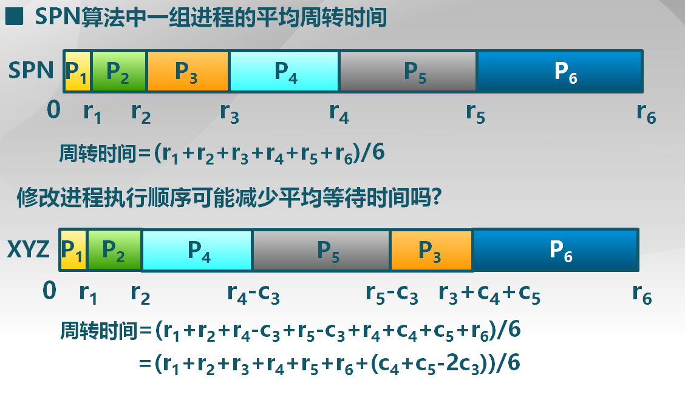
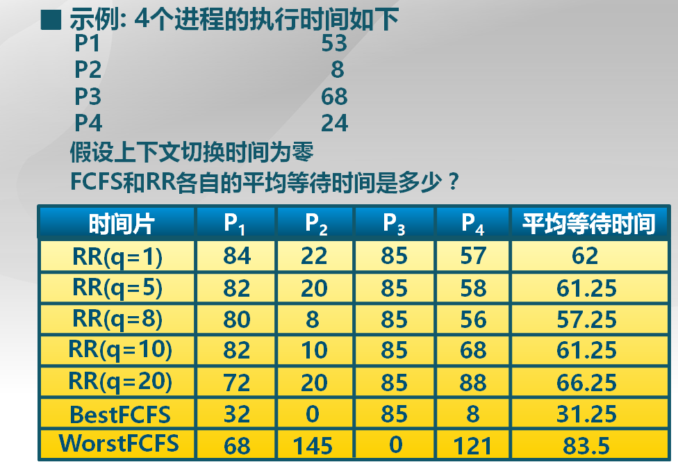
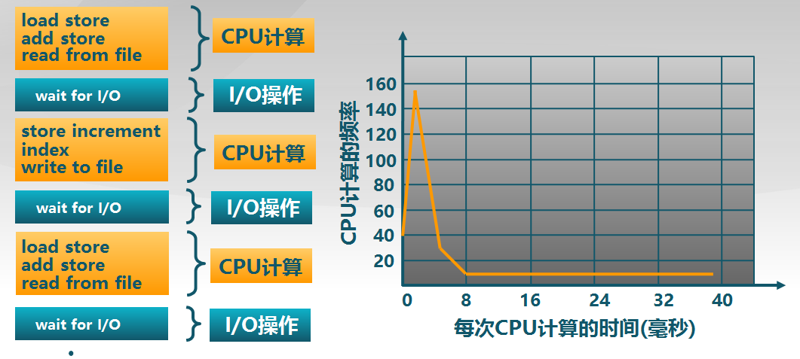

进程管理（2）：进程调度策略
=========================

## 进程调度的概念

> 第一个问题还是，为什么需要对进程进行调度？

在前面一篇[进程管理（1）：进程和线程的概念](chp11.md)中已经提出，进程这个概念是在多道程序的背景下产生的，之所以引入进程，就是为了让操作系统可以更好地管理这些并发的任务。而我们知道，进程的并发并不可能是真正的并行，因为无论是在单处理机还是多处理机中，进程的数量都远远多于CPU的内核数，因此进程的并发本质上只是对CPU资源的时分复用而已。一个CPU在任何时刻，还是只能执行一个程序。

这样，当一个进程执行完一定的时间，或者主动放弃了CPU资源以后，操作系统就需要选择另一个进程到CPU上去执行。怎么从众多进程中选择这一个进程，就是对进程的调度问题。

> 进程调度的时机。

进程调度还要解决的一个问题就是进程调度的时机，即应该在什么时候对进程进行调度。很自然可以想到，当一个进程因为各种原因主动放弃CPU资源时，比如因为等待某一个资源而进入阻塞，比如因为执行完毕了而退出等，都应该进行进程的调度。

除此以外，对于基于抢占式的进程调度算法，在一个更高优先级的进程进入就绪队列以后，也应该让这个高优先级进程抢占正在CPU上执行的低优先级进程，让它开始执行。但是这种情况不同于进程主动放弃CPU的情况，因为正在执行的进程无法知晓一个高优先级进程进入了就绪状态，因此就需要操作系统的介入，借助中断机制，打断正在执行的低优先级进程，并且在中断服务例程响应完毕时进行进程的切换。事实上，在`ucore`中，的确也是采取这两种进程调度的时机的。

## 进程调度策略的评价

和前面的页面置换算法一样，你尽可以设计各种各样的进程调度算法，但是又应该如何评价这些算法的优劣，并且对它们进行改进呢？所以在讨论具体的进程调度算法之前，应该首先关心它的一些评价指标。

从操作系统和计算机系统的角度来看，自然是希望设计的调度算法可以更高的资源利用率。这里的资源利用率指标可以用CPU利用率以及系统的吞吐量来表示。CPU利用率是指CPU处于忙状态的时间百分比，因为进程的运行模式一般是CPU运算和I/O操作交替进行，如果CPU在不断运行，则说明计算机系统的资源具有一个比较高的利用率。吞吐量是指单位时间内完成的进程数量，是一个比较宏观的目标，吞吐量越高则说明系统完成服务效率越高。此外，还有一个周转时间指标，表示一个进程从初始化到结束的总时间，其中也包括处于等待状态的时间。

但是从用户的角度来看，则具有完全不同的评价指标。对于用户来说，更加注重的是一种用户体验，也就是一个进程的等待时间和响应时间。等待时间是指进程在就绪队列中等待CPU的总时间，响应时间是指从提交请求到产生响应所花费的时间。这两个指标对于提升用户体验的作用不言而喻，例如如果用户移动了鼠标，光标却没有移动，用户可能会直接砸键盘。

应该指出，吞吐量指标和响应时间（延迟指标）并不是矛盾的，实际上它们是相互独立，可以并行不悖的。这就好比你打开水龙头想要喝水，你刚一开水就出来了，这是低延迟。开了水龙头以后水就倾泻而出，这是高带宽，也就是高吞吐量。这两个指标是可以同时兼顾的。

为了提升系统的吞吐量，一方面可以通过减小系统内部的开销，如进程切换时的上下文切换开销，以及操作系统本身的开销。另一方面，则可以通过减小每个进程等待时间来实现。此外，操作系统需要保证吞吐量不受用户交互的影响，即在存在许多交互任务时，还是需要不时进行调度。

而为了降低系统的相应时间，可以从调度算法的策略来着手，比如让交互式进程具有比较高的优先级，以及时处理用户的请求。此外，还需要减少平均响应时间的波动，让系统具有较好的可预测性。

最后，调度策略还有一个公平性指标，比如在多用户的情况下，让各个用户几乎均分CPU的使用权。有一种策略是保证每个进程占用CPU的时间相同，但是这种策略显然经不起推敲，因为如果一个用户创建更多进程，他就可以获得更多的CPU时间。为了解决这个问题，真正的策略应该是保证每个进程的等待时间相同。需要指出的是，为了保证系统的公平性，往往需要付出一定的代价，比如平均响应时间会增加。

## 进程调度算法

以下分析具体的进程调度算法。

### 先来先服务算法（FCFS, First Come First Served)

顾名思义啊，就是按照进程进入就绪队列的次序，依次让它们得到CPU的使用权。

这种算法应该是最简明的一种算法了，显然它具有很多缺陷。首先就是这个算法的性能具有很大的波动性，考察一种情况，现有三个进程$P_1, P_2, P_3$，它们需要的计算时间分别是12，3，3。如果是$P_1$先于$P_2, P_3$到达，则具有一个相当长的平均周转时间；反之，如果是$P_1$最后到达，平均周转时间会有一个显著的下降。如下图所示：


在平均周转时间以外，CPU密集型进程（长进程）如果优先到达，还会导致系统的资源利用率低。因为该进程长时间占用CPU，导致后面的I/O密集型进程没有机会进行I/O操作，此时I/O设备就会闲置。

### 短进程优先算法（SPN, Shortest Process Next）

短进程优先算法是对FCFS的改进。在上面的例子中，容易注意到，当运行时间长的进程最后到达时，系统具有一个非常优化的性能。短进程优先算法就是基于这样的分析，让进程执行的顺序按照进程执行的时间由短到长依次执行。SPN就是选择就绪队列中执行时间最短进程占用CPU进入运行状态。

事实上，可以证明，当采取短进程优先算法时，系统具有最优的平均周转时间。如下图所示：



此外，还可以将SPN改进成可抢占的版本，即短剩余时间优先算法（SRT, Shortest Remaining Time）。在该算法中，需要管理每个进程还需要的剩余执行时间，如果在一个进程执行时，有一个拥有更短的剩余执行时间的进程加入就绪队列，则会抢占当前进程的执行。

容易注意到，无论是SPN还是SRT算法，都具有一个问题：在短进程持续不断地到达的情况下，早已经进入就绪队列的长进程迟迟得不到执行，就会导致长进程的饥饿现象。

此外，两种算法都需要预先知道进程的执行时间，即需要预测未来，这是难以做到的，一种做法是向用户询问，但是用户也许为了更快得到执行而给出一个很短的执行时间来欺骗操作系统，在这种情况下可以无论用户进程是否执行完毕，时间到了总是进行调度。另一种做法和页面置换算法中的LRU算法类似，利用历史数据来估计未来，一种可行的实现方法是总是保存该进程历史执行时间，利用下面的公式来预估未来的执行时间：

$$
\tau_{n+1} = \alpha t_n + (1 - \alpha)\tau_n
$$

这里的$t_n$是第$n$次的CPU执行时间，$\tau_n$是第$n$次的CPU计算时间估计，这样对进程执行时间的预估，本质上是以$\alpha$为系数，对历史各次CPU执行时间的加权平均：

$$
\tau_{n+1} = \alpha t_n + (1 - \alpha)\alpha t_{n-1} + (1 - \alpha)(1 - \alpha)\alpha t_{n-2} + \cdots 
$$

利用该算法对进程执行时间的预估如下图所示：


### 最高响应比优先算法（HRRN, Highest Response Ratio Next）

最高响应比优先算法是在SPN的基础上提出的。前面我们指出，SPN算法对于长进程有可能产生饥饿现象。HRRN算法就是为了解决这个问题，而在SPN的基础上改进提出的。

最高响应比优先算法将一个进程的等待时间也作为进程调度的指标，提出了响应比的概念：

```
Response_ratio = (service_time + waiting_time) / service_time
```

HRRN算法就是在每次调度时，总是选择响应比最高的进程，让它获得CPU的使用权。可以注意到，在等待时间`waiting_time`相同时，该算法还是倾向于选择执行时间更短的进程，即还是对短进程有利。但是对于始终得不到CPU资源的长进程，随着它等待时间的增加，它的响应比也随之增加，当它的等待时间增加到一定的程度后，该长进程就会具有足够大的响应比，从而被调度。这样，就防止了SPN算法中长进程无限期等待的现象。

### 时间片轮转调度算法（RR, Round Robin）

时间片轮转算法的思想也非常简单，即让每个进程只能占用CPU一个固定的时间，即时间片，随后就会被调度，将CPU的控制权转交给其他进程。这里的调度算法就是简明的FCFS算法，选择就绪队列的队首进入执行，如果被调度的进程仍然处于就绪状态，则重新进入就绪队列的末尾。

可以看到，时间片轮转算法实际上是时间片和FCFS的一个综合算法。由于引入了时间片，相对于前面的调度算法，RR算法增加了额外的进程切换，也就是多了额外的上下文切换的开销。此外，RR算法的平均等待时间性能较差，如下图的实例所示：



可以看到，RR的平均等待时间介于最好情况与最坏情况之间，一般说来还是比较糟糕。

还有一个问题，RR算法中时间片长度的选择也需要重点考虑。如果时间片取得过大，比如任何进程都可以在一个时间片内完成执行，则RR算法就退化成了FCFS算法；而如果时间片取得过小，则会产生频繁的进程切换，这些额外的开销会影响到系统的吞吐量。前面提到过，进程的运行模式通常是CPU运算和I/O操作交替进行，如下图所示：



可以看到，每次CPU运行时间几乎总是在8ms以内。如果时间片取得过短，则进程可能在本次的CPU运算完成之前就被迫放弃CPU的使用权，下次进入调度时，又只能运行很短的时间就会因为等待I/O资源而被阻塞。在这种情况下，进程执行效率很低，资源的利用率比较低下。因此，时间片的选择以应该恰好可以覆盖一次CPU的运行时间为宜，并且维持上下文切换具有较小的开销，比如在1%以内。

## 多级队列调度算法（MQ, Multi-level Queues）和多级反馈队列调度算法（MLFQ, Multi-Level Feedback Queues）

多级队列调度算法是维护了多个就绪队列，各个队列之间具有不同的优先级，也可以具有不同的调度策略。进行进程调度时，总是选取最高优先级队列的首进程进入运行。

多级队列调度算法的思想是，将具有不同优先级的进程分别放在不同的队列中，使得高优先级进程有更多机会得到调度，此外，由于不同队列的调度算法不同，也可以做到比较灵活。例如可以将交互式进程放在优先级高的队列中，采用RR调度算法；将后台CPU密集型进程放在优先级低的队列中，采用FCFS算法。

很明显，MQ算法是会产生饥饿现象的。为了解决这个问题，可以利用时间片轮转为每个就绪队列都分配一定的运行时间总额，比如可以将80%的CPU时间用于前台，20%的CPU时间用于后台。

多级反馈队列调度算法是在MQ算法的基础上进行了改进，使得进程可以在不同优先级的队列间移动，时间片大小随着优先级的降低而增加。它的执行策略是，所有进程在刚创建时都进入最高优先级的队列，一旦用完了当前的时间片，则加入下一级的就绪队列。这样，CPU密集型进程很快就会下降到最低的优先级队列，而I/O密集型进程则留在最高优先级队列。它的执行流程如图所示：


### 公平共享调度（FSS, Fair Share Scheduling）

公平共享调度的首要准则是公平。为此，FSS控制用户对系统资源的访问，它的策略是使得一些用户组比其他用户组更重要，保证不重要的组无法垄断资源。没有使用的资源按比例分配，没有达到资源使用率目标的组将获得更高的优先级。公平共享调度的示意如下图所示：


## 优先级反置（Priority Inversion)

设想一种情况，在基于可抢占式的调度算法中，一个优先级较低的进程$P_1$当前占用CPU在执行，同时它还占用了一个共享资源`S`。此时有一个优先级很高的进程$P_2$在运行中申请共享资源`S`，由于$P_1$已经占用了该资源，$P_2$只能进入阻塞状态等待资源`S`。而这时出现了第三个进程$P_3$，它的优先级介于$P_1, P_2$之间，但是由于它并不需要资源`S`，$P_3$将抢占CPU进入运行。如果$P_3$的执行时间很长，那么$P_2$这个具有最高优先级的进程将不得不一直等待低优先级的进程执行，这就是优先级反置现象。

为了解决这样一种情况，我们的想法是要占用资源的进程$P_1$迅速得到执行，以释放资源。为此，就需要暂时提升$P_1$的优先级，让它可以不被其他进程抢占。基于这种思想，就产生了下面的两种算法。

> 优先级继承

在上面的例子中，一种解决方案是将$P_1$的优先级提升到$P_2$的优先级，这样$P_1$就可以率先得到执行，从而释放资源。这种策略就是优先级继承。

优先级继承的思想是，只有在高优先级进程申请低优先级进程占用的资源，且在在低优先级进程被阻塞后，才提升低优先级进程的优先级，可以看出，这是一种懒惰的思想。

> 优先级天花板协议

优先级天花板协议是指，对于每一个共享资源`S`，都预先定义一个优先级天花板，其值为可能申请该资源的所有进程中的最高优先级。在一个进程获得了该资源以后，无论是否出现了阻塞，都将该进程的优先级提升到这个优先级天花板。这样，该进程就不可能被优先级更低的进程所阻塞了。

## 实时调度策略

（目前还不会，日后添加......）
