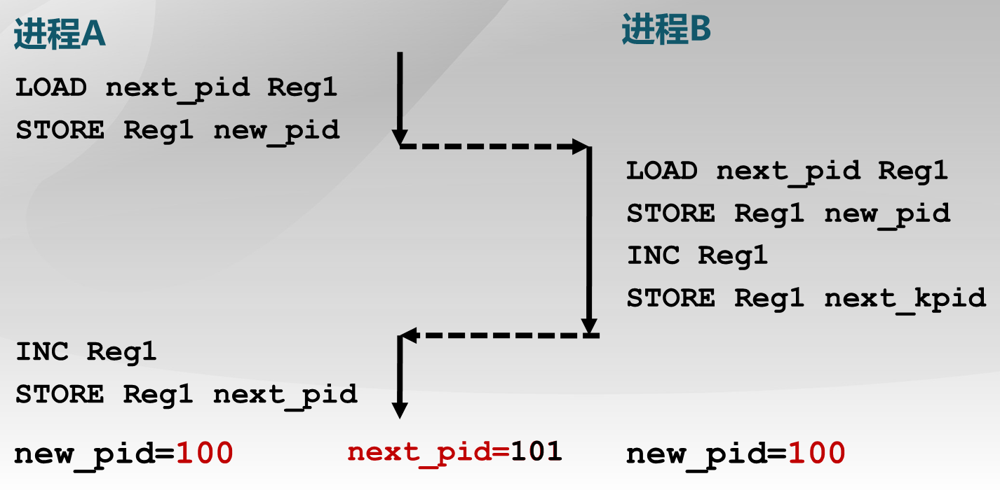

进程管理（3）：同步互斥
=====================

## 什么是同步互斥问题？

引入了进程和线程的概念以后，多个进程和线程可以并发地在处理器中执行。在实际应用中，它们并不是独立地自己执行自己的，有时候会存在多个进程协作完成一个更大的任务。例如前面在[进程管理(1)：线程和进程的概念](chp11.md)中提到的例子，一个MP3播放器软件，被划分为I/O读取数据，解压数据，和播放解压后的音频文件三个子模块，我们可以使用三个线程来实现这三个子模块，I/O操作总是把数据读到某一个缓冲区，解压操作则到这个缓冲区去读取数据。考虑一种情况，由于线程的调度，解压的线程先于I/O的线程得到执行，此时它去读取缓冲区的数据，就只能得到无意义的数据。

上面这个例子说明了进程之间同步运行的概念，即一些进程的操作一定要先于另一些进程的操作执行，否则就会导致致命性的问题。同步又称为进程之间的直接制约关系，它本质上是源于进程之间的相互合作。

互斥问题则更加普遍，在没有协作的进程之间也有可能发生。例如在前面讲过，在进程创建时，需要为它分配唯一的标志符`pid`，具体的操作通过内核函数`get_pid`来实现。其中的主要操作是：

```c
new_pid = next_pid++;
return new_pid;
```

这里的`next_pid`存储了下一个可用的`pid`，进程申请`pid`时，直接将这个`next_pid`分配给该进程即可，然后`next_pid++`存储下一个可用的`pid`。上面代码的汇编指令是：

```asm
LOAD  next_pid REG1
STORE REG1 new_pid
INC   REG1
STORE REG1 next_pid
```

考虑有两个新创建的进程都请求操作系统分配一个新的`pid`，假定当前`next_pid = 100`，则预期两个进程被分配到`pid = 100`和`pid = 101`，并且`next_pid`增加到`102`。但是如果在为一个进程分配`pid`时发生了调度，例如在第二行调度到了另一个进程，如下图所示：



程序执行完毕后，两个进程都将分配到`pid = 100`，并且`next_pid = 101`，这对于操作系统显然是一个致命性的错误。

这个例子说明，对于操作系统中某些共享资源，例如外部设备，全局变量，一次是只允许一个进程访问的，否则就会出现难以预料的错误。互斥就是指进程之间这种访问的制约关系，又称为间接制约关系，这里要互斥访问的资源，被称为临界资源。以下首先探讨如何解决互斥问题。

## 临界区的概念

临界区(`critical section`)是指进程中访问临界资源的一段需要互斥执行的代码。在进入临界区之前的区域被称为进入区(`entry section`)，通常需要在该段区域获得对资源的互斥访问权限。临界区之后的部分被称为退出区`exit section`，在这里释放资源的互斥访问权限。剩下的区域成为剩余区。这样，进程的代码就组织成了下面的形式：

```
entry_section
{
	critical_section
}
exit_section
remainder_section
```

对临界区的访问原则，可以抽象为下面的四条规则，即

+ `忙则等待`；指有进程在临界区时，其他想要进入临界区的进程必须等待。
+ `空闲则入`；指没有其他进程访问临界区时，可以对临界区进行访问。
+ `有限等待`；等待临界区资源的进程不能无限地等待下去。
+ `让权等待`；指进程在等待进入临界区时，应该放弃CPU的使用权，进入阻塞状态。这一条是可选的。

为了实现上面四条对临界区的访问规则，有三种具体的方式，即禁用中断、软件方法和高级抽象方法，将在下面一一进行叙述。

## 禁用中断

对上面的互斥问题进行分析，可以发现，之所以会引发临界区的冲突访问，其根源在于一个进程在访问临界区时发生了进程的调度，使得另一个进程也进入了临界区进行访问。因此，我们可以从根源上来解决这个问题，即在进程访问临界区时禁止调度，禁用中断就是这样一种方法。

这样，访问临界区的代码，就可以组织成下面的形式：

```c
local_irq_save(unsigned long flags); 
critical_section
local_irq_restore(unsigned long flags); 
```

即在进入临界区之前禁用中断，执行完临界区代码后再使能中断。为了禁用中断，需要将`cr0`寄存器中的中断标志位`FL_IF`清零，在使能中断时再将该位置一。所以看到在禁用中断时需要保存当前的状态标志，在使能中断时恢复这些状态标志。

这种方法是切实有效的，只是容易看出，稍微有点简单粗暴。在禁用中断后，当前进程就不能被停止，如果此时进程出现了错误，就会导致整个系统都停止运行；又或者临界区可能很长，此时将不能响应硬件中断了。因此，这种方法需要小心使用，一般只有在迫不得已的时候才使用。

## 软件方法

为了实现临界区的互斥访问，另一种想法是所有要进入临界区的进程共享一些访问标志位，首个进入临界区的进程通过设置这些标志位“通知”其他进程【我已经在临界区了嘻嘻嘻，你们现在不能进来】，这就好比在农村上厕所，又没有锁，只能在厕所外放置一条红丝带之类的东西来告知【已经有人了】。这种方法就是软件方法，它的本质其实是进程之间的通信，可以看到是不需要操作系统参与的，因此开销比较小。

我们可以根据这里的思想，才尝试着实现一下软件方法，为了简单起见，首先我们只考虑两个进程的情况。比如我就设置一个占用标志位`occupied`，一个进程在进入临界区之前先判断这个标志位，只有在`occupied == false`的时候再进入临界区，并且同时设置`occupied = true`。在退出临界区时在释放标志位，可以形成下面的伪代码：

```c
while(occupied == true);    // wait for other processes to exit
occupied = true;
critical_section
occupied = false;           //exit
```

看起来是很理想的，但是稍微分析可以发现，当`occupied = false`，如果两个进程同时想要进入临界区，在第一个进程通过了`while`循环后进行了调度，此时第二个进程也会通过`while`循环进入临界区，也就是说这种方案不满足`忙则等待`原则。

为了解决上述问题，可以不让两个进程同时进入临界区，而是让它们依次进入。为此，可以设置一个`turn`标志，表示当前应该是谁去<del>上厕所了</del>进入临界区了。进程在进入临界区之前首先判断`turn`是否等于自己的`pid`，如果是则进入临界区，否则就等待；退出临界区时应将`turn`标志位设置成另一个进程。可以形成下面的代码：

```c
//code for process i
while(turn != i);           // wait for my turn to enter
critical_section;
turn = j;                   // exit
```

通过分析可以发现，采用这种策略后，两个进程只可能有一个可以通过`while`循环，因此不会出现上面两个进程同时进入临界区的情况，即满足了`忙则等待`条件。但是，考虑下面一种情况，当前`turn == j`但是进程`j`并不想进入临界区，此时进程`i`只能一直等待`j`进入了临界区后才能执行临界区代码，不满足`空闲则入`原则。简单说来就是占着茅坑不拉屎。

还有两种基于第一种方案的改进，一种是为每个进程都分配一个标志位`flag[i]`，表示这个进程是否在临界区，进程在进入临界区前首先检查另一进程的标志位是否为`true`，否则进入，并且设置自己的标志位。这种方案又称为`双标志先检查法`，通过分析可以看出，它同样不满足`忙则等待`原则。

为了解决`双标志先检查法`的问题，提出了`双标志后检查法`，即进程在进入临界区前首先设置自己的标志位`flag[i] = true`，表示当前进程想要进入临界区，随后再检查另一进程的标志。这种策略的确可以解决`忙则等待`原则，但是却不满足`空闲则入`原则，也是不可行的。

### `Peterson`算法

经过上面四种方案尝试失败后，我终于意识到，原来软件方法并不是想象中那么简单。难怪成功解决这个问题的人用他的名字命名了这个算法，就是这里的`Peterson`算法。

实际上，`Peterson`算法是上面几种方法的综合，它同时采用了`turn`标志位和双标志位。具体的代码如下：

```c
//code for process i
flag[i] = true;	                            // current proc want to enter
turn = j;
while((turn == j) && flag[j] == true);      // wait for proc j
critical_section;
flag[i] = false;                            //exit
```

如果两个进程同时都想要进入临界区，它们都会首先设置自己的标志位表示想要进入临界区，实际上，这就是双标志后检查法，通过前面的分析，它会保证`忙则等待`原则，却不能保证`空闲则入`原则。而这里的`turn`就是为了保证`空闲则入`，如果两个进程都想要进入临界区，此时`turn`的值只能有一个，因此必然有一个进程可以通过`while`循环。可见，`Peterson`算法是利用双标志位解决临界资源的互斥访问，用`turn`解决饥饿现象。

通过对进程调度的所有情况进行分析，可以证明`Peterson`算法是正确的，它的确可以做到两个进程之间临界资源的互斥访问。

### `Dekkers`算法

`Dekkers`算法是另一种软件解决同步互斥问题的方法，它的本质和`Peterson`算法是一样的，都是利用双标志位`flag[]`和`turn`来实现的。具体的伪代码如下：

```c
flag[i] = true;
while(flag[j] == true){ 
    if(turn != i){ 
       flag[i] = false 
       while(turn != i); 
       flag[i] = true 
    }  
} 
critical_section
turn = j
flag[i] = false;
```

在`Dekkers`算法中，总是拥有`turn`的进程优先，另一个进程需要等待拥有`turn`的进程执行完临界区后，才可以进入临界区，即`忙则等待`原则；但是如果拥有`turn`的进程不想进入临界区，另一个进程也可以直接进入，即`空闲则入`原则。通过对所有可能的进程调度情况进行分析，可以证明`Dekkers`算法也是正确的。

然后老师说，为什么要在`Peterson`算法的基础上再引入`Dekkers`算法呢？是因为`Dekkers`算法是可以方便地扩展到多进程的情形。我还以为多方便呢，就自己想了想，结果发现问题并不简单。问题的分析过程以及多进程下的互斥软件方法`Eisenberg`算法，可以查看这篇文章[`Eisenberg`算法实现多进程互斥访问](eisenberg.md)。

### 软件解决方法评价

可以看到，软件方法来实现互斥访问非常复杂啊，设计算法很复杂，证明一个算法可以正确运行也很复杂，需要穷举所有可能的情况，从我的学习时间来看，研究这点内容用了一个下午就足以说明它有多复杂了......

然后实现软件方法需要在进程之间共享数据，对于进程数量较多的情况，问题就更加复杂，想想都觉得烦！以及从上面的实现中可以看到，等待访问临界区的进程，并没有做到`让权等待`原则，而是在忙等待，这是需要消耗CPU时间的。实际上只要没有操作系统的参与，是不可能做到`让权等待`的。

## 高级抽象方法

高级抽象方法是操作系统提供的编程抽象，以简化进程之间资源互斥访问的解决方案的。为什么叫高级抽象方法呢？回顾前面的软件方法，我们自己设计的那几种算法均不奏效，其本质原因是进程在检查标志和设置标志之间可能会被打断，被操作系统调度。当操作系统介入进程之间的互斥访问时，就提供一些高级编程抽象，使得这些操作可以不被打断地执行，即原子操作。

高级抽象方法包括锁，信号量和条件变量。这里就只讨论锁机制，后面两种将在[进程管理（4）：信号量与管程](chp18.md)中进行讨论。

什么是锁机制呢？就比如你去上厕所，前面那些方案，比如先检查有没有标志还是先设置自己的标志啊，都花里胡哨的，莫名其妙。锁机制就是我去上厕所看到锁没有锁上，我就进去然后把门锁上；锁上了我就等着。这样不就简单快捷地实现了互斥资源的访问了吗？

和前面的软件方法相比，锁机制之所以可以这么简单，究其原因，是操作系统可以保证我检查锁是否锁上以及获得锁的动作是一气呵成的，中间不会被调度，因此就极大的简化了问题。

根据上面的叙述，锁机制应该具有两个基本的操作，即获得锁`lock.acquire()`与释放锁`lock.release()`，`lock.acquire()`的语意是在锁被释放前一直等待，锁被释放再得到锁。这样，使用了锁机制的临界区访问伪代码如下：

```c
lock.acquire();                       // wait for lock and acquire it
critical_section;
lock_release();                       // exit
```

> 操作系统怎么实现锁机制呢？

实现锁机制的关键在于保证检查锁的状态与获得锁这两个动作是原子操作，而这可以通过硬件来实现。在现代的CPU体系结构中，都提供一些特殊的原子操作指令，比如测试与置位指令`test_and_set`以及交换指令`exchange`，它们的伪代码如下：

```c
bool test_and_set(bool *target){
	bool ret = *target;
	*target = true;
	return ret;
}

void exchange(bool *a, bool *b){
	bool temp = *a;
	*a = *b;
	*b = temp;
}
```

通过这两个原子操作指令可以实现锁机制，下面首先叙述如果通过`ts`指令来实现锁。

> 使用原子指令实现自旋锁(`spin lock`)

自旋锁这个概念是相对于互斥锁而言的。对于自旋锁，当一个进程不能得到锁资源时，并不会放弃CPU而进入阻塞状态，而是不断地在那里进行循环检测，因此称它为自旋锁。通过`ts`指令实现自旋锁的代码如下：

```c
class Lock{
	bool value = 0;
	void acquire();
	void release();
}

Lock::acquire(){
	while(test_and_set(&value));    //spin
}

Lock::release(){
	value = 0;
}
```

可以看到，获得锁的操作正是通过`ts`指令来实现的。无论锁的状态如何，在执行了`ts`指令后，锁都是被占用了。只是，如果锁在一开始就被占用，进程就会反复不断地调用`ts`指令，循环判断锁的状态是否为空闲；一旦锁为空闲，则获得锁，并且可以退出循环进入临界区了。

利用`exchange`指令，也可以实现自旋锁，只需要让`lock::value`与`true`做交换，就可以实现与`ts`指令一样的语意。利用`exchange`指令实现自旋锁的代码如下：

```c
Lock::acquire(){
	bool temp = true;
	while(1){                       //spin
		exchange(&value, &temp);
		if(temp == false) break;
	}
}

Lock::release(){
	value = 0;
}
```

可以看到，相对于前面的软件方法，引入了锁机制后可以方便地实现进程临界区的互斥访问，并且很容易可以证明该方法的正确性，并且可以适用于多处理器中任意数量的进程之间的互斥访问。

当然，锁机制也具有一定的缺点，比如这里的等待仍然是忙等待，而不是`让权等待`。此外，也可能会出现饥饿和死锁的现象，比如低优先级进程占用资源，而高优先级进程占用CPU并且请求资源，此时两方互不相让就会出现死锁。关于死锁问题的解决会在后面[进程管理（5）：死锁](chp20.md)中进行讨论。

> 利用`ts`指令实现无忙等待锁

它的基本的思想和自旋锁是一样的，只是一旦进程不能进入临界区，则将它加入等待队列，并且进入阻塞状态。在一个进程释放了锁资源后，再挑选等待队列中的一个阻塞进程，并将它唤醒。具体的代码如下：

```c
Lock:acquire(){
	while(test_and_set(&value)){
		add to waiting queue
		wait();                                  // call schedule inside
	}
}

Lock:release(){
	value = 0;
	if(!empty(waiting queue))
		pick up a proc
		wakeup_proc(this proc);
}
```

需要注意的是，在`acquire`函数中，仍然是一个`while`循环而非`if`判断，这是因为当退出临界区的进程将另一个进程唤醒后，被唤醒进程并不一定就可以获得锁，也许在它之前执行的进程会优先请求进入临界区。在这种情况下，需要对锁是否空闲进一步进行判断。
