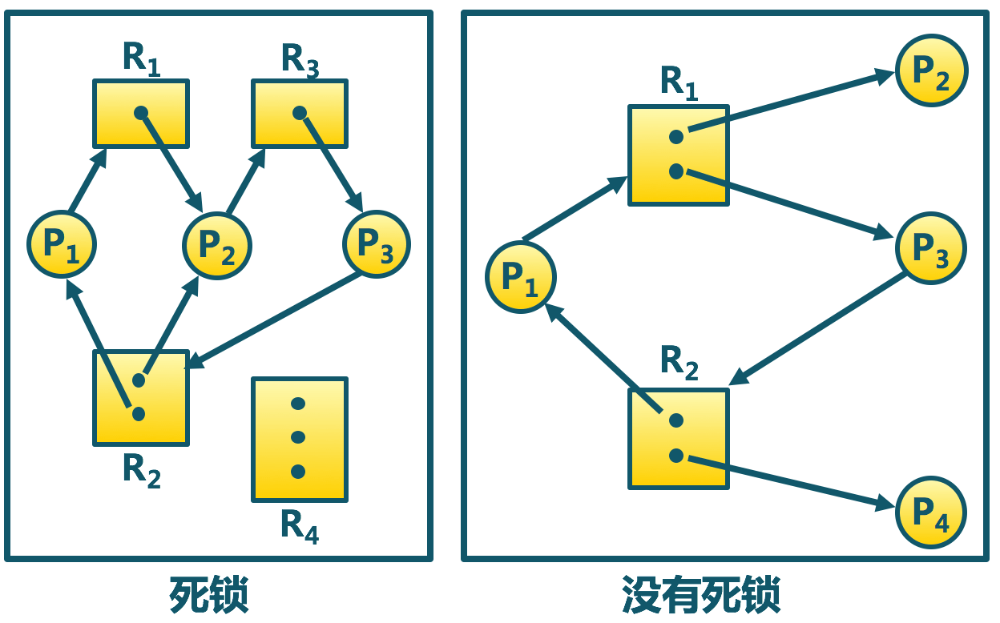

进程管理（5）：死锁
=================

## 死锁的基本概念

> 为什么会发生死锁？

其实在前面进程管理的总结中，已经多次出现了死锁的概念，比如在信号量机制中，如果信号量使用不慎，就会出现死锁。实际上，在现实生活中，死锁现象也经常会出现，比如两个胖子过独木桥，比如[哲学家就餐问题](philosopher.md)。比如我去清华面试，面试老师和蔼地让我陈述一下自己的科研经历，我说<我很厉害的，真的！你们先答应录我我就跟你们讲我的科研经历>，老师说<那不行，你得先讲讲你的科研经历，我们再录你>，然后我们双方就僵持不下，谁也不让谁，也就是发生了死锁。当然了，最后这个死锁会因为我被扔出面试教室而被打破。

可以看到，死锁之所以会发生，是因为所有进程都占有了一些资源，却仍然在请求另一个进程的资源，它们相互之间形成了一种`循环等待`的死局，因此可以总结出死锁发生的两个条件，即`持有并等待条件`与`循环等待条件`。需要指出的是，这两个条件都是必要条件，缺一不可的，如下图所示：



可以看到，左边的情形是会出现死锁的，而右边则不会。究其原因，是因为右边的情形中，有两个进程`P2`和`P4`并不满足`持有并等待`条件，因此尽管满足`循环等待条件`，仍然是不会出现死锁的。

但是也是并非满足上面两个条件就一定会出现死锁，比如两个胖子过独木桥，如果一个胖子把另一个挤下去，就不会出现这种情况了。可见，出现死锁对资源的类型也有一定的要求，资源需要是不可抢占的，即`非抢占条件`。最后，如果独木桥很宽，可以容纳这两个胖子一起通过，则也不会出现死锁，即资源还应该满足`互斥性条件`。

综上，可以总结出死锁出现的四个必要条件，即

+ `互斥条件`
+ `非抢占条件`
+ `持有并等待条件`
+ `循环等待条件`

死锁现象显然是我们不想要看到的，那么应该如何解决死锁呢？这就是下面重点讨论的问题。

## 死锁的解决

可以从多个方面来解决死锁问题。比如说，我可以防患于未然，一开始就从原理上完全杜绝死锁的出现，即`死锁预防`；或者可以退一步，在临了要分配资源的时候，对整个系统的状态进行检查，看如果分配了这个资源是否会出现死锁，如果的确会，就拒绝分配资源，这就是`死锁避免`；与预防措施相对，我也可以提前做好预案，即允许死锁的发生，在死锁发生后再去对系统进行调控，从而恢复正常的状态，即`死锁检测与恢复`。下面就分配讨论各种措施。

### 死锁预防

死锁预防是从死锁发生的源头，即从基本原理上，妥善地设计操作系统，使得死锁根本就不可能发生。它的基本思路，其实就是破坏死锁发生的四个必要条件，因此可以从四个方面来进行`死锁预防`。

> 破坏互斥条件

可以通过一些软件的抽象，使得互斥资源可以被多个进程同时访问。比如打印机原来一次只能有一个进程访问的，但是通过`spooling`技术，就可以由多个用户多个进程共同访问了。

> 破坏持有并等待条件

其实就是让进程不可能持有一些资源的同时，又还在等待其他资源。一种做法是在为进程分配资源的时候，要么就为它分配全部的资源，要么就一个也不分配。很明显，使用这种策略时资源利用率低下，因为空闲资源无法被分配。

此外还有一种策略，老师是把它归到了`破坏非抢占条件`里面的，我觉得本质还是破坏`持有并等待条件`。即在进程请求资源时，要么为它分配相应的资源，如果进程不能得到请求的资源，将释放已占有的资源，这样`持有`和`等待`的状态就不能并存了。老师可能是觉得强制释放进程的资源，是`抢占`策略的一种体现，所以是破坏了`非抢占条件`。

> 破坏循环等待条件

例如当前有`n`类资源，分别将它们编号为`1, 2, ..., n`号资源，`循环等待条件`是指，`1`号进程占有`1`号资源，然后请求`2`号资源；`2`号进程占有`2`号资源，请求`3`号资源，......，`n`号进程占有`n`号资源，请求`1`号资源。因此各个进程就僵持不下。

为了破坏`循环等待条件`，可以让进程按资源编号的顺序请求资源。这样，`n`号进程请求`1`号和`n`号资源时，是首先请求`1`号资源，此时就会因为不能获得资源而进入阻塞状态，也就因此不能请求并持有`n`号资源了。`循环等待条件`因此被打破。

需要注意的是，这种策略会引起大量空闲资源无法被请求，因此资源的利用率低。

### 死锁避免

死锁避免并不是从操作系统的设计上着手，而是在客观上承认死锁发生的可能性，但是在分配资源的时候，对整个系统进行检查，判断是否有可能会发生死锁，然后避免可能会发生死锁的情况。

把不会出现死锁的状态称为`安全状态`，因此死锁避免要解决的主要问题，就是如何识别`安全状态`。一般地，当系统处于`安全状态`时，所有占有资源的进程总是存在`安全序列`，即`<P1, P2, ..., Pn>`，系统可以按照该序列的次序执行进程，而不会出现死锁的情况。

为了找到这样的一个安全序列，需要各个进程告知操作系统其最大的资源需求量。在一个进程请求资源时，假想地将资源分配给该进程，随后对所有占有资源的进程做一次遍历，找到第一个这样的进程，它的资源需求量小于操作系统的资源剩余量，这样该进程一定可以成功执行完毕，然后将它当前占有的资源全部归还给操作系统，此时操作系统的资源剩余量就可以加上该进程的资源占有量。重复上面的过程，直到所有进程都遍历完毕，则的确存在这样一个`安全序列`，或者某一次遍历中找不到一个这样的进程，表示系统当前处于`不安全状态`。

上述算法类似于银行家在向多个客户放贷的时候，采取的借贷分配策略，因此称之为`银行家算法(banker's algorithm`。下面给出`银行家算法`的算法描述：

设系统中存在`n`个进程，`m`类资源，设置一个`m`维列向量`available`，表示操作系统中各类资源的剩余数量；为了表示各个进程对每个资源的占用情况，设置一个`n x m`的矩阵`allocation`，其中第`i`行表示第`i`个进程对`m`个资源的占用情况；此外还设置两个`n x m`的矩阵`need`和`max`，分别表示每个进程对各个资源的需求量和最大需求量，容易看出，

```c
need[i, j] = max[i, j] - allocation[i, j]
```

当一个进程请求资源时，设置`m`维列向量`request`，表示对各个资源的请求量，算法流程如下：

+ 如果`request > available`，表示资源请求量已经超过了操作系统的剩余资源总量，直接返回`不安全状态`。
+ 如果`request > need[i]`，即资源请求量超过了该进程的最大需求量，拒绝资源申请，返回`不安全状态`。
+ 更新`availble -= request`，`allocation[i] += request, need[i] -= request`，即假想将资源分配给该进程。
+ 遍历所有的进程，直到发现第一个进程，满足`need[i] < available`，将该进程标记为`finish`状态，表示加入`安全序列`中，更新`available += allocation[i]`。重复该过程，直到全部进程都加入了`安全序列`中，返回`安全状态`；否则，如果没有找到满足条件的进程，则返回`不安全状态`。

从`银行家算法`可以看出，`不安全状态`并非就一定会发生死锁，实际上，死锁只是不安全状态的一个真子集。这是因为`银行家算法`在判断`不安全状态`的时候，总是从最坏的打算出发，即每个进程只有在得到它所要求的全部资源时，才会执行完毕并归还资源给操作系统。实际上，进程未必会申请它告知系统的最大需求量，而在进程执行的过程中，也会因为某些资源使用完毕就归还给操作系统了。

### 死锁检测与恢复

`死锁检测与恢复`策略客观上允许死锁的发生，它相当于是做好预案，在死锁发生后及时去检查到这种情况，并且将之恢复到正常状态。因此，它主要需要解决两个问题，即如何检测到死锁，又如何将之恢复。

死锁的检测在本质上和`银行家算法`是一样的思路，即取决于是否可以找到一个`安全序列`，与银行家算法不同的是，这里不需要假想将资源分配给某个进程，而是资源已经分配出去了，现在只是检查整个系统的状态是否出现了死锁，因此是没有银行家算法的前三步的。

如果的确检测到了死锁的发生，就需要采取措施恢复死锁，即`死锁恢复`。为了恢复死锁，可以有许多不同的策略。

> 进程终止策略

即直接将发生死锁的进程终止。最简单暴力的是把所有死锁进程给终止了，得劲是挺得劲的，这个开销未免太大。

柔和一点的就是一次终止一个进程，直到死锁被解除。所以这里就涉及到应该选择进程被终止的问题，一般说来，总是选择优先级较低的，已经运行时间较短的，以及后台的批处理进程（交互进程留下），此外，还要考虑进程占有的资源数量，进程完成需要的资源，以及终止的进程数量越少越好。进程终止策略其实就是类似于我被清华的面试老师直接赶出了面试教室。

> 资源抢占策略

资源抢占策略是不终止任意一个进程，而是将进程的资源进行抢占，将这些资源分配给其他死锁的进程，来解决死锁。但是这种策略可能会导致饥饿，即每次都抢占同一个进程，让该进程一直得不到资源。

> 进程回退策略

`进程回退策略`的核心思想和`资源抢占策略`是一致的，即将某些进程的资源分配给其他进程。但是进程回退策略并非是`剥夺`某一个进程的资源，而是该进程主动让出自己的资源，通过让进程回退到`安全状态`来从死锁中恢复。这就好比两个过桥的胖子中的一个主动后退，让出了自己的资源。而`资源抢占策略`是一个胖子把另一个撞了下去。


