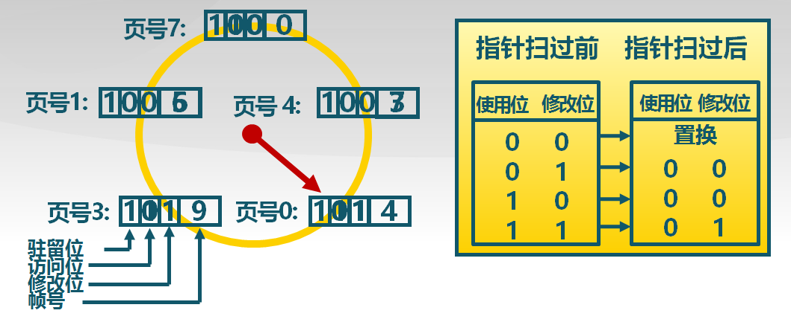
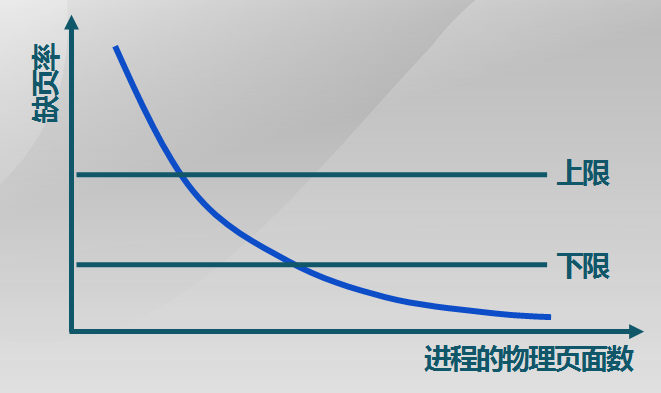
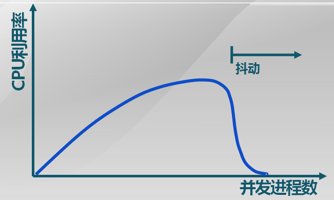
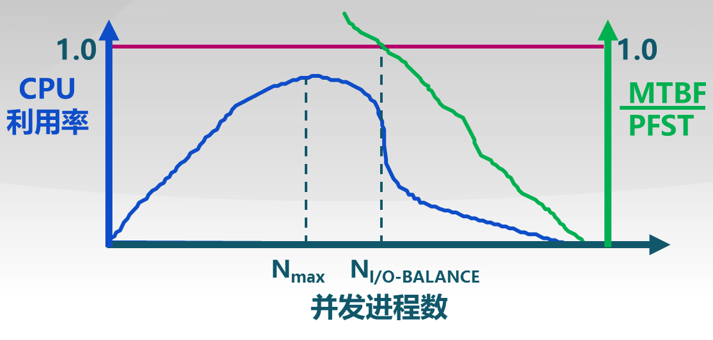

页面置换算法总结
==============

上次说到，当程序要加载不在内存中的页面时，就会产生一个缺页异常。从而操作系统会选择内存中的一个页面，将它换出到外存当中，这样需要加载的页面就可以驻留在刚刚释放出的内存空间了。那么，在内存中的页面那么多，操作系统是如何选择被换出的页面呢？这就是涉及到具体的页面置换算法。

## 页面置换算法的设计思路

前面提到，虚拟存储性能的一个评价指标是有效存储访问时间(EAT, Effective memory Access Time)，页面置换算法的选择将对EAT具有重大的影响。考虑一个比较极端的情况，即每次被换出的页面都是下一次程序要访问的页面，这样每次访存都会产生一次缺页异常，频繁的I/O操作使EAT的值迅速上升，这样的虚拟存储的性能显然是我们不能接受的。

可见，页面置换算法对虚拟存储的性能具有非常重要的意义，好的页面置换算法可以有效地降低缺页率，从而提升虚拟存储整体性能。因此，我们可以提出页面置换算法的设计目标，即

+ 应该尽可能减少页面的调入调出次数。
+ 把未来不再访问或短期不再访问的页面调出。

在设定好了页面置换算法的设计目标后，我们很快就产生了下一个问题，即

> 怎么评价不同的页面置换算法呢？

一个简明的思路是在一个用户进程的运行过程中，对发生的缺页异常数进行统计，通过比较不同置换算法下发生的缺页异常数量，来评估置换算法之间的好坏。

不难看出，这个思路存在很大的缺陷。因为即使是同一个程序，在先后的两次运行中，其访问的内存页面序列也会是不一样的，从而难以对页面置换算法的性能进行评价。

为了获得相同的内存页面访问序列，我们可以记录进程访问内存的页面轨迹，随后再离线地模拟页面置换的行为，记录产生缺页的次数。从而缺页数更少的页面置换算法对应了更好的性能。

> 所有的页面都可以被换出吗？

需要指出的是，并非所有的页面都可以被换出，这应该是显而易见的，因为你显然不可以把操作系统驻留的页面给换出去。除此以外，一些应用进程也有一些必须常驻内存的逻辑页面，还有某些对响应速度要求很高的代码和数据，这些页面也不可以被换出，这种情况被称为页面锁定(frame locking)。

为了将这种页面与其他可以被换出的页面区别开，可以在页表项中增加一个锁定标志位(lock bit)，来标志这种页面锁定的情况。

现有的页面置换算法可以分为局部的页面置换算法和全局页面置换算法两种。

## 局部页面置换算法

局部页面置换算法是指，被置换的页面仅限于当前进程占用的物理页面内，而不得影响其他的进程。这就有点类似于前面的覆盖技术了，不过这里的页面置换并不需要程序各模块之间的逻辑关系。

### 最优页面置换算法(OPT)

顾名思义，最优页面置换算法是拥有最优性能的算法(optimal)，除了一点，它不能被实现......这就好比我说我的女朋友是世界上最好看身材最好的女生，除了唯一的缺点就是她不存在。

那我们就先来看看<del>我的女朋友她的性能有多优</del>（不是），<del>这个页面置换算法有多好看</del>......算了，差不多就是这个意思。

> 最优页面置换算法的思路

其实它的思路就是每次发生缺页的时候，总是换出未来最长时间不访问的页面。这其实是一种贪心的策略，看起来似乎未必是最优，以后我可能会写个证明。

由于实现这个算法，操作系统需要事先知道未来的一段的时间里，这个程序会访问哪些页面，所以很明显这个算法是不可被实现的！

那么既然如此，它存在的意义又是什么呢？这就好比真理的绝对性与相对性的辩证关系一样，绝对真理是存在的，但是客观世界中的定理只有可能接近这个真理，却不可能完全达到这个真理，即真理的相对性。这里也是一样，最优页面置换算法可以给其他算法提供一个评价指标，来判断某个可以实现的算法离真正的最优还有多少距离。

### 先进先出算法(FIFO)

这个算法的思路也和它的名字一样，即驻留在内存中时间最长的页面被置换。

为了实现这个算法，只需要维护一个队列，来记录所有页面进入内存的先后次序。队列头驻留内存的时间最长，队列尾最短。出现缺页时，选择队列头页面进行置换，将被换入的页置于队列尾。

容易看出，这个算法实现非常简单，并且为了维护这个队列所需要额外的开销也很小。不过它的缺点是性能太差，并且可能会出现`belady`现象。

> 什么是`belady`现象？

一般说来，随着一个进程被分配的物理页数量的增加，其运行时产生的缺页异常数应该减少才对。`belady`现象却是，进程分配物理页面数增加时，缺页出现的次数也增加的情况。

发生`belady`现象的原因，是页面置换算法的置换特征与进程访问内存的动态特征矛盾了，例如前面提到的每次刚被换出的页面，恰好是下一次访存会访问的页面。即被置换出去的页面，并不一定是进程近期不会再访问的。

以后可能会写一个证明，对于栈式的页面置换算法，例如最优页面置换算法，是不会出现`belady`现象的。像是`FIFO`这样的队列式的算法，就比较够呛。

### 最近最久未使用算法(LRU)

这个算法是思路就是选择最长时间没有被引用的页面进行置换。它是基于局部性原理的一种思路，因为`LRU`认为，如果一个页面长时间没有被访问，那么它在将来的很长时间内也很可能不会被访问。可以看到，`LRU`其实是最优置换算法的一种近似啊，所以它的性能也是最接近最优置换算法的。

为了实现`LRU`，需要记录内存中的每个逻辑页面上一次的访问时间。在缺页时，选择上一次使用到当前时间最长的页面。

`LRU`的可能实现方法可以使用一个页面链表，其中的页面按最后一次的访问时间排序，如果访问到了一个驻留在内存中的页面，则找到链表中的该页面，并且将它移动到链表首部。可以看到，`LRU`算法运行的开销很大，一次未发生缺页的访问也需要遍历链表，平均情况下的时间复杂度为`O(n)`。或者使用一个活动页面栈，其实也是类似的思路。

### 时钟置换算法(clock)

时钟置换算法是`FIFO`与`LRU`的折中。通过分析，我们可以发现，`FIFO`的性能之所以很差，是因为它只记录了各个页面进入内存的时间，却没有利用上过去一段时间内对这些页面的访问信息。而`LRU`虽然性能很好，但是算法本身运行的开销却太大，这是因为它完全保存了过去一段时间的页面访问情况。

因此，我们希望设计一种算法，它会利用到过去页面的访问信息，但是不会像`LRU`那样将全部信息都维护起来，这就是我们这里的时钟置换算法的思路。

时钟置换算法会利用到页表项中的访问位，当访问某一页面时，就将该页面的访问位置一。发生缺页时，依次检查驻留在内存中的页面的访问位，如果该位为一，则清零；直到找到一个访问位为零的页面，将该页面置换出去。由于这样一个逐个扫描内存中的页面的行为，类似于时钟指针的运行，所以这个算法才叫时钟置换算法。下图是`clock`算法的图示：


可以看到，这里的访问位，其实就对应了上次缺页到此次缺页，页面的访问情况--访问位为一表示在此期间页面曾被访问，访问位为零则表示没有访问。将访问位为零的页面置换，其实就类似于`LRU`中将最长时间没有被访问的页面置换。相对于`FIFO`，`clock`利用了过去页面的访问信息；相对于`LRU`，又没有保存那么全面的信息，因此算法运行的开销较小。

根据上面的讨论，如果根本就没有过去页面访问的信息，那么`FIFO`, `LRU`, `clock`算法应该是一致的。这种情况对应于，所有页面在第一次进入内存当中后，就再也没有被访问过，此时`LRU`和`clock`算法都将退化为`FIFO`算法。

### 改进的时钟置换算法

上一篇提到，对于发生了修改的页面，在被移出内存时，还需要被写回到硬盘上，因此比一般的页面置换多了一次的访存开销。基于这样的考虑，在选择被换出的页面时，是否可以优先选择没有被修改的页面，从而节省开销。这样的话，被修改的页面在后续也极有可能再次被修改，将多次修改一次写回到外存会节省不少的I/O时间。

将这样修改的思路应用到时钟置换算法上，就是这里的改进的时钟置换算法。具体的思路就是上面那样，总是优先选择未被访问(访问位为零)，且未被修改的页面被置换。

具体的实现可以参考访问位的思路，在页表项中再添加一个修改位，来表示该页面被修改的情况。在发生缺页异常时，同样地依次检查驻留在内存中的页面的页表项，若访问位为一，则将访问位清零；若访问位为零且修改位为一，则将该页面写回到外存，且将修改位清零；直到发现一个访问位和修改位都是零的页面，选择将其置换。改进的时钟置换算法如下图所示：



可以看到，通过增加了修改位，可以使被修改的页面延迟被写回到外存中的时间，从而减少修改页的缺页处理开销。

### 最不常用算法(LFU)

最不常用算法和`clock`算法一样，其实也是`FIFO`和`LRU`的折中。它的思路是在每次缺页时，将访问次数最少的页面换出到外存当中。

它的实现也比较简单，只需要维护一个计数器，来对每个页面被访问的次数进行计数，在缺页时选出计数值最小的页面进行换出就可以了。

这个算法还是具有一些问题的，例如考虑一种情况。我们说内存的访问是有局部性的，考虑某一页面，在进程运行的前一半时间内经常被该进程访问；后来该页面的功能已经完成了，在该进程运行的后半时间里面，对这个页面将不再访问。根据`LFU`算法，此时这个页面的计数值已经足够得大，以至于后续根本不能将该页面进行换出了。

## 全局页面置换算法

> 为什么还需要全局页面置换算法？它产生的思路是什么？

我们说，进程在运行的整个生命周期内，对内存的需求是变化的，例如一个进程在刚开始运行的时候需要比较多的内存空间，在运行的后期进行收尾工作了，需要的内存空间也因此变少了。局部页面置换算法无法考虑到这种情况，从而各个时期分配给该进程的空间都是一样的，无法把一个进程多余的页面分配给其他更需要的进程使用。此外，不同的进程对内存的需求也不一样，一些进程需要更多的空间，另一些进程则较小的空间就可以满足，对于这种情况，局部页面置换算法也难以适应。

全局页面置换算法就是基于这样的考虑产生的，它希望根据进程对内存需求量的变化，动态地调整分配给不同进程的内存页面，从而使得内存的利用率最高。

全局页面置换算法包括工作集置换算法和缺页率置换算法。

### 工作集置换算法

> 什么是工作集？

工作集是指一个进程当前正在使用的逻辑页面的集合，可以表示成二元函数$W(t, \Delta)$。其中，t是当前的执行时刻，$\Delta$称为工作集窗口（working-set window ），即一个定长的页面访问时间窗口。这样，$W(t, \Delta)$是指在当前时刻t前的 $\Delta$时间窗口中的所有访问页面所组成的集合。

工作集的大小，就可以表示当前时刻，一个进程对内存的需求量。在进程的执行周期内，工作集的变化如图所示：


可以看到，

+ 进程开始执行后，随着访问新页面逐步建立较稳定的工作集。
+ 当内存访问的局部性区域的位置大致稳定时，工作集大小也大致稳定。
+ 局部性区域的位置改变时，工作集快速扩张和收缩过渡到下一个稳定值。

> 工作集置换算法

工作集置换算法的思路就是换出不在工作集中的页面。可见，工作集置换算法也是基于局部性原理的，它认为过去访问过的页面（工作集中的页面），在以后有很大可能再次被访问。

这里还需要引入一个常驻集的概念，常驻集是指在当前时刻，进程实际驻留在内存中的页面的集合。工作集和常驻集具有以下的关系，即

+ 当常驻集大于工作集时，缺页较少。
+ 常驻集增大到一定的规模以后，缺页率也不会明显下降。
+ 在工作集发生剧烈变动（过渡阶段）时，缺页较多。

可以看到，工作集置换算法，其实就是维护进程的常驻集与工作集时刻保持相等。

为了实现工作集置换算法，只需要维护一个工作集链表。在访存时，将不在工作集中的页面换出内存；在发生缺页时，直接为换入的页面分配新的内存空间，并且更新工作集链表。这样，在每一次访问后，都可以保证工作集和常驻集的大小相等。

容易看出，工作集置换算法的开销很大。尽管在发生缺页时直接将页面换入就可以了，省去了其他算法寻找被换出页面的开销，但是这是以正常访问时的高成本维护为代价的。因为在正常访问时，需要遍历工作集链表，并且将不在其中的页面换出，遍历的时间复杂度为`O(n)`，此外还有换出页面的I/O开销。

### 缺页率置换算法

缺页率可以定义为一段时间内发生的缺页次数/内存访问次数。即

```
缺页率 = 缺页次数 / 内存访问次数
```

或者也可以用缺页平均时间间隔的倒数来指示。

缺页率置换算法的思路是，如果一个进程的缺页率显著地高于某一个阈值，则认为分配给该进程的物理页面数过少，从而增加分配给该进程的物理页面；而如果一个进程的缺页率明显太低，则认为该进程所占用的物理内存空间太多，从而回收该进程的部分空间。这样，通过调整常驻集的大小，使每个进程的缺页率保持在一个合理的范围内。缺页率算法的思路如图所示：



为了实现缺页率置换算法，可以给页表项增加引用位标志。在每次发生缺页时，计算从上次缺页到此次缺页的时间间隔$t_{current} - t_{last}$，

+ 如果$t_{current} - t_{last} > T$（T为阈值），则认为缺页率太低，置换该进程在$[t_{last}, t_{current}]$时间内没有被引用的页。
+ 如果$t_{current} - t_{last} < T$，则认为缺页率太高，增加缺失页到工作集中。

可以看到，缺页率算法的开销要比工作集置换算法小很多，因为在正常访存时不需要做过多的操作，只需要将被访问的页面的引用位置一即可。

> 两个全局页面置换算法的比较

实际上，工作集置换算法和缺页率置换算法，在本质上，都是希望尽可能地跟踪进程运行周期内，对内存需求量的动态变化。工作集置换算法无疑具有更好的性能，因为每次访存后，工作集置换算法都会保证常驻集的大小等于工作集，但是也因为此，它执行起来需要更大的开销。缺页率置换算法则是开销与性能的一种折中。

### 抖动与负载控制

设想一种特殊情况，当运行缺页率置换算法的时候，几乎所有进程的缺页率都大于预先设定的阈值。按照缺页率置换算法，此时应该给这些进程分配更多的内存空间，但是此时已经没有剩余的内存空间可以分配了，并且由于所有进程的缺页率都高于阈值，也并不可以将某一个进程的页面换入到内存中来获得空闲的内存空间。

这种情况有可能会发生吗？答案是会的，当内存中同时存在的进程过多，以至于每个进程都不能得到足够的内存空间时，就会产生这种现象。但是，如果内存中只有很少的进程在运行，例如只有一个，这就又回到了以前的单进程操作系统了，此时CPU的利用率又会非常低下。可见，CPU的利用率与并发进程存在相互促进与制约的关系。如图所示：



+ 进程数少时，提高并发进程数，可提高CPU利用率
+ 并发进程导致内存访问增加
+ 并发进程的内存访问会降低了访存的局部性特征
+ 局部性特征的下降会导致缺页率上升和CPU利用率下降

当内存中的进程过多时，访存操作会导致大量的缺页，频繁的页面置换使得进程的运行速度变慢，CPU利用率降低，这种现象就是抖动(thrashing)。

对于传统的缺页置换算法，是无法解决抖动的。此时需要负载控制来解决抖动问题。

> 什么是负载控制？

负载控制的本质，其实是操作系统需要在并发水平和缺页率之间达到一个平衡。具体的手段，就是调整并发进程数(MPL, Multi-Programming level)，以获得较高的CPU利用率。

负载控制需要主要考虑两个指标，即平均缺页间隔时间(MTBF, Mean time Between page Faults)以及缺页异常处理时间(PFST, Page Fault Service Time)。考虑一种极端情况，即

$$
\frac{PFST}{MTBF} = 1
$$

此时，每次访存都会产生缺页，CPU的全部时间都用于处理缺页异常的换入换出了，对应于CPU的利用降到了零。负载控制就是通过调整并发进程数，从而改变这个比值，使之对应于CPU利用最高的位置，如图所示。


