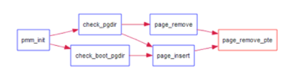

Lab 2 Report
============

## 实验目的

+ 理解基于段页式内存地址的转换机制
+ 理解页表的建立和使用方法
+ 理解物理内存的管理方法

## 实验内容

本次实验包含三个部分。首先了解如何发现系统中的物理内存；然后了解如何建立对物理内存的初步管理，即了解连续物理内存管理；最后了解页表相关的操作，即如何建立页表来实现虚拟内存到物理内存之间的映射，对段页式内存管理机制有一个比较全面的了解。本实验里面实现的内存管理还是非常基本的，并没有涉及到对实际机器的优化，比如针对 cache 的优化等。如果大家有余力，尝试完成扩展练习。

## 练习

为了实现lab2的目标，lab2提供了3个基本练习和2个扩展练习，要求完成实验报告。

对实验报告的要求：

+ 基于markdown格式来完成，以文本方式为主
+ 填写各个基本练习中要求完成的报告内容
+ 完成实验后，请分析ucore_lab中提供的参考答案，并请在实验报告中说明你的实现与参考答案的区别
+ 列出你认为本实验中重要的知识点，以及与对应的OS原理中的知识点，并简要说明你对二者的含义，关系，差异等方面的理解（也可能出现实验中的知识点没有对应的原理知识点）
+ 列出你认为OS原理中很重要，但在实验中没有对应上的知识点

## 文件架构与执行流程

lab2的文件架构相对lab1产生了一些区别，在后面可以看到，这些区别的存在是必要的，都是为了操作系统可以正常地运行。下面简述一下lab2中各个文件执行的流程。

+ 首先自然是`bios`的程序，在机器上电时被加载到`0xffff0`地址处，完成相关设备的初始化工作，并且到硬盘的主引导扇区读取`bootloader`到`0x7c00`地址处。
+ 此后机器的控制权就交给了`bootloader`，首先是`bootasm.S`中的汇编代码开始执行，在其中完成CPU从实模式到保护模式的转换，为此需要首先使能`A20`地址线，初始化段表等，这些都是lab1里面就完成了的工作。与lab1不同的是，在`bootasm.S`中，还进行了对物理内存的探测工作，是通过`bios`系统调用来完成的。完成段表的建立与各个段寄存器的初始化后，就建立起了C语言的运行环境，程序转入`bootmain.c`中开始执行。
+ `bootmain.c::bootmain`函数功能非常单一，即将存在于硬盘扇区中的操作系统内核读入内存中，并且通过分析`elf`格式文件找到内核的入口地址，从而转入内核开始运行。这里与lab1都是相同的，所不同的是这里并非直接转入`kern/init/init.c`中，而是转入`kern/init/entry.S`中运行。
+ 在`kern/init/entry.S`中，更新了之前建立的段机制，从而可以将虚拟地址`va`映射到物理地址`va - 0xC000000`，保证了操作系统可以正常地运行。此后程序才进入`kern/init/init.c::kern_init`中运行。
+ 在`kern_init`中进行各种设备的初始化工作，这里主要讨论`pmm_init`函数，即物理内存管理的初始化。
+ 在`pmm_init`中，首先进行了物理内存管理器（physical memory manager）的初始化工作，利用之前对物理内存的探测工作，对所有的空闲物理内存通过一个`free_area`链表进行管理，这里对应了`page_init`函数。
+ 此后就是完成了页表的建立（对应了`boot_map_segment`）函数，并且再次更新了段机制，完成了段页式的地址映射机制。这里的逻辑相对复杂，将在后面详细说明。

下面就将按照lab2中各个文件执行的步骤，来详细说明其中的具体操作，相关功能的实现，以及这样实现的原因。

## 物理内存的探测

lab2的实验目的，是要建立起对物理内存的管理机制，包括连续的内存分配算法（如`first fit`）以及非连续的段页式管理机制。但是在实现这些管理机制之前，首先需要知道当前的机器有多少的内存可用，它们的分布是怎么样的，从而将所有的空闲内存组织起来统一进行管理。所以就首先需要进行物理内存的探测工作。

探测物理内存是通过`bios`的中断调用实现的，由于`bios`中断调用只能在实模式下进行，所以相应的工作就需要在`boot/bootasm.S`中，完成实模式向保护模式的转换之前进行。具体探测的方法是调用参数为`e820h`的`INT 15h`的`bios`中断。`bios`通过系统内存映射地址描述符（Address Range Descriptor）格式来表示系统物理内存布局，该地址描述符分为三个字段，即内存的起始地址，连续内存的大小以及内存的状态或者类型（可用或者保留）。具体的细节其实查看`INT 15`系统调用的输入与输出来确定啊，这里就不详述了。下面是探测物理内存的汇编代码：

```asm
probe_memory:
    movl $0, 0x8000
    xorl %ebx, %ebx
    movw $0x8004, %di
start_probe:
    movl $0xE820, %eax
    movl $20, %ecx
    movl $SMAP, %edx
    int $0x15
    jnc cont
    movw $12345, 0x8000
    jmp finish_probe
cont:
    addw $20, %di
    incl 0x8000
    cmpl $0, %ebx
    jnz start_probe
finish_probe:
```

这段代码的功能就是利用`bios`系统调用`INT 15`来实现物理内存的探测，将返回的地址描述符放在`es:di`起始的内存处，这里即是`0x8004`处。此外可以看到，在地址`0x8000`处还存放了一个变量来保存探测到的物理内存块的数量，这样，在`0x8000`内存地址处，就存放了一个与下面结构体相对应的变量：

```c
struct e820map {
    int nr_map;
    struct {
        uint64_t addr;
        uint64_t size;
        uint32_t type;
    } __attribute__((packed)) map[E820MAX];
};
```

在`kern/mm/pmm.c::page_init`函数中，即是通过这个结构体来建立起物理内存的页管理机制的。这个函数还将在后面详述。

## 第一次更新段映射机制

上面谈到，在lab2中，`boot/bootmain.c::bootmain`执行完后，并非是像lab1一样直接跳转到`kern/init/init.c::kern_init`函数执行，而是首先进入`kern/init/entry.S`，再转入`init.c::kern_init`函数。实际上，这样的操作是必要的，倘若没有经过这样的转换，操作系统内核将不能正常运行。

与lab1中一样，在lab2中操作系统内核也是被加载到物理地址为`0x00100000`的内存区段。所不同的是，lab2中的操作系统设定了虚拟地址空间，其中内核的起始地址为`0xC0100000`，这点在`tools/kernel.ld`文件中有所体现，该链接脚本文件是用于规定链接时的输出文件在程序地址空间的布局的，当然还有其他的功能。可以看到：

```
...
ENTRY(kern_entry)

SECTIONS {
    /* Load the kernel at this address: "." means the current address */
    . = 0xC0100000;

    .text : {
...
```

这里规定了内核的入口地址为`kern_entry`，即`entry.S`中的主函数，并且规定了操作系统是被加载到起始虚拟地址为`0xC0100000`的内存区段上。而操作系统被加载到的物理地址，则是由`bootloader`决定的。在`boot/bootmain.c::bootmain`中，可以看到：

```c
...
	// load each program segment (ignores ph flags)
    ph = (struct proghdr *)((uintptr_t)ELFHDR + ELFHDR->e_phoff);
    eph = ph + ELFHDR->e_phnum;
    for (; ph < eph; ph ++) {
        readseg(ph->p_va & 0xFFFFFF, ph->p_memsz, ph->p_offset);
    }

    // call the entry point from the ELF header
    // note: does not return
    ((void (*)(void))(ELFHDR->e_entry & 0xFFFFFF))();
...
```

这里`readseg`函数的第一个参数，就是`bootloader`将内核加载到内存中的地址，由于此时建立的段表还是一对一对等映射，所以这里的加载地址就是物理地址。其中，`ph->p_va`就是在`kernel.ld`中设定的虚拟地址，所以操作系统内核实际上是被加载到起始物理地址为`ph->p_va & 0xFFFFFF = 0x00100000`的内存中。

从上面的讨论可以看出，lab2内核的物理地址与虚拟地址是不同的，它们之间的对应关系满足

```
virt addr - 0xC0000000 = phy addr
```

因此，如果直接从`bootmain`函数跳转进入内核的`init.c::kern_init`函数，由于此时的段机制还是对等映射，内核将不能正确得到要运行的代码与数据，此时显然是不可以运行的。所以在进入内核之前，我们首先需要在`kern/entry.S`中更新段机制，将虚拟地址映射到正确的与之对应的物理地址，此后才能进入内核。

需要注意的是，由于`entry.S`也是内核代码的一部分，因此其中涉及的内存地址都是虚拟地址，在访存时需要手动进行虚拟地址向物理地址的转化，才能访问到正确的内存空间，具体的代码如下：

```asm
#define REALLOC(x) (x - KERNBASE)

.text
.globl kern_entry
kern_entry:
    # reload temperate gdt (second time) to remap all physical memory
    # virtual_addr 0~4G=linear_addr&physical_addr -KERNBASE~4G-KERNBASE 
    lgdt REALLOC(__gdtdesc)
    movl $KERNEL_DS, %eax
    movw %ax, %ds
    movw %ax, %es
    movw %ax, %ss

    ljmp $KERNEL_CS, $relocated

relocated:

    # set ebp, esp
    movl $0x0, %ebp
    # the kernel stack region is from bootstack -- bootstacktop,
    # the kernel stack size is KSTACKSIZE (8KB)defined in memlayout.h
    movl $bootstacktop, %esp
    # now kernel stack is ready , call the first C function
    call kern_init
...
__gdt:
    SEG_NULL
    SEG_ASM(STA_X | STA_R, - KERNBASE, 0xFFFFFFFF)      # code segment
    SEG_ASM(STA_W, - KERNBASE, 0xFFFFFFFF)              # data segment
__gdtdesc:
    .word 0x17                                          # sizeof(__gdt) - 1
    .long REALLOC(__gdt)
```

实际上，这里的`REALLOC(x)`宏，就是实现虚拟地址向物理地址转换的工作的。可以看到，在`entry.S`中，重新更新了段表，使得虚拟地址能被映射到正确的物理地址。此后，就可以毫无禁忌地直接使用虚拟地址了。

## 练习1：实现 first-fit 连续物理内存分配算法（需要编程）

在实现`first fit`内存分配算法的回收函数时，要考虑地址连续的空闲块之间的合并操作。提示:在建立空闲页块链表时，需要按照空闲页块起始地址来排序，形成一个有序的链表。可能会修改`default_pmm.c`中的`default_init`，`default_init_memmap`，`default_alloc_pages`， `default_free_pages`等相关函数。请仔细查看和理解`default_pmm.c`中的注释。

请在实验报告中简要说明你的设计实现过程。请回答如下问题：

+ 你的`first fit`算法是否有进一步的改进空间

### 空闲物理内存的页式管理

在进行对物理内存的分配与回收之前，肯定首先需要知道当前的空闲物理内存有哪些，从而才可以选择某一区段的内存进行分配啊。也就是说，首先我们是需要管理所有的空闲物理内存。通过之前的物理内存探测，我们已经可以知道哪些区域的物理内存是可用的，接下来，我们要建立页式物理内存管理机制，将物理内存组织成一个个固定大小的页帧来进行管理，并且建立起一个链表结构将这些空闲的内存块组织起来，进而实现内存的分配与回收工作。这部分的工作都是在`kern/mm/pmm.c::page_init`函数中实现的。

首先，需要将物理内存组织成一个个固定大小的页帧，这里页帧的大小固定为`4K`。为此，我们就需要知道物理内存的起始点与终止点，从而确定可以划分的页帧的数目，对于每一个物理页，都有一个与之对应的`struct Page`结构体与之对应，来表示该物理页的状态，如是否可用或者被操作系统保留。这部分的工作对应了`page_init`函数的前半部分：

```c
/* *
 * struct Page - Page descriptor structures. Each Page describes one
 * physical page. In kern/mm/pmm.h, you can find lots of useful functions
 * that convert Page to other data types, such as phyical address.
 * */
struct Page {
    int ref;                        // page frame's reference counter
    uint32_t flags;                 // array of flags that describe the status of the page frame
    unsigned int property;          // the num of free block, used in first fit pm manager
    list_entry_t page_link;         // free list link
};

static void
page_init(void) {
    struct e820map *memmap = (struct e820map *)(0x8000 + KERNBASE);
    uint64_t maxpa = 0;

    cprintf("e820map:\n");
    int i;
    for (i = 0; i < memmap->nr_map; i ++) {
        uint64_t begin = memmap->map[i].addr, end = begin + memmap->map[i].size;
        cprintf("  memory: %08llx, [%08llx, %08llx], type = %d.\n",
                memmap->map[i].size, begin, end - 1, memmap->map[i].type);
        if (memmap->map[i].type == E820_ARM) {
            if (maxpa < end && begin < KMEMSIZE) {
                maxpa = end;
            }
        }
    }
    if (maxpa > KMEMSIZE) {
        maxpa = KMEMSIZE;
    }

    extern char end[];

    npage = maxpa / PGSIZE;
    pages = (struct Page *)ROUNDUP((void *)end, PGSIZE);

    for (i = 0; i < npage; i ++) {
        SetPageReserved(pages + i);
    }
    uintptr_t freemem = PADDR((uintptr_t)pages + sizeof(struct Page) * npage);
...
}
```

关于这段代码，有一些要说明的地方：

+ 可以看到，函数一开始就是获得前面`bios`中断调用得到的地址描述符结构体，这里主要是利用它的信息来获得最大的物理地址`maxpa`，从而可以确定页面的数量。这里的`KMEMSIZE`宏是代表了当前机器的最大内存量。
+ 程序的后半部分，就建立起了结构数组`Struct Page* pages`，对于每一个物理页面，`pages`数组都有一项的`Struct Page`与之对应，并且首先将所有的页面都初始化为[保留的]，对应于`SetPageReserved(pages + i);`。
+ 这里的全局变量`char end[]`并非是在代码文件里面定义的，而是在`kernel.ld`中

```
...
/* The data segment */
    .data : {
        *(.data)
    }

    PROVIDE(edata = .);

    .bss : {
        *(.bss)
    }

    PROVIDE(end = .);
...
```

可见，这里的`end`变量是代表`bss`段的结束地址，也就是操作系统内核被加载到内存中的结束地址。通过设置`pages = (struct Page *)ROUNDUP((void *)end, PGSIZE);`，表示`pages`数组是被存放在内存中紧跟在操作系统内核后面，被圆整到一个页帧大小的整数倍的区域中，而后面的`freemem`变量则是表示存放完`pages`数组之后，内存中空闲的区域。这样，我们可以物理内存的结构分布图：

```
/* *
 * Physical memory map:                                                                                                       
 *
 *     						  +---------------------------------+
 *                            |                                 |
 *                            |         Free Memory (*)         |
 *                            |                                 |
 *     freemem -------------> +---------------------------------+
 *                            |   	  Struct Page *pages    	| 
 *     pages ---------------> +---------------------------------+ 
 *                            |        Invalid Memory (*)       | 
 *     end kern ------------> +---------------------------------+ 
 *                            |                                 |
 *                            |    		   KERNEL     			| 
 *                            |                                 |
 *     load addr -----------> +---------------------------------+ 0x00100000
 *                            |                                 |
 *                            |                                 |
 *                            ~~~~~~~~~~~~~~~~~~~~~~~~~~~~~~~~~~~0x000000000
 *
 * */
```

在对物理内存进行分页之后，我们需要再次利用`e820map`的信息，找到所有空闲的页面，并将这些页面组织到一起集中进行管理，这也就是`page_init`后半部分进行的工作：

```c
...
for (i = 0; i < memmap->nr_map; i ++) {
    uint64_t begin = memmap->map[i].addr, end = begin + memmap->map[i].size;
    cprintf("[begin, end]: [%08llx, %08llx]\n", begin, end);
    if (memmap->map[i].type == E820_ARM) {
        if (begin < freemem) {
            begin = freemem;
        }
        if (end > KMEMSIZE) {
            end = KMEMSIZE;
        }
        if (begin < end) {
            begin = ROUNDUP(begin, PGSIZE);
            end = ROUNDDOWN(end, PGSIZE);
            if (begin < end) {
                init_memmap(pa2page(begin), (end - begin) / PGSIZE);
            }
        }
    }
}
```

可以看到，这里的核心函数是`init_memmap`，它的作用是将起始地址为`begin`的若干个连续的页面，保存到`kern/mm/default_pmm.c`中定义的`free_area`变量中，表示该连续页面是空闲的，可用于后续的分配操作。这个`free_area`变量其实非常神奇，它是类似于一种链式数组，就是说它只保存各个连续的空闲页的起始页，通过`pages`数组就可以轻易地访问到该起始页后面连续的空闲页面，不连续的区段的起始页之间通过一个链表来互相连接。可见，`free_area`的组织方式与采用的页面分配算法息息相关，比如说，倘若采用`best fit`算法，就应该按空闲区段从小到大的顺序来组织起始页链表，`worst fit`算法则恰好相反，而倘若采用`first fit`分配算法，就应该按照起始页的地址顺序，由小到大组织。`pmm_manager`中的`init_memmap`, `alloc_pages`, `free_pages`实现的关键，都在于维护这种有序关系。

对于我们要实现的`first fit`算法而言，在调用`init_memmap`将新的空闲页加入到`free_area`当中时，就需要遍历当前的起始页链表，从而找到一个合适的位置插入新的空闲页，其实现如下：

```c
/* search for a proper positon in free_list to place new memory block*/
static void 
insert2free_list(list_entry_t *elem){
    list_entry_t *le = &free_list;
    while((le = list_next(le)) != &free_list){
        if(elem < le){
            list_add_before(le, elem);
            break;
        }
    }
    if(le == &free_list) list_add_before(le, elem);
}

static void
default_init_memmap(struct Page *base, size_t n) {
    assert(n > 0);
    struct Page *p = base;
    for (; p != base + n; p ++) {
        assert(PageReserved(p));
        p->flags = p->property = 0;
        set_page_ref(p, 0);
    }
    base->property = n;
    SetPageProperty(base);
    nr_free += n;
    cprintf("current number of free pages: %d\n", nr_free);
    insert2free_list(&(base->page_link));
}
```

这里，我首先写了一个`insert2free_list`函数，来找到`first fit`算法中合适的插入位置，并且将新的空闲页插入其中。在`default_init_memmap`中，首先进行一些权限的设置，比如将当前页面设置为[可用的]，而非继续被操作系统[保留的]等，然后就调用`insert2free_list`将新的页面插入到合适的位置。对于参考答案给出的这个代码，是直接将新的页面插入到页表的末端，可能是老师清楚`INT 15`的中断调用返回的`e820map`地址顺序是有序的，但是我并不清楚这个事实，所以我觉得我的实现也许还更严谨？

### `first fit`算法的实现

在建立好`free_area`来管理所有的空闲内存区块后，就可以着手实现`first fit`连续物理内存分配算法了。主要的工作其实就是实现两个函数，页面分配算法(`alloc_pages`)以及页面回收算法(`free_pages`)。

对于页面分配算法，应该按照空闲内存区块的起始地址从小到大的顺序，遍历这些内存区块，直到发现一个区块大于要分配的内存空间，则将这个区块切割，将要求的内存空间分配出去后，把剩下的空闲内存继续保存到`free_area`中，这其中涉及到一些标志位以及相关状态变量的修改。具体的代码如下：

```c
static struct Page *
default_alloc_pages(size_t n) {
    assert(n > 0);
    if (n > nr_free) {
        return NULL;
    }
    struct Page *page = NULL, *p;
    list_entry_t *le = &free_list;
    while ((le = list_next(le)) != &free_list){
        p = le2page(le, page_link);
        if (p->property >= n) {
            page = p;
            break;
        }
    }
    if (page != NULL) {
        list_del(&(page->page_link));
        if (page->property > n) {
            p = page + n;
            p->property = page->property - n;
            insert2free_list(&(p->page_link));
        }
        nr_free -= n;
        ClearPageProperty(page);
    }
    return page;
}
```

我这里的这个实现其实是还可以改进的。可以看到，我在将剩下的空闲内存再次加入到`free_area`中时，调用了前面提到的`insert2free_list`函数，这个函数会遍历所有的空闲区块，直到发现插入的合适位置，其最坏情况与平均情况的时间复杂度都是`O(n)`。实际上，直接将该剩下的空闲区块插入到`page`后面不就可以了吗？为此只需要首先添加该剩余的空闲区块，之后再删除掉`free_area`中的`page->page_link`就可以了，实际复杂度仅为`O(1)`。实际上，老师给出的参考答案就是这样实现的。

对于页面回收算法，则要相对复杂。因为不仅需要将被回收的页面插入到`free_area`中的合适位置，还需要考虑该新加入的页面是否可以和其前后相邻的页面进行合并，从而组织成一个更大的空闲区块。我的回收算法就是这样实现的，先找到合适的位置插入新的页面，再分别检测是否可以与前后相邻的页面合并。具体的代码如下：

```c
static void
default_free_pages(struct Page *base, size_t n) {
    assert(n > 0);
    struct Page *p = base, *front;
    for (; p != base + n; p ++) {
        assert(!PageReserved(p) && !PageProperty(p));
        p->flags = 0;
        set_page_ref(p, 0);
    }
    base->property = n;
    SetPageProperty(base);
    list_entry_t *le = &free_list;
    while ((le = list_next(le)) != &free_list) {
        p = le2page(le, page_link);
        if(base < p){
            list_add_before(&(p->page_link), &(base->page_link));
            if(base + base->property == p){
                base->property += p->property;
                ClearPageProperty(p);
                list_del(&(p->page_link));
            }
            if(list_prev(&(base->page_link)) != &free_list){
                front = le2page(list_prev(&(base->page_link)), page_link);
                if(front + front->property == base){
                    front->property += base->property;
                    ClearPageProperty(base);
                    list_del(&(base->page_link));
                }
            }
            break;
        }
    }
    if(le == &free_list){
        list_add_before(&free_list, &(base->page_link));
        if(list_prev(&(base->page_link)) != &free_list){
            front = le2page(list_prev(&(base->page_link)), page_link);
            if(front + front->property == base){
                front->property += base->property;
                ClearPageProperty(base);
                list_del(&(base->page_link));
            }
        }
    }
    nr_free += n;
}
```

在主循环里面，我是试图查找新加入的页面的后继页面，将新的页面插入到其后继页面之前，再进行合并的检测。但如果新加入页面是被插入到`free_area`链表的最后，则没有这样的后继页面，同时也只有可能与它的前驱进行合并了，`while`循环之后就是对于这种特殊情况的处理。相对于参考答案的代码，我的版本应该是更好的，因为参考答案用了两次循环，存在大量的冗余操作，当然老师的注释也写了应该对这个代码进行优化。

## 页表的建立

我们知道，页表的本质其实就是虚拟页与物理页帧之间的地址映射关系。因此，页表的建立其实就是将两者联系起来，填写相应的页表项，从而使得操作系统通过页表可以完成从线性地址到物理地址的转化工作。

为了建立两级页表，我们首先要为页目录表分配一个页的存储空间：

```c
// create boot_pgdir, an initial page directory(Page Directory Table, PDT)
boot_pgdir = boot_alloc_page();
```

对于每一个线性地址，通过其高十位来索引页目录表，可以得到唯一的页目录表项，从而得到其对应的页表的起始地址；通过其中间十位索引页表，可以得到唯一的页表项，并且进而得到该页表项所对应的物理页帧。可以看出，建立页表的关键，就是要将物理页帧的地址，填入某个线性地址所对应的页表项中，并且设置相应的权限标志位。为此，我们需要首先找到任何一个线性地址所对应的页表项，这个工作被抽象为下面的`get_pte`函数。

### 练习2：实现寻找虚拟地址对应的页表项（需要编程）

通过设置页表和对应的页表项，可建立虚拟内存地址和物理内存地址的对应关系。其中的`get_pte`函数是设置页表项环节中的一个重要步骤。此函数找到一个虚地址对应的二级页表项的内核虚地址，如果此二级页表项不存在，则分配一个包含此项的二级页表。本练习需要补全`get_pte`函数in`kern/mm/pmm.c`，实现其功能。请仔细查看和理解`get_pte`函数中的注释。`get_pte`函数的调用关系图如下所示：


请在实验报告中简要说明你的设计实现过程。请回答如下问题：

+ 请描述页目录项（`Page Director Entry`）和页表项（`Page Table Entry`）中每个组成部分的含义和以及对ucore而言的潜在用处。
+ 如果ucore执行过程中访问内存，出现了页访问异常，请问硬件要做哪些事情？

> 页目录项与页表项的结构

由于一页的大小是`4K`，因此虚拟地址的页偏移量为12位，其余的20位就是逻辑页号。这里的20位逻辑页号又划分为页目录表的索引和页表的索引，分别是10位。这样可以保证一个页目录表或者页表中恰好有`2^10 = 1024`个表项，每个表项占四个字节，一个页目录表或者页表也就是`4K`大小，恰好可以容纳在一页之中。

页目录表与页表的功能是一致的，都是给出某个物理地址。页目录表是给出相应的页表的物理地址，页表则是给出某个物理页帧的起始物理地址。由于一个页表的大小也恰好是一个物理页帧的大小，因此这两个地址都是相对于`4K`对齐的，只需要20位就可以描述。这样，页表项或者页目录表项的其余12位就可以用来表示一些控制信息，比如访问的权限是否可读或是可执行，以及该页表项是否存在。实际上，页目录项与页表项的结构如下所示：

```
----------------------------------
|    20bits       | ... |  |  |  |
----------------------------------
 phy page number         U  W  P     (PTE_U  PTE_W   PTE_P)
```

这里的三个标志位`PTE_U, PTE_W, PTE_P`分别代表用户态是否可读，该物理内存也是否可写，以及该页表项是否存在。此外还有一些其他标识符，在lab2中没有出现，所以就不一一说明了。这里需要注意一下`PTE_P`标识位，若该标志位置一，则说明当前的表项是存在的，这意味着当前表项的各个字段都是有意义的，其前20位确实对应了某个物理页帧。这就是说，对应的物理页帧已经建立了与某个线性地址之间的映射关系；而该表项不存在则说明了索引到该表项的线性地址还没有对应到任何的物理页帧，可能等待后续的操作添加这种对应关系，特殊地，如果该表项还是一个页目录表项的话，就意味着该页目录表项还没有对应任何的页表，后续需要分配一页的存储空间来保存新建立的页表。

> `get_pte`函数的实现

`get_pte`的功能是找到与一个线性地址相对应的页表项，因此`get_pte`的流程应该是模拟操作系统查询页目录表与页表的过程，即首先用线性地址的高10位索引页目录表，再用中间10位索引页表，如果顺利的话，就可以找到与之对应的页表项，返回其虚拟地址就可以了。但是这里我们还需要考虑特殊的情况，倘若索引页目录表得到的页目录项并非是有效的(`PTE_P`未设置)，就需要调用前面的物理内存分配的函数，为建立一个新的页表分配一页的空间，然后将页表的物理地址填入页目录项中，后续的操作再查这个新的页表就可以了。`get_pte`的具体实现如下：

```c
pte_t *
get_pte(pde_t *pgdir, uintptr_t la, bool create) {
    pde_t *pde = pgdir + PDX(la);
    struct Page* p;
    if(!(*pde & PTE_P)){
        if(!create) return NULL;
        //else allocate a new page for page table
        *pde = PADDR(boot_alloc_page());
        *pde = *pde | PTE_P | PTE_U | PTE_W;
        p = pa2page(*pde);
        set_page_ref(p, 1);
        memset(page2kva(p), 0, PGSIZE);
    }
    return ((pte_t*)KADDR(PDE_ADDR(*pde))) + PTX(la);
}
```

需要注意这里的地址转换，还是有点复杂的，比如说查页目录表得到的是页表的物理地址，为了找到该页表，需要将物理地址转换成虚拟地址。此外这里的`create`参数，是表示页表不存在的时候，是否需要新建一个页表，只有在`create = True`时才新建页表。我这个代码的问题是安全性不足，因为即使`create = 1`，也仍然会出现内存不足，分配不出空间的情况，此时贸然调用`boot_alloc_page()`，可能会出现内核停止工作的情况。参考答案就比我优雅多了：

```c
    ...
    if (!create || (page = alloc_page()) == NULL) {
        return NULL;
    }
    ...
```

实现了`get_pte`函数之后，就可以方便地设置页表项了，这个工作体现在`page_insert`函数当中。与设置映射关系相反，有时候也需要取消线性地址与物理地址的映射，这时就需要实现`page_remove_pte`函数。

> 如果ucore执行过程中访问内存，出现了页访问异常，请问硬件要做哪些事情？

不会......需要后面更强的我来完成。不知道这里的页访问异常是怎么出现的，难道是访问了未映射到物理地址的虚拟地址？我不清楚这种情况为什么会出现啊。

### 练习3：释放某虚地址所在的页并取消对应二级页表项的映射（需要编程）

当释放一个包含某虚地址的物理内存页时，需要让对应此物理内存页的管理数据结构Page做相关的清除处理，使得此物理内存页成为空闲；另外还需把表示虚地址与物理地址对应关系的二级页表项清除。请仔细查看和理解`page_remove_pte`函数中的注释。为此，需要补全在`kern/mm/pmm.c`中的`page_remove_pte`函数。`page_remove_pte`函数的调用关系图如下所示：



请在实验报告中简要说明你的设计实现过程。请回答如下问题：

+ 数据结构Page的全局变量（其实是一个数组）的每一项与页表中的页目录项和页表项有无对应关系？如果有，其对应关系是什么？
+ 如果希望虚拟地址与物理地址相等，则需要如何修改lab2，完成此事？ 鼓励通过编程来具体完成这个问题

> `page_remove_pte`函数的实现

`page_remove_pte`的功能其实恰好与`page_insert`相反啊，因为它要清除这种线性地址到物理地址的映射关系，按照前面的讨论，其实就是将`PTE_P`标志位清零，为此我们首先需要调用`get_pte`函数来获得与当前线性地址对应的页表项。此外，对于物理页帧，也需要修改某些属性，例如`Page.ref`属性是表示有多少个虚拟地址映射到当前的物理页帧，因此取消一个这样的对应关系后，应该使`Page.ref--`，如果`Page.ref == 0`，则表示已经没有任何虚拟页映射到当前物理页，因此就可以将物理页帧释放掉，以供后续的分配使用。

需要注意的是，取消了线性地址到物理地址的映射关系后，还需要`invalidate TLB`，即更新快表。否则如果快表里面仍然存储当前线性地址到物理地址无效的映射，在后续的内存访问中可能会访问到无效错误的区段，这是非常严重的问题。我实际实现的代码如下：

```c
//page_remove_pte - free a Page sturct which is related to linear address la
//                - and clean(invalidate) pte which is related to linear address la
//note: PT is changed, so the TLB needs to be invalidated
static inline void
page_remove_pte(pde_t *pgdir, uintptr_t la, pte_t *ptep) {
    //assert(ptep == get_pte(la));
    if(ptep != NULL && (*ptep & PTE_P)){
        struct Page* page = pte2page(*ptep);
        page_ref_dec(page);
        if(page->ref == 0){
            free_page(page);
            *ptep = *ptep & ~PTE_P;
            tlb_invalidate(pgdir, la);
        }
    }
}
```

很容易可以看出，我这里的实现是错误的，最后两条语句应该放在`if`判断语句之外，即

```c
...
if(page->ref == 0){
    free_page(page);
}
*ptep = *ptep & ~PTE_P;
tlb_invalidate(pgdir, la);
...
```

因为只要的确取消了`la`到`ptep`的映射关系，无论`page->ref`是否减到了零，都应该使当前页表项无效化，并且刷新快表`TLB`。然而最神奇的是，我这个错误的代码还通过了测试......
