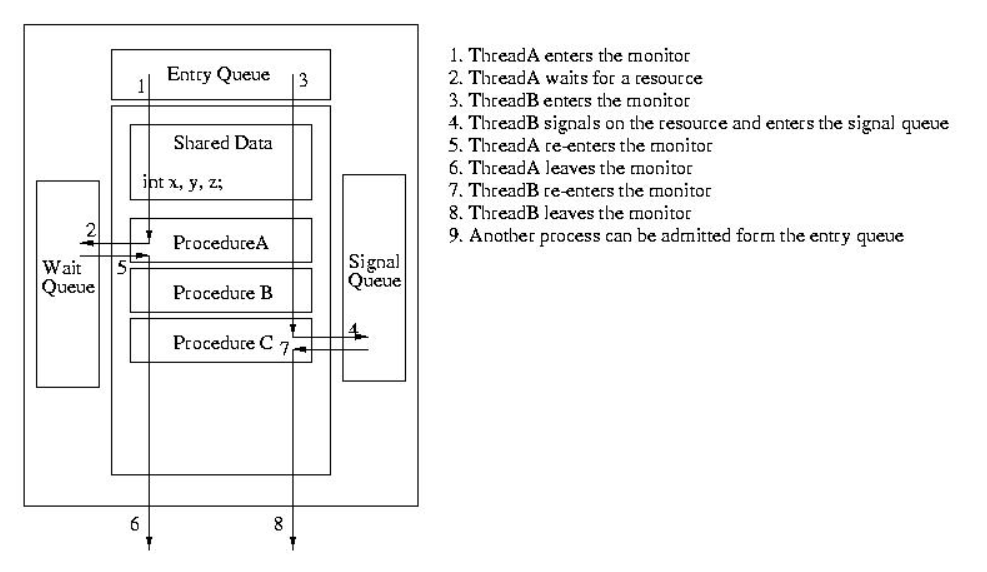

Lab7 Report
===========

## 实验目的

+ 熟悉ucore中的进程同步机制，了解操作系统为进程同步提供的底层支持；
+ 在ucore中理解信号量（`semaphore`）机制的具体实现；
+ 理解管程机制，在ucore内核中增加基于管程（`monitor`）的条件变量（`condition variable`）的支持；
+ 了解经典进程同步问题，并能使用同步机制解决进程同步问题。

## 实验内容

实验六完成了用户进程的调度框架和具体的调度算法，可调度运行多个进程。如果多个进程需要协同操作或访问共享资源，则存在如何同步和有序竞争的问题。本次实验，主要是熟悉ucore的进程同步机制—信号量（`semaphore`）机制，以及基于信号量的哲学家就餐问题解决方案。然后掌握管程的概念和原理，并参考信号量机制，实现基于管程的条件变量机制和基于条件变量来解决哲学家就餐问题。

在本次实验中，在`kern/sync/check_sync.c`中提供了一个基于信号量的哲学家就餐问题解法。同时还需完成练习，即实现基于管程（主要是灵活运用条件变量和互斥信号量）的哲学家就餐问题解法。哲学家就餐问题描述如下：有五个哲学家，他们的生活方式是交替地进行思考和进餐。哲学家们公用一张圆桌，周围放有五把椅子，每人坐一把。在圆桌上有五个碗和五根筷子，当一个哲学家思考时，他不与其他人交谈，饥饿时便试图取用其左、右最靠近他的筷子，但他可能一根都拿不到。只有在他拿到两根筷子时，方能进餐，进餐完后，放下筷子又继续思考。

## 练习

对实验报告的要求：

+ 基于markdown格式来完成，以文本方式为主
+ 填写各个基本练习中要求完成的报告内容
+ 完成实验后，请分析`ucore lab`中提供的参考答案，并请在实验报告中说明你的实现与参考答案的区别
+ 列出你认为本实验中重要的知识点，以及与对应的OS原理中的知识点，并简要说明你对二者的含义，关系，差异等方面的理解（也可能出现实验中的知识点没有对应的原理知识点）
+ 列出你认为OS原理中很重要，但在实验中没有对应上的知识点

## lab7 整体框架

lab7的主要任务其实就只有两个，即在ucore中实现信号量机制，然后用信号量机制来实现哲学家问题；以及基于信号量机制实现条件变量和管程，然后再用管程来实现哲学家就餐问题。下面的报告也主要按照这个逻辑来进行。

代码中的主要修改，是在`kern/process/proc.c::initmain`中调用了`check_sync`函数，其中创建了五个内核线程来代表五个哲学家，并利用这五个内核线程来模拟哲学家就餐问题。

## 练习1: 理解内核级信号量的实现和基于内核级信号量的哲学家就餐问题（不需要编码）

完成练习0后，建议大家比较一下（可用`kdiff3`等文件比较软件）个人完成的lab6和练习0完成后的刚修改的lab7之间的区别，分析了解lab7采用信号量的执行过程。执行`make grade`，大部分测试用例应该通过。

请在实验报告中给出内核级信号量的设计描述，并说其大致执行流流程。

请在实验报告中给出给用户态进程/线程提供信号量机制的设计方案，并比较说明给内核级提供信号量机制的异同。

### 内核级信号量的实现

在[进程管理（4）：信号量与管程](chp18.md)中，已经给出了实现信号量机制的伪代码描述，这里将分析并给出ucore中实现信号量机制的具体代码。

首先将信号量`P`和`V`操作的伪代码贴在下面：

```c
class Semaphore{
private:
	int sem;
	WaitQueue q;

public:
	void up();
	void down();
}

void Semaphore::down(){
	--sem;
	if(sem < 0){
		add current process to q;
		schedule();
	}
}

void Semaphore::up(){
	++sem;
	if(sem <= 0){
		pick a process in q;
		wakeup_proc();
	}
}
```

为了在ucore中实现信号量机制，首先应该保证信号量的`PV`操作都是原子操作，按理说是应该用硬件原语实现的锁机制来保证这一点的，但是ucore只是在模拟器上运行嘛，可能这些硬件外设的条件有限，这里就简单地禁用中断来实现`PV`操作的原子性。

为了实现`P`操作，按照在[进程管理（4）：信号量与管程](chp18.md)中的描述，应该首先执行`--sem`表示占用了一个资源，随后检查`sem >= 0`来判断进程请求的资源是否空闲，如果空闲就可以获得资源直接退出了；否则该进程将进入等待队列等待这个资源。在ucore中，`P`操作的实现到目前为止都与我们分析的逻辑一致。但是当该进程从等待中被唤醒时，该进程实质上已经获得了请求的资源，此时在退出之前还需要将进程中等待队列中删除。ucore中`P`操作的实现如下：

```c
static __noinline uint32_t __down(semaphore_t *sem, uint32_t wait_state) {
    bool intr_flag;
    local_intr_save(intr_flag);
    if (sem->value > 0) {
        sem->value --;
        local_intr_restore(intr_flag);
        return 0;
    }
    wait_t __wait, *wait = &__wait;
    wait_current_set(&(sem->wait_queue), wait, wait_state);
    local_intr_restore(intr_flag);

    schedule();

    local_intr_save(intr_flag);
    wait_current_del(&(sem->wait_queue), wait);
    local_intr_restore(intr_flag);

    if (wait->wakeup_flags != wait_state) {
        return wait->wakeup_flags;
    }
    return 0;
}
```

可以注意到，还有一些细节部分与原理中描述的不一样，比如这里的`sem`变量总是不小于零的，一旦`sem == 0`，就表示资源已经被分配完了。在原理中是利用负的`sem`变量来指示有多少个进程在等待当前的信号量，而ucore中是利用等待队列的是否非空来判断是否还有阻塞的进程。在`V`操作中，如果的确还有阻塞的进程，则直接将一个进程唤醒而不执行`++sem`，`V`操作的具体实现如下：

```c
static __noinline void __up(semaphore_t *sem, uint32_t wait_state) {
    bool intr_flag;
    local_intr_save(intr_flag);
    {
        wait_t *wait;
        if ((wait = wait_queue_first(&(sem->wait_queue))) == NULL) {
            sem->value ++;
        }
        else {
            assert(wait->proc->wait_state == wait_state);
            wakeup_wait(&(sem->wait_queue), wait, wait_state, 1);
        }
    }
    local_intr_restore(intr_flag);
}
```

### 利用内核级信号量实现哲学家就餐问题

在`ucore`中，是使用`AND`信号量来实现哲学家就餐问题的，关于哲学家就餐问题和`AND`信号量，在[哲学家就餐问题及其实现](philosopher.md)中已经有过了描述和伪代码实现。这里就不再赘述，只是把代码贴在下面：

```c
int state_sema[N]; /* 记录每个人状态的数组 */
/* 信号量是一个特殊的整型变量 */
semaphore_t mutex; /* 临界区互斥 */
semaphore_t s[N]; /* 每个哲学家一个信号量 */

struct proc_struct *philosopher_proc_sema[N];

void phi_test_sema(i) /* i：哲学家号码从0到N-1 */
{ 
    if(state_sema[i]==HUNGRY && state_sema[LEFT]!=EATING
             && state_sema[RIGHT]!=EATING)
    {
        state_sema[i]=EATING;
        up(&s[i]);
    }
}

void phi_take_forks_sema(int i) /* i：哲学家号码从0到N-1 */
{ 
        down(&mutex); /* 进入临界区 */
        state_sema[i]=HUNGRY; /* 记录下哲学家i饥饿的事实 */
        phi_test_sema(i); /* 试图得到两只叉子 */
        up(&mutex); /* 离开临界区 */
        down(&s[i]); /* 如果得不到叉子就阻塞 */
}

void phi_put_forks_sema(int i) /* i：哲学家号码从0到N-1 */
{ 
        down(&mutex); /* 进入临界区 */
        state_sema[i]=THINKING; /* 哲学家进餐结束 */
        phi_test_sema(LEFT); /* 看一下左邻居现在是否能进餐 */
        phi_test_sema(RIGHT); /* 看一下右邻居现在是否能进餐 */
        up(&mutex); /* 离开临界区 */
}

int philosopher_using_semaphore(void * arg) /* i：哲学家号码，从0到N-1 */
{
    int i, iter=0;
    i=(int)arg;
    cprintf("I am No.%d philosopher_sema\n",i);
    while(iter++<TIMES)
    { /* 无限循环 */
        cprintf("Iter %d, No.%d philosopher_sema is thinking\n",iter,i); /* 哲学家正在思考 */
        do_sleep(SLEEP_TIME);
        phi_take_forks_sema(i); 
        /* 需要两只叉子，或者阻塞 */
        cprintf("Iter %d, No.%d philosopher_sema is eating\n",iter,i); /* 进餐 */
        do_sleep(SLEEP_TIME);
        phi_put_forks_sema(i); 
        /* 把两把叉子同时放回桌子 */
    }
    cprintf("No.%d philosopher_sema quit\n",i);
    return 0;    
}
```

### 为用户态进程/线程提供信号量的方案

因为信号量是操作系统提供的同步互斥机制啊，为了让用户态进程也可以使用信号量，应该要把信号量封装成系统调用，用户进程需要通过系统调用进入内核，然后由操作系统来实现对信号量的操作。

## 练习2: 完成内核级条件变量和基于内核级条件变量的哲学家就餐问题（需要编码）

首先掌握管程机制，然后基于信号量实现完成条件变量实现，然后用管程机制实现哲学家就餐问题的解决方案（基于条件变量）。

执行：`make grade` 。如果所显示的应用程序检测都输出ok，则基本正确。如果只是某程序过不去，比如`matrix.c`，则可执行`make run-matrix` 命令来单独调试它。大致执行结果可看附录。（使用的是`qemu-1.0.1`）。

请在实验报告中给出内核级条件变量的设计描述，并说其大致执行流流程。

请在实验报告中给出给用户态进程/线程提供条件变量机制的设计方案，并比较说明给内核级提供条件变量机制的异同。

### 内核级条件变量实现

关于管程，以及两种管程的不同实现方法，即`Hansen`管程和`Hoare`管程，在[进程管理（4）：信号量与管程](chp18.md)中都已经有所涉及。在ucore中使用的是`Hoare`管程，下面就主要阐述`Hoare`管程的实现方法。

`Hoare`管程的主要特点是进入管程的进程具有优先权，这体现在某一进程`signal`了某个条件变量以后，立即将CPU的控制权交给等待那个条件变量的进程，而自身进入阻塞状态，被加入到`signal queue`当中，表示因为`signal`操作而阻塞；一个进程退出管程时，首先是寻找`signal queue`中是否还有阻塞的进程，如果的确有，则直接从中挑选一个占用管程执行，而不会让未进入管程的进程获得管程的使用权。`Hoare`管程的执行流程如下所示：



因此，对于`Hoare`管程的`wait`操作，基本的操作与原理中叙述的是一致的，即将当前进程加入到等待队列中，并且执行`num_waiting++`。但是，随后应该首先选择`signal queue`中的进程并将其唤醒，如果没有这样的进程才释放管程锁，允许其他进程进入管程。在ucore中，是使用一个`next`信号量来表示`signal queue`的，该信号量初始化为零，一个进程通过执行`next.P()`来进入`next`信号量的等待队列中，一个进程退出管程时，通过`next.V()`操作来唤醒`signal queue`中的一个进程。再引入一个`next_count`变量来表示等待`next`信号量的进程数量。管程的类定义如下：

```c
typedef struct monitor{
    semaphore_t mutex;      // the mutex lock for going into the routines in monitor, should be initialized to 1
    semaphore_t next;       // the next semaphore is used to down the signaling proc itself, and the other OR wakeuped waiting proc should wake up the sleeped signaling proc.
    int next_count;         // the number of of sleeped signaling proc
    condvar_t *cv;          // the condvars in monitor
} monitor_t;
```

这样，就可以给出条件变量的`wait`操作实现了：

```c
void
cond_wait (condvar_t *cvp) {
    //LAB7 EXERCISE1: YOUR CODE
    cprintf("cond_wait begin:  cvp %x, cvp->count %d, cvp->owner->next_count %d\n", cvp, cvp->count, cvp->owner->next_count);

	++(cvp->count);
    if(cvp->owner->next_count > 0)
    	up(&(cvp->owner->next));
    else
    	up(&(cvp->owner->mutex));
    down(&(cvp->sem));
    --(cvp->count);

    cprintf("cond_wait end:  cvp %x, cvp->count %d, cvp->owner->next_count %d\n", cvp, cvp->count, cvp->owner->next_count);
}
```

对于`signal`操作，实现则与原理课中稍有不同——在原理课中讲的是，唤醒了一个等待进程后，应该释放管程的互斥访问锁，但实际上这是`Hansen`管程的语义，使得管程外的进程也可以争夺管程的使用权。在`Hoare`管程中，唤醒了一个等待进程后，当前进程就应该进入`signal queue`了，因此执行`next.P()`表示等待`next`信号量，此时不应该释放管程锁，使得只有刚唤醒的进程拥有管程的访问权。`signal`操作的实现如下：

```c
void 
cond_signal (condvar_t *cvp) {
   //LAB7 EXERCISE1: YOUR CODE
   cprintf("cond_signal begin: cvp %x, cvp->count %d, cvp->owner->next_count %d\n", cvp, cvp->count, cvp->owner->next_count);  

    if(cvp->count > 0){
        up(&(cvp->sem));
        ++(cvp->owner->next_count);
        down(&(cvp->owner->next));
        --(cvp->owner->next_count);
   }

   cprintf("cond_signal end: cvp %x, cvp->count %d, cvp->owner->next_count %d\n", cvp, cvp->count, cvp->owner->next_count);
}
```

### 利用内核级条件变量实现哲学家就餐问题

使用条件变量实现哲学家就餐问题和信号量的方式有所不同，这是因为条件变量的`wait`操作以及`signal`操作并非完全等价于信号量的`P`操作和`V`操作，例如`V`操作总是会执行`++sem`而`signal`则未必执行`--num_waiting`；还有`P`操作不一定会使进程阻塞而`wait`则总是会使进程阻塞。此外，使用条件变量，一个进程要退出管程时并非简单地释放锁，而是检查是否有进程在等待`next`信号量，若有则不释放锁而唤醒其中一个进程。利用条件变量实现哲学家就餐问题的代码如下：

```c
struct proc_struct *philosopher_proc_condvar[N]; // N philosopher
int state_condvar[N];                            // the philosopher's state: EATING, HUNGARY, THINKING  
monitor_t mt, *mtp=&mt;                          // monitor

void phi_test_condvar (i) { 
    if(state_condvar[i]==HUNGRY&&state_condvar[LEFT]!=EATING
            &&state_condvar[RIGHT]!=EATING) {
        cprintf("phi_test_condvar: state_condvar[%d] will eating\n",i);
        state_condvar[i] = EATING ;
        cprintf("phi_test_condvar: signal self_cv[%d] \n",i);
        cond_signal(&mtp->cv[i]) ;
    }
}


void phi_take_forks_condvar(int i) {
     down(&(mtp->mutex));
//--------into routine in monitor--------------
     // LAB7 EXERCISE1: YOUR CODE
     // I am hungry
     // try to get fork
     state_condvar[i] = HUNGRY;
     phi_test_condvar(i);
     if(state_condvar[i] != EATING)
        cond_wait(&(mtp->cv[i]));
//--------leave routine in monitor--------------
      if(mtp->next_count>0)
         up(&(mtp->next));
      else
         up(&(mtp->mutex));
}

void phi_put_forks_condvar(int i) {
     down(&(mtp->mutex));

//--------into routine in monitor--------------
     // LAB7 EXERCISE1: YOUR CODE
     // I ate over
     // test left and right neighbors
     state_condvar[i] = THINKING;
     phi_test_condvar(LEFT);
     phi_test_condvar(RIGHT);
//--------leave routine in monitor--------------
     if(mtp->next_count>0)
        up(&(mtp->next));
     else
        up(&(mtp->mutex));
}

//---------- philosophers using monitor (condition variable) ----------------------
int philosopher_using_condvar(void * arg) { /* arg is the No. of philosopher 0~N-1*/
  
    int i, iter=0;
    i=(int)arg;
    cprintf("I am No.%d philosopher_condvar\n",i);
    while(iter++<TIMES)
    { /* iterate*/
        cprintf("Iter %d, No.%d philosopher_condvar is thinking\n",iter,i); /* thinking*/
        do_sleep(SLEEP_TIME);
        phi_take_forks_condvar(i); 
        /* need two forks, maybe blocked */
        cprintf("Iter %d, No.%d philosopher_condvar is eating\n",iter,i); /* eating*/
        do_sleep(SLEEP_TIME);
        phi_put_forks_condvar(i); 
        /* return two forks back*/
    }
    cprintf("No.%d philosopher_condvar quit\n",i);
    return 0;    
}

void check_sync(void){

    int i;

    //check semaphore
    sem_init(&mutex, 1);
    for(i=0;i<N;i++){
        sem_init(&s[i], 0);
        int pid = kernel_thread(philosopher_using_semaphore, (void *)i, 0);
        if (pid <= 0) {
            panic("create No.%d philosopher_using_semaphore failed.\n");
        }
        philosopher_proc_sema[i] = find_proc(pid);
        set_proc_name(philosopher_proc_sema[i], "philosopher_sema_proc");
    }

    //check condition variable
    monitor_init(&mt, N);
    for(i=0;i<N;i++){
        state_condvar[i]=THINKING;
        int pid = kernel_thread(philosopher_using_condvar, (void *)i, 0);
        if (pid <= 0) {
            panic("create No.%d philosopher_using_condvar failed.\n");
        }
        philosopher_proc_condvar[i] = find_proc(pid);
        set_proc_name(philosopher_proc_condvar[i], "philosopher_condvar_proc");
    }
}
```

应该注意到这里的实现本质上还是使用的是`AND`信号量的思想，只不过使用条件变量和管程来实现的而已。

### 为用户态进程/线程提供条件变量的方案

感觉还是就使用系统调用吧，把管程的`wait`和`signal`操作都封装成系统调用，管程的相关控制代码由编译器在编译程序时自动添加。
