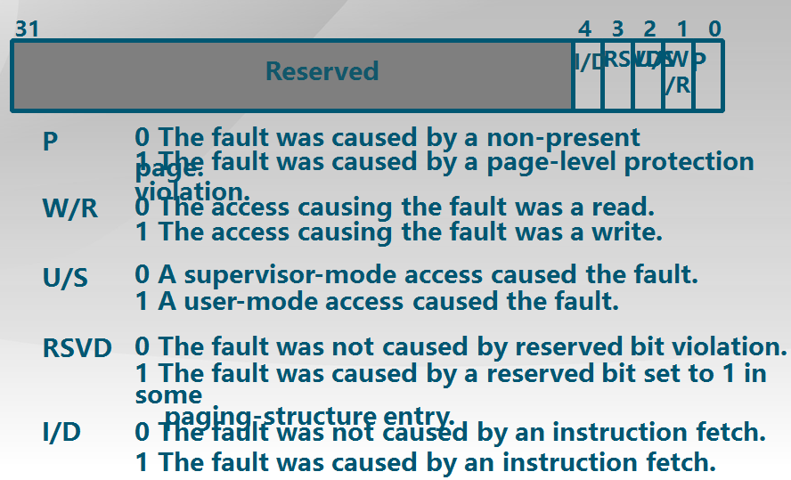

Lab3 Report
============

## 实验目的

+ 了解虚拟内存的Page Fault异常处理实现
+ 了解页替换算法在操作系统中的实现

## 实验内容

本次实验是在实验二的基础上，借助于页表机制和实验一中涉及的中断异常处理机制，完成Page Fault异常处理和FIFO页替换算法的实现，结合磁盘提供的缓存空间，从而能够支持虚存管理，提供一个比实际物理内存空间“更大”的虚拟内存空间给系统使用。这个实验与实际操作系统中的实现比较起来要简单，不过需要了解实验一和实验二的具体实现。实际操作系统系统中的虚拟内存管理设计与实现是相当复杂的，涉及到与进程管理系统、文件系统等的交叉访问。如果大家有余力，可以尝试完成扩展练习，实现extended　clock页替换算法。

## 练习

对实验报告的要求：

+ 基于markdown格式来完成，以文本方式为主
+ 填写各个基本练习中要求完成的报告内容
+ 完成实验后，请分析ucore_lab中提供的参考答案，并请在实验报告中说明你的实现与参考答案的区别
+ 列出你认为本实验中重要的知识点，以及与对应的OS原理中的知识点，并简要说明你对二者的含义，关系，差异等方面的理解（也可能出现实验中的知识点没有对应的原理知识点）
+ 列出你认为OS原理中很重要，但在实验中没有对应上的知识点

## 新增加的文件概述

lab3相对于前面的lab2，增加了虚拟内存的管理，为此lab3中增加了一些关键文件。首先对这些文件的功能做一个简单的说明，后面还会有更详细的分析。

为了进行对虚拟内存的管理，需要有相关数据结构的支持，其中的两个关键数据结构`struct mm_struct`， `struct vma_struct`以及相关的函数定义在`mm/vmm.c(h)`当中。通过这两个结构体，`ucore`模拟了一个用户进程的虚拟地址空间，并对其进行相关的测试工作。

在`mm/swap.c(h)`中，定义了页面置换算法的框架`struct smap_manager`，以及为了完成页面换入换出所需要的一些必要函数，还有相关的测试代码。

在`mm/swap_fifo.c(h)`中，利用`struct swap_manager`框架实现了先进先出置换算法`FIFO`（其实没有实现，需要自己编程实现）。

此外，为了将页面换入换出到外存上，需要支持对外存的读写操作，这些函数定义在了`driver/ide.c`当中。

## 虚拟内存管理

lab3中需要完成对虚拟内存的管理工作。上面已经说到，虚拟内存的管理是通过两个结构体`mm_struct`以及`vmm_struct`来实现的，下面主要阐述这两个结构体如何实现对虚拟内存的管理。

### `vma_struct`

`vma_struct`是用于描述一个进程的连续虚拟内存空间的，如果一个进程有若干个相互之间不连续的虚拟内存空间，则每个虚拟内存空间都需要维护一个`vma_struct`结构体。`vma_struct`的结构如下：

```c
// the virtual continuous memory area(vma), [vm_start, vm_end), 
// addr belong to a vma means  vma.vm_start<= addr <vma.vm_end 
struct vma_struct {
    struct mm_struct *vm_mm; // the set of vma using the same PDT 
    uintptr_t vm_start;      // start addr of vma      
    uintptr_t vm_end;        // end addr of vma, not include the vm_end itself
    uint32_t vm_flags;       // flags of vma
    list_entry_t list_link;  // linear list link which sorted by start addr of vma
};
```

可以看到，其中的`vm_start`以及`vm_end`分别描述该连续虚拟内存空间的起始虚拟地址和结束虚拟地址，一个进程的各个`vma_struct`之间通过`vma_struct::list_link`连接起来，构成了整个进程的虚拟内存空间。

### `mm_struct`

`mm_struct`可以被认为是进程控制块(PCB, Process Control Block)之类的结构，一个`mm_struct`代表了一个进程。`mm_struct`的结构如下：

```c
// the control struct for a set of vma using the same PDT
struct mm_struct {
    list_entry_t mmap_list;        // linear list link which sorted by start addr of vma
    struct vma_struct *mmap_cache; // current accessed vma, used for speed purpose
    pde_t *pgdir;                  // the PDT of these vma
    int map_count;                 // the count of these vma
    void *sm_priv;                 // the private data for swap manager
};
```

可以看到，`mm_struct`维护了一个页目录表`mm_struct::pgdir`，它是当前进程的页目录表，将当前进程的虚拟地址映射到物理地址上。此外，`mm_struct::mmap_list`其实是`vma_struct`的链表的头节点，通过这个`mmap_list`可以将当前进程的各个虚拟地址空间连接起来，并且用`map_count`来指示这些虚拟地址空间的数量。通过这两个数据结构，就可以实现进程的虚拟地址空间向物理地址空间的映射，如图所示：


此外，需要注意的是，`mm_struct`还维护了一个`mmap_cache`变量，这其实保存的是当前进程上一次访问的连续虚拟地址空间。根据局部性原理，该进程接下来极有可能再次访问该虚拟地址空间，从而可以在下次访问它时，可以直接获得对应的`vma_struct`，而不需要遍历`vma_struct`链表来找到它。

通过对虚拟地址空间的管理，操作系统可以完成一系列的工作，例如检查当前进程所要访问的虚拟地址是否合法。检查的方法是在该进程的虚拟地址空间查找要访问的虚拟地址，如果的确在其中，则说明该地址是一个合法的访问地址，否则就会触发页访问异常。相关的代码如下：

```c
// find_vma - find a vma  (vma->vm_start <= addr <= vma_vm_end)
struct vma_struct *
find_vma(struct mm_struct *mm, uintptr_t addr) {
    struct vma_struct *vma = NULL;
    if (mm != NULL) {
        vma = mm->mmap_cache;
        if (!(vma != NULL && vma->vm_start <= addr && vma->vm_end > addr)) {
                bool found = 0;
                list_entry_t *list = &(mm->mmap_list), *le = list;
                while ((le = list_next(le)) != list) {
                    vma = le2vma(le, list_link);
                    if (vma->vm_start<=addr && addr < vma->vm_end) {
                        found = 1;
                        break;
                    }
                }
                if (!found) {
                    vma = NULL;
                }
        }
        if (vma != NULL) {
            mm->mmap_cache = vma;
        }
    }
    return vma;
}
```

查找的方法就是从`mm_struct::mmap_cache`开始遍历整个`vma_struct`链表，直到找到一个对应的虚拟地址空间，或者始终没有找到。

## 练习一：给未被映射的地址映射上物理页（需要编程）

完成`do_pgfault`（`mm/vmm.c`）函数，给未被映射的地址映射上物理页。设置访问权限的时候需要参考页面所在`VMA` 的权限，同时需要注意映射物理页时需要操作内存控制结构所指定的页表，而不是内核的页表。注意：在`LAB2 EXERCISE 1`处填写代码。执行

```
make qemu
```

后，如果通过check_pgfault函数的测试后，会有“check_pgfault() succeeded!”的输出，表示练习1基本正确。

请在实验报告中简要说明你的设计实现过程。请回答如下问题：

+ 请描述页目录项（Pag Director Entry）和页表（Page Table Entry）中组成部分对ucore实现页替换算法的潜在用处。
+ 如果ucore的缺页服务例程在执行过程中访问内存，出现了页访问异常，请问硬件要做哪些事情？


### 页访问异常的处理

产生页访问异常的原因有很多，比如

+ 目标页帧不存在，即页表项全为零，表示没有给虚拟页分配物理页帧。
+ 相应的物理页帧不在内存当中，而是在磁盘的`swap`分区。此时页表项的`PTE_P`标志位为零。
+ 访问权限出错，比如试图写只读的页，或者用户进程试图访问内核的地址空间。

所有这些情况都会产生页访问异常(Page Fault, PF)，因此页访问异常的处理函数首先需要解决的问题，就是如何来分辨当前页访问异常产生的原因，从而根据不同的情况采取不同的解决方法。

> 如何辨别不同原因产生的页访问异常？

在发生页访问异常时，CPU会将产生异常的线性地址存储在`CR2`寄存器中，并且把页访问异常类型的值（简称页访问异常错误码，errorCode）保存在中断栈中。因此，可以通过这两个信息来追溯页访问异常的原因。

lab3中采用的方法是将这两个信息接合起来考虑，首先根据错误码来定位某些原因引起的页访问异常，再利用`CR2`寄存器中的线性地址，通过手动查当前进程的页目录表，来进一步对页访问异常进行定位。页访问异常错误的结构如下所示：



我们这里只用到了第零位和第一位，毕竟目前还没有用户态，第二位的内核访问/用户访问也无从说起。根据错误码来对页访问异常进行辨别的代码如下所示：

```c
int
do_pgfault(struct mm_struct *mm, uint32_t error_code, uintptr_t addr) {
    int ret = -E_INVAL;
    //try to find a vma which include addr
    struct vma_struct *vma = find_vma(mm, addr);

    pgfault_num++;
    //If the addr is in the range of a mm's vma?
    if (vma == NULL || vma->vm_start > addr) {
        cprintf("not valid addr %x, and  can not find it in vma\n", addr);
        goto failed;
    }
    //check the error_code
    switch (error_code & 3) {
    default:
            /* error code flag : default is 3 ( W/R=1, P=1): write, present */
    case 2: /* error code flag : (W/R=1, P=0): write, not present */
        if (!(vma->vm_flags & VM_WRITE)) {
            cprintf("do_pgfault failed: error code flag = write AND not present, but the addr's vma cannot write\n");
            goto failed;
        }
        break;
    case 1: /* error code flag : (W/R=0, P=1): read, present */
        cprintf("do_pgfault failed: error code flag = read AND present\n");
        goto failed;
    case 0: /* error code flag : (W/R=0, P=0): read, not present */
        if (!(vma->vm_flags & (VM_READ | VM_EXEC))) {
            cprintf("do_pgfault failed: error code flag = read AND not present, but the addr's vma cannot read or exec\n");
            goto failed;
        }
    }
    // other operations
    //......
```

可以看到，根据异常错误码，主要是对一些权限信息进行检查。例如当前进程是否在试图写一个不可写的页面，或者被访问的页面是否是不可读也是不可执行的，如果的确出现了权限的越界，操作系统应该终止这些操作的进行，并且直接返回错误信息。而如果所有权限信息都是正确的，发生页访问异常的原因只是当前页面不存在(`P = 0`)，则需要进行后续的操作，以判断是进行内存分配，还是页面置换。此时，就需要结合存储在`CR2`寄存器中的线性地址来进行进一步的判断了。

前面已经提到过，具体的方法就是查询当前进程的页目录表(`mm_struct::pgdir`)，通过得到的页表项来进行判断--如果页表项全为零，则表示不存在当前虚拟地址的映射关系，此时应该给当前的虚拟页分配一个新的页面；而如果页表项不为零，只是`PTE_P`为零，则表示要访问的页不在内存中，需要进行页面置换，这部分将在练习二中讨论。

### 给未被映射的地址映射上物理页

如果访问的地址尚未被映射到物理页，则在页访问异常的处理函数`do_pgfault`中，需要给该页也分配一个新的物理页帧，并且将分配的物理页的地址以及相关的权限信息填入到页表项中，这和我们前面的内容是一致的。

但是这里需要考虑特殊的情况，假如当前内存中已经没有空闲的页面了，又应该如何操作呢？在lab2中我们是直接返回错误码，然后就退出了，但是这在引入了虚拟内存地址的现在显然是不合适的。因此，此时是需要调用页面置换算法，从当前进程的页面中，选择一个置换到外存中，随后再进行存储空间的分配。然后这一系列的操作，老师都已经封装成的一个函数，见下面的代码：

```c
    uint32_t perm = PTE_U;
    if (vma->vm_flags & VM_WRITE) {
        perm |= PTE_W;
    }
    addr = ROUNDDOWN(addr, PGSIZE);
    ret = -E_NO_MEM;
    pte_t *ptep=NULL;

    /*LAB3 EXERCISE 1: YOUR CODE*/
    ptep = get_pte(mm->pgdir, addr, 1);                   //(1) try to find a pte, if pte's PT(Page Table) doesn't existed, then create a PT.
    if (*ptep == 0) {
        pgdir_alloc_page(mm->pgdir, addr, perm | PTE_P);  //(2) if the phy addr isn't exist, then alloc a page & map the phy addr with logical addr
    }
```

这里的`pgdir_alloc_page`函数，已经实现了上面我所描述的功能。在它的内部，是调用了`alloc_pages`函数，其实现如下：

```c
//alloc_pages - call pmm->alloc_pages to allocate a continuous n*PAGESIZE memory 
struct Page *
alloc_pages(size_t n) {
    struct Page *page=NULL;
    bool intr_flag;
    
    while (1)
    {
         local_intr_save(intr_flag);
         {
              page = pmm_manager->alloc_pages(n);
         }
         local_intr_restore(intr_flag);

         if (page != NULL || n > 1 || swap_init_ok == 0) break;
         
         extern struct mm_struct *check_mm_struct;
         swap_out(check_mm_struct, n, 0);
    }
    return page;
}
```

可以看到，在`alloc_pages`函数内部，已经包含了页面置换的功能。

我的exercise1的实现，和老师的大体相同吧，但是我的肯定还是有问题的，老师的代码主要是多了很多异常的检查工作，比我的代码健壮多了，见下：

```c
	// try to find a pte, if pte's PT(Page Table) isn't existed, then create a PT.
    // (notice the 3th parameter '1')
    if ((ptep = get_pte(mm->pgdir, addr, 1)) == NULL) {
        cprintf("get_pte in do_pgfault failed\n");
        goto failed;
    }
    
    if (*ptep == 0) { // if the phy addr isn't exist, then alloc a page & map the phy addr with logical addr
        if (pgdir_alloc_page(mm->pgdir, addr, perm) == NULL) {
            cprintf("pgdir_alloc_page in do_pgfault failed\n");
            goto failed;
        }
    }
```

## 练习2：补充完成基于FIFO的页面替换算法（需要编程）

完成`vmm.c`中的`do_pgfault`函数，并且在实现`FIFO`算法的`swap_fifo.c`中完成`map_swappable`和`swap_out_victim`函数。通过对`swap`的测试。注意：在`LAB2 EXERCISE 2`处填写代码。执行

```
make　qemu
```

后，如果通过`check_swap`函数的测试后，会有`check_swap() succeeded!`的输出，表示练习2基本正确。

请在实验报告中简要说明你的设计实现过程。

请在实验报告中回答如下问题：

+ 如果要在ucore上实现"extended clock页替换算法"请给你的设计方案，现有的`swap_manager`框架是否足以支持在ucore中实现此算法？如果是，请给你的设计方案。如果不是，请给出你的新的扩展和基此扩展的设计方案。并需要回答如下问题
	- 需要被换出的页的特征是什么？
	- 在ucore中如何判断具有这样特征的页？
	- 何时进行换入和换出操作？

### `FIFO`算法的实现

`FIFO`算法其实就维护一个按页面在内存中的驻留时间排序的队列。在未出现缺页异常的页面访问时，`FIFO`算法不需要做任何操作，因为此时访问的页面必然早就进入了内存，并且早就被添加到页面队列了。因此，只有在产生页面异常时，`FIFO`算法才具有实质性的操作，包括首先将队列头取出，它代表了驻留内存时间最长的页面，对应于`swap_out_victim`函数，将其换出到外存当中；继而将新进入的页面添加到队列尾，对应于`map_swappable`函数。

为了实现`FIFO`算法，对于每一个进程，我们都需要维护这样的一个驻留页面队列，事实上，`mm_struct::sm_priv`就是为了页面置换算法而预留的，由于它是一个`void*`类型的指针，即它可以指向任何类型，因此这个变量不只是可以用来维护`FIFO`的驻留页面队列，对于其他的页面置换算法，该变量也可以用来指向它们所需要维护的数据结构。

除此以外，还需要扩展`struct Page`结构体，需要给它增加一个新的字段，将这些驻留在内存中的页面链接起来，并且使`mm_struct::sm_priv`作为这个链表的头节点。这样，通过对进程进行描述的`mm_struct`结构体，就还可以获得该进程的页面访问信息了。

但是目前为止还存在一个问题--`struct Page`是对物理页帧进行描述的结构体，通过物理页帧并不能直接找到与之映射的虚拟页面，从而找不到对应于该物理页帧的页表项，而将页面换出是需要修改页表项的。为了解决这个问题，还需要给`struct Page`增加一个字段，指出当前映射到它的虚拟地址。这样，`struct Page`的结构如下所示：

```c
/* *
 * struct Page - Page descriptor structures. Each Page describes one
 * physical page. In kern/mm/pmm.h, you can find lots of useful functions
 * that convert Page to other data types, such as phyical address.
 * */
struct Page {
    int ref;                        // page frame's reference counter
    uint32_t flags;                 // array of flags that describe the status of the page frame
    unsigned int property;          // the num of free block, used in first fit pm manager
    list_entry_t page_link;         // free list link
    list_entry_t pra_page_link;     // used for pra (page replace algorithm)
    uintptr_t pra_vaddr;            // used for pra (page replace algorithm)
};
```

到目前为止，终于可以实现`FIFO`算法了，对于`map_swappable`函数，主要功能就是将刚进入内存的页面，添加到页面队列的队尾，即页面链表的最后。而`swap_out_victim`函数，主要功能就是取出页面队列的队首，并且将该被置换的页面返回。具体的实现如下：

```c
/*
 * (3)_fifo_map_swappable: According FIFO PRA, we should link the most recent arrival page at the back of pra_list_head qeueue
 */
static int
_fifo_map_swappable(struct mm_struct *mm, uintptr_t addr, struct Page *page, int swap_in)
{
    list_entry_t *head=(list_entry_t*) mm->sm_priv;
    list_entry_t *entry=&(page->pra_page_link);
 
    assert(entry != NULL && head != NULL);
    //record the page access situlation
    /*LAB3 EXERCISE 2: YOUR CODE*/ 
    //(1)link the most recent arrival page at the back of the pra_list_head qeueue.
    list_add_before(head, entry);
    return 0;
}
/*
 *  (4)_fifo_swap_out_victim: According FIFO PRA, we should unlink the  earliest arrival page in front of pra_list_head qeueue,
 *                            then set the addr of addr of this page to ptr_page.
 */
static int
_fifo_swap_out_victim(struct mm_struct *mm, struct Page ** ptr_page, int in_tick)
{
     list_entry_t *head=(list_entry_t*) mm->sm_priv;
         assert(head != NULL);
     assert(in_tick==0);
     /* Select the victim */
     /*LAB3 EXERCISE 2: YOUR CODE*/ 
     //(1)  unlink the  earliest arrival page in front of pra_list_head qeueue
     //(2)  set the addr of addr of this page to ptr_page
     list_entry_t *victim = list_next(head);
     list_del(victim);
     struct Page* p = le2page(victim, pra_page_link);
     *ptr_page = p;
     return 0;
}

```

相关的实现都非常简单啊，我就不多说了。

### 缺页异常的处理

接下来是应该补全`do_pgfault`函数，前面已经处理了页面不存在的情况，还剩下页面不在内存中，而是驻留在外存的情况没有处理。

这里首先需要解决一个问题，如果页面在外存中，那么又应该如何在外存中找到该页面呢？我们这里的方法是利用了“交换表项”(swap_entry)，它的结构如图所示：


它的高24位，是当前页面所驻留的磁盘扇区号，这样只要读对应的磁盘扇区，就可以将该页面从外存中换入内存了。需要说明的是，这里我们并没有利用额外的空间来存储这个“交换表项”，而是继续沿用页表项来存储这样的磁盘扇区号的。可以这样做是因为，可以通过`PTE_P`位的值来将页表项与“交换表项”区别开，当`PTE_P`位的值是1时，当前页表项就是存储内存中某个页面的起始地址以及相关的权限；当`PTE_P`位的值是0时，当前的页表项就成了“交换表项”，用来保存被交换到磁盘上的该页的磁盘扇区号。

这样，为了处理缺页异常，只需要调用`swap_out_victim`，将某一页置换出内存，再将被访问的页换入到该物理页帧的空间中，然后将其添加到页面队列的队尾，并且修改对应的页表项就可以了。对应的代码如下：

```c
 else { // if this pte is a swap entry, then load data from disk to a page with phy addr
           // and call page_insert to map the phy addr with logical addr
        if(swap_init_ok) {
            struct Page *page=NULL;
            swap_in(mm, addr, &page);
            page->pra_vaddr = addr;
            page_insert(mm->pgdir, page, addr, perm | PTE_P);
            swap_map_swappable(mm, addr, page, 0);
        }
        else {
            cprintf("no swap_init_ok but ptep is %x, failed\n",*ptep);
            goto failed;
        }
   }
   ...
```

这里并没有显式地调用`swap_out`函数来将某一页面换出，这是因为在`swap_in`函数的实现中，是首先调用了前面提到的`alloc_pages`函数，在物理内存不够时，通过这个函数来调用`swap_out`以将某个页面换出。由此也可以看出，我们采用的是消极的页面换出机制，即只有在内存空间不足时，才执行页面的换出；在还有剩余的内存空间时，直接给要换入的页面分配新的内存空间，并不执行换出操作。

### `extended clock`页替换算法设计方案

为了实现`extended clock`算法，需要管理物理页面的访问特征，即被访问(`accessed`)以及被修改(`dirty`)，这两个参数在页表中分别对应了`PTE_A`和`PTE_D`。

此外，还需要一个驻留页面的循环链表，可以采用前面的双向循环链表来作为它的底层结构，用`struct mm.sm_priv`作为时钟的指针。为了选择被置换的页面，需要进行两次循环：

+ 第一次循环寻找`PTE_A == 0 && PTE_D == 0`的页面，并且同时将经过的页面的`PTE_A`赋值为零。如果的确找到这样的页面，则将它作为要换出的页面，从循环链表中删除，并且将指针`sm_priv`移向它的后一个页面。
+ 如果第一次循环没找到适合换出的页面，则进行第二次循环，仍然是查找满足`PTE_A == 0 && PTE_D == 0`，后续操作也与第一步相同。
+ 如果第二步也失败，直接将当前指针`sm_priv`指向的页面换出。这是因为，此时链表中的所有页面都满足`PTE_A == 0 && PTE_D == 1`，此时只能换出一个修改过的页面。

此外，在`swap_out`函数中也要做相应的修改，增加对页面`PTE_D`的判断，只有在`PTE_D = 1`时，才将页面写回到外存当中。将页面换出后，记得要修改页表项相关的标志位。

在`map_swappable`函数中，需要将换入的页面置于被换出的页面的位置，为此只需要将它插入到当前指针`sm_priv`的前一个位置即可。
