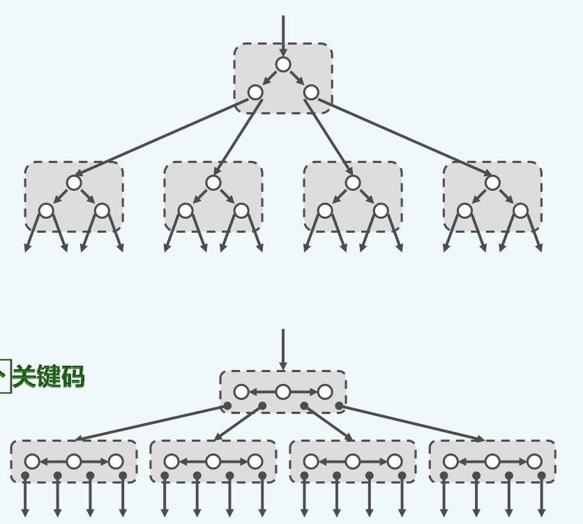
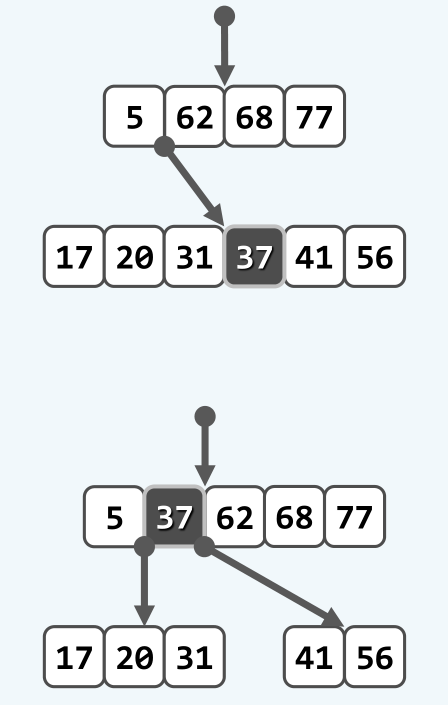
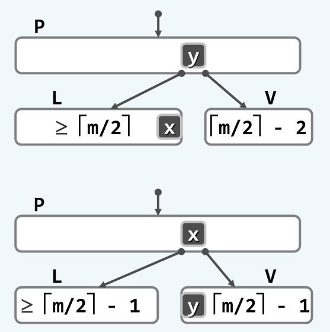

Conclusion on B-Tree
====================

## B树的基本概念

> 什么是B树？

B树其实是由二叉搜索树变化而来，它的本质仍然是二叉搜索树。如下面的图所示，将原有的二叉搜索树的结点进行适当的合并，得到超级结点。由这些超级结点组成的新的树，就是一棵B树。



应该注意的是，并不是所有由超级结点组成的搜索树都是B树。B树一定是一棵多路平衡搜索树，也就是构成B树原本的BST可以是不平衡的，但是经过超级结点的重组之后，新得到的B树一定是平衡的。

> 为什么需要B树？

既然B树是由BST的结点合并重组而来，其本质上和BST完全等效，那么B树存在的意义是什么？

这里就需要考虑多级存储系统了。考虑某个大型数据文件在某低级存储介质上（如硬盘）以二叉平衡树AVL的形式组织。假如该文件的大小为1G，即$2^{30}$。这样每次查找至多需要30次I/O操作。我们知道，不同存储介质之间的访问速度差异往往是巨大的，例如内存的访问速度大约是硬盘的$10^5$倍，尽管最坏情况下也只需要30次访问，但是这样30次硬盘访问操作的代价其实是非常巨大的。

而如果采用B树的话，我们已经注意到，树的整体高度会显著降低。此时的问题是，每次需要从外存中读入一个超级结点，它可能包含了许许多多先前的普通结点，对这样超级结点的I/O操作需要花费的时间又如何呢？

得益于外存访问的缓存机制，从外存中访问一个数据或者是多个数据，它们需要的时间几乎是没有区别的。这是因为在硬件的设计中，不同层次存储器之间往往设置一个buffer，用来缓冲读写的数据，基于此，外存可以提供对批量访问的高效支持。这样，从外存中读取一个超级结点和读取一个普通结点，其时间代价几乎是一样的，而由于B树高度相较于传统的BST显著降低，在多级存储系统中，采用B树可以大大减少I/O次数。

> B树的定义。

下面给出B树完整的定义。

所谓m阶B树，本质是m路平衡搜索树。树中的每个结点，除根结点外，至多拥有m个分支，但是至少也要拥有$\left \lceil m/2 \right \rceil$个分支，这里的$\left \lceil \right \rceil$是取上整。对于根结点，可以只拥有两个分支，但不可以少于两个分支。

这里需要区别B树的叶结点(leaf node)和外部结点(external node)。叶结点就是处于B树最底层的，实际存在的结点。而外部结点则是假想的，不存在的，叶结点不具有的子结点。对于上述B树的定义并不能保证B树是一棵平衡树，因此需要再附加<外部结点的深度统一相等，所有叶结点的深度统一相等>的条件。

B树高度定义为外部结点的深度，而与传统的BST高度的定义不同。

> B树的最小高度和最大高度？

首先考虑B树的最大高度，此时根结点为单个结点，并且只具有两个子代（超）结点。每个非根结点都只拥有$\left \lceil m/2 \right \rceil$个分支，亦即只拥有$\left \lfloor m/2 \right \rfloor$个关键码。这样，$n_0 = 1, n_1 = 2[m/2], n_k = 2[m/2]^k$。设B树的总（关键字）结点数量为N，所以外部结点数为N + 1，故有
$$
N + 1 = n_h \ge 2[m/2]^h
$$
所以
$$
h \le log_{[m/2]}^{\frac{N+1}{2}} = O(log_m^N)
$$
可以看到，与普通的BBST相比，B树的最大高度要降低了$log_2^m$倍，若取m = 256，树高(I/O次数)约降低至1/7。

同理的方法可以分析B树的最小高度，即$n_0 = m - 1, n_1 = (m-1)^2, n_k = (m-1)^{k+1}$，所以对于所有的外部结点有
$$
N + 1 = n_h \le (m-1)^{h+1}
$$ 
所以
$$
h \ge log_{m-1}^{N+1} - 1 = \Omega(log_m^N)
$$
同样地，若取m = 255，相对传统的BBST，B树的高度(I/O次数)约降低至1/8。

> 为什么B树又宽又矮？

邓公说这个问题需要自己慢慢体悟...

## B树的操作

B树查找操作的内涵和前面的BST以及AVL是完全一致的，只是在相关细节方面稍作修改以适应B树的结构。对于B树动态操作，即插入和删除，和其他平衡搜索树一样，主要是关注一次操作导致B树结构改变，以至于不再满足B树的定义时，需要对树的结构进行的修正。

## B树调整算法

> B树的上溢调整。

进行一次插入操作后，如果某个超级结点的分支数超过了该B树固定的分支数，就会引发上溢异常。在这种情况下，就需要对B树进行上溢调整。

上溢调整的主要思路是分裂，即将一个上溢的超级结点分裂成两个较小的超级结点，这样该结点的父结点就会增加一个分支，从而需要添加一个关键码以维持结点数与分支数的平衡。可以选择上溢的结点的中间结点添加到父结点的关键码中，上溢结点以该关键码为界分裂成两个更小的超级结点。如下图所示：



可以证明，以这种方法来对上溢结点进行调整，的确可以解决该上溢结点的上溢异常，并且分裂的两个超级结点也都满足B树的定义。证明如下：

发生上溢的结点必然具有m个关键码，分裂后的左右两个超级结点分别都具有$\frac{m-1}{2}$个关键码。设m为奇数，则左右结点的关键码数量相同，都等于$\frac{m-1}{2}$，此时每个结点所含的最少的关键码数量为$\left \lceil m/2 \right \rceil - 1= \frac{m-1}{2}$，刚好可以满足条件。

若m为偶数，设左结点的关键码数为$\frac{m}{2}$，那么右结点的关键码数为$\frac{m}{2} - 1$，此时每个结点所含的最少关键码数为$\frac{m}{2} - 1$，同样是满足要求的。故得证。

需要注意的是，上溢调整后相当于原上溢结点的父结点也被插入了一个新的结点，因此该结点也可能因此产生上溢异常。通过这种方式，上溢可能会持续发生，并且不断地向上传播，直到传播至根结点。此时，应该将原根结点分裂，并且将中间结点提升为新的根结点，这也是B树高度增加的唯一方式。需要注意的是，此时根结点只具有两个分支，这也是B树定义中根结点的分支数不必遵守下限的原因。

上溢调整的具体代码如下：

```cpp
template <typename T>
void BTree<T>::solveOverflow(BTNodePosi(T) x){
	while (x->keys.getSize() == __order) {
		int mid = __order / 2;
		BTNodePosi(T) newLeaf = new BTNode<T>();
		BTNodePosi(T) p = x->parent;

		//construct split node
		int ix = mid + 1;
		newLeaf->children[0] = x->children[ix];
		if (x->children[ix]) x->children[ix]->parent = newLeaf;
		for(;ix != __order; ++ix){
			newLeaf->keys.push_back(x->keys[ix]);
			newLeaf->children.push_back(x->children[ix + 1]);
			if (x->children[ix + 1]) x->children[ix + 1]->parent = newLeaf;
		}

		if(!p){//construct new __root
			__root = new BTNode<T>(x->keys[mid], x, newLeaf);
			x->parent = __root;
			newLeaf->parent = __root;
			p = __root;
		}
		else {
			int pos = p->keys.search(x->keys[mid]);
			p->keys.insert(pos + 1, x->keys[mid]);
			p->children.insert(pos + 2, newLeaf);
			newLeaf->parent = p;
		}

		x->keys.pop(mid, __order);
		x->children.pop(mid + 1, __order + 1);

		x = p;
	}
}
```

> B树的下溢调整。

与上溢异常相对应，当从B树中删除一个结点时，如果当前超级结点的分支数少于B树分支数的下限，就会产生下溢异常，此时需要对该结点进行下溢调整来恢复B树原本的性质。

下溢调整主要有两个策略。首要考虑的是<左顾右盼>，即产生下溢缺陷的结点首先去判断它的左右兄弟结点是否有多余的结点，如果的确有，那么可以从它的左右兄弟中借一个到当前产生下溢的结点中，这样下溢缺陷就可以修复。

这里需要注意的是，实际借的结点并不是真的左右兄弟的结点，因为B树同时还要满足BST的局部有序性，所以实际上是左右兄弟的结点与父结点之间做了一个旋转，如下图所示：

 

借了这个结点后，被借的那个兄弟结点还需要将自己的一个子结点转让给下溢结点，才能使全树重新满足B树的性质。

可是，倘若左右兄弟结点都没有多余的关键码可借，就需要进行合并调整策略，这个过程其实就是上面分裂过程的逆过程。简单说来，就是将下溢结点，连同左/右结点中的一个，以及处于它们之间的父结点的关键码合并成为一个更大的超结点。具体的过程如下图所示：


可以证明，通过这种方式合并后产生的结点，一定是满足B树对结点的要求的。证明方法与上面分裂过程的证明一样。

需要注意的是，一次合并操作后，相当于从下溢结点的父结点也删除了一个关键码，从而其父结点相应的也有可能会产生下溢异常。因此，这种下溢异常可以不断地向上传播，直到传播至根结点。倘若唯一的根结点也产生下溢，那么全树的高度就会下降1，这也是B树高度降低的唯一原因。下溢调整过程的具体代码如下：

```cpp
template <typename T>
void BTree<T>::solveUnderflow(BTNodePosi(T) x){
	while (x != __root && x->children.getSize() == ((__order - 1) >> 1)) {
		BTNodePosi(T) p = x->parent;
		int pos = 0;
		while (p->children[pos] != x) ++pos;
		BTNodePosi(T) leftSibling  = (pos != 0 ? p->children[pos - 1] : nullptr);
		BTNodePosi(T) rightSibling = (pos != p->children.getSize() - 1 ? p->children[pos + 1] : nullptr);

		//look around left and right
		if (leftSibling && leftSibling->children.getSize() > ((__order + 1) >> 1)) {
			x->keys.insert(0, p->keys[pos - 1]);
			x->children.insert(0, leftSibling->children.pop_back());
			if (x->children[0]) x->children[0]->parent = x;

			p->keys[pos - 1] = leftSibling->keys.pop_back();
			return;
		}
		else 
		if (rightSibling && rightSibling->children.getSize() > ((__order + 1) >> 1)) {
				x->keys.push_back(p->keys[pos + 1]);
				x->children.push_back(rightSibling->children.pop(0));
				if (x->children[x->children.getSize() - 1]) x->children[x->children.getSize() - 1]->parent = x;

				p->keys[pos + 1] = rightSibling->keys.pop(0);
				return;
		}
		else {
			if (leftSibling) {//merge left sibling
				leftSibling->keys.push_back(p->keys[pos - 1]);
				int ix = 0;
				for (; ix != x->keys.getSize(); ++ix) {
					leftSibling->keys.push_back(x->keys[ix]);
					leftSibling->children.push_back(x->children[ix]);
					if (x->children[ix]) x->children[ix]->parent = leftSibling;
 				}
				leftSibling->children.push_back(x->children[ix]);
				if (x->children[ix]) x->children[ix]->parent = leftSibling;

				p->keys.pop(pos - 1);
				p->children.pop(pos);
				delete x;
			}
			else {			//merge right sibling
				x->keys.push_back(p->keys[pos]);
				int ix = 0;
				for (; ix != rightSibling->keys.getSize(); ++ix) {
					x->keys.push_back(rightSibling->keys[ix]);
					x->children.push_back(rightSibling->children[ix]);
					if (rightSibling->children[ix]) rightSibling->children[ix]->parent = x;
				}
				x->children.push_back(rightSibling->children[ix]);
				if (rightSibling->children[ix]) rightSibling->children[ix]->parent = x;

				p->keys.pop(pos);
				p->children.pop(pos + 1);
				delete rightSibling;
			}
			if (p == __root && p->keys.getSize() == 0) {
				__root = p->children[0];
				__root->parent = 0;
				p = __root;
			}
			x = p;
		}
	}
}
```

可以看到，下溢的处理的确比上溢的处理复杂得多。其实对比其他搜索树，也有同样的性质。无论是BST, AVL, 还是伸展树，乃至后面的红黑树，删除操作都要比插入操作复杂得多。

## B树的查找

B树的查找本质上和BST的查找没什么区别，关键是接口语义进行一个定义。B树查找同样需要维护一个`__hot`变量，来记录被查找结点的父结点，如果被查找的关键字不存在，则`__hot`应指向查找失败前的那个叶结点。

查找操作返回的是目标关键码所在的超结点，因此如果希望确定地找到目标关键码，还需要对超结点的`Vector`进行一次查找操作。

查找的代码如下：

```cpp
template <typename T>
BTNodePosi(T) BTree<T>::search(T const &key){
	BTNodePosi(T) x = __root;
	__hot  = nullptr;
	int pos;
	while(x){
		pos = x->keys.search(key);
		if (pos != -1 && x->keys[pos] == key) break;
		//else
		__hot = x;
		x     = x->children[pos + 1];
	}
	return x;
}
```

## B树的插入

B树插入首先还是进行常规的插入操作，即无论是否会产生溢出，都首先将目标关键码插入到对应的超级结点中，随后再调用上面的`solveOverflow`方法对可能出现的上溢进行调整。

需要注意插入了关键码后，还需要添加一个分支指针，由于插入总是发生在叶结点，该超级结点所有分支指针一定为`nullptr`，所以可以添加在分支指针`Vector`的最后面。具体的代码如下：

```cpp
template <typename T>
bool BTree<T>::insert(T const &key){
	BTNodePosi(T) x = search(key);
	if (x) return false;
	//else
	x = __hot;
	int pos = x->keys.search(key);
	x->keys.insert(pos + 1 , key);
	x->children.push_back(nullptr);
	++__size;

	solveOverflow(x);
	return true;
}
```

## B树的删除

B树的删除就比较复杂了。首先肯定还是先在目标关键码所在的超级结点中删除掉目标关键码，之后再调用上面的`solveUnderflow`方法进行可能出现的下溢调整操作。

对于目标关键码的删除还是要分情况讨论：

+ 如果目标关键码所在的超级结点是叶结点，那么就可以直接删除，注意不要忘了同时也删除掉该超级结点的一个分支。
+ 如果目标关键码没有在叶结点中，类似BST的删除，还是需要先找到该关键码的直接后继。只是这里不同的是，只要该结点不是叶结点，那么该结点一定拥有右孩子（多路平衡搜索树），因此只需要从该结点的右孩子不断向左，即可找到该关键码的后继，从而转而删除它的后继关键码。

具体的删除代码如下：

```cpp
template <typename T>
bool BTree<T>::remove(T const &key){
	BTNodePosi(T) x = search(key);
	if (!x) return false;
	//else
	int pos = x->keys.search(key);
	if(x->children[0]){						//if x is not a leaf node, find x's succ
		BTNodePosi(T) succ = x->children[pos + 1];
		while (succ->children[0]) succ = succ->children[0];
		x->keys[pos] = succ->keys[0];
		x = succ;
		pos = 0;
	}
	//now x is a leaf node
	x->keys.pop(pos);
	x->children.pop_back();

	--__size;
	solveUnderflow(x);
	return true;
}
```
