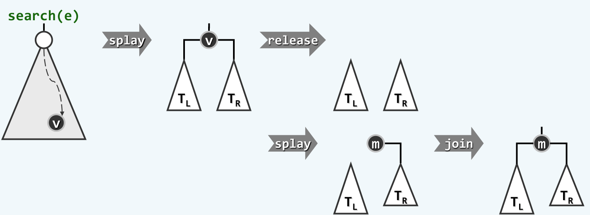

Conclusion on Splay Tree
========================

## 伸展树基本概念

> 伸展树的基本思想。

伸展树完全是基于`局部性原理(locality)`的。

局部性原理是计算机科学中非常重要的原理，很多设计，比如说多级存储器，缓存，都是基于局部性原理。简单说来就是刚访问过的数据，在一段时间内极有可能再次被访问。因此，对于物理存储器而言，会将刚刚访问过的数据，转移存储到更高级的存储介质中，比如内存或者缓存，以便下次访问这些数据时可以高效地进行。而对于数据结构而言，则可以把刚访问过的数据移动到更容易被访问到的区域，比如列表可以把每次被访问的数据都交换到列表的头部，这就构成了自调整列表。

伸展树也是同样的思想，即对于一棵二叉搜索树而言，将刚刚被访问的数据移动到树根结点，从而使得后续的访问可以高效地找到该数据。

> 伸展树和AVL树的比较。

伸展树也是一棵平衡二叉搜索树，但是可以看到，伸展树和AVL树有很大的差异。

前面我们说，对于任意一种平衡二叉搜索树，都是关注两个方面的问题，即平衡条件，以及失衡后的调整算法。因此，AVL树引入了一个平衡因子来作为它的平衡条件，并且失衡调整算法也都是围绕这个平衡因子而展开。但是，从前面伸展树的思想可以看出，伸展树没有所谓的平衡条件，因此它不需要维护任何额外的信息，包括树的高度。它只是在每次对某结点的访问后，将该结点移动到树根，并且同时对树的结构进行调整，就这样实现了它的平衡。

因此相较而言，AVL树更像是循规蹈矩，如履薄冰。而伸展树则更加潇洒，不羁小节。

## 伸展策略

那么实现伸展树就比较简单了，只需要将被访问结点移动到根结点就可以了，所以应该怎么移动呢？

> 逐层伸展策略。

一个很简单的思想是找到被访问的结点后，不断地将该结点与它的父结点进行单旋转，直到该结点被旋转到根结点。

这种策略固然是可行的，但是在最坏情况下，它拥有比较差的时间性能，如下图所示：


对于这种一开始就呈现单链结构的搜索树，设它具有n个结点，如果每次都访问它深度最深的那个结点，那么每次被访问结点的深度为$n-1, n-2, ...., 3, 2, 1, 0$，所以一个周期这样的访问累计需要$\Omega(n^2)$的时间，分摊时间复杂度为$\Omega(n)$。这个结果已经与列表这种线性结构相当了，所以很难可以让人满意。

> 双层伸展策略。

双层伸展策略只是逐层伸展策略的一个推广，它们之间的差别其实非常小，但是对性能却有一个质的提升。据邓公所说，双层伸展策略其实就是逐层伸展这条龙上点出的<睛>，而在这之前，逐层伸展这样一个整体的龙的结构是已经具备了的。

双层伸展策略，顾名思义，就是每次伸展时都以两个单位向上层追溯，而不是逐层伸展的一个单位。所以，这就需要反复考察祖孙三代$g, p ,v$，通过两次旋转将$v$上升两层，使之成为新的树根。关于这个前面我们已经进行过讨论，根据祖孙三代的拓扑结构可以分为`zigzig`, `zigzag`, `zagzig`, `zagzag`四种情况。

+ `zigzag`和`zagzig`。优先讨论着两种情况是因为，在这两种拓扑结构下，以$v$为新的根结点的树是没有异构情况的，无非是$p, g$分别是$v$的左右孩子结点。所以伸展树的`zigzag`与前面AVL的`zigzag`没有任何区别，可以直接调用前面的`connect34`来进行重构。
+ `zigzig`和`zagzag`。这两种情况是有重构的，以`zigzig`为例，调整后以$v$为根结点的树有`zagzag`和`zagzig`两种构型，如果将前面的两次单旋转看做这里的一次旋转的话，逐层伸展策略对应的`zagzig`构型，而我们这里的双层伸展策略将要采用的`zagzag`构型。一会儿我们可以看到这点细微的差距给整棵伸展树带来的不同。

下图展示了单层伸展和双层伸展策略的不同。


可以看到，双层伸展策略具有某种<折叠>的效果。即一旦访问最坏的结点，双层伸展就会通过调整将整棵树的高度降低到大约原来的一般，从而使得最坏情况不至于持续发生。

这里，也可以看出两种策略本质上的区别。在最坏情况下，单层伸展策略每次伸展只能将树高降低1，而双层伸展策略每次伸展可以将树高降低到原来的一般。所以，这也是单层伸展的分摊时间复杂度为$O(n)$而双层伸展的分摊时间复杂度为$O(logn)$的原因，详细的证明可以查看邓公习题集。

最后，由于双层伸展是以两个单位向上层追溯，要是当前结点只有父亲而没有祖父时（即父结点是根结点），可以相应的将当前结点与其父结点做一次单旋转，从而可以将当前结点移动到树根。

## 伸展树的实现

前面提到，伸展树完全是基于局部性原理构造的一种数据结构，因此，其算法的具体实现中也要处处体现局部性原理，才能使伸展树发挥最大的作用。

伸展树的基本操作同样只有搜索，插入，删除三种。对于这三种基本操作，都要应用局部性原理。

> 搜索操作。

首先调用BST常规的搜索操作。每次需要将被查找的结点移动到树根，或者没有找到目标关键码，则将失败处的父结点移动到树根，这是因为失败处的父结点是和目标关键码差距最小的结点，根据局部性原理，该结点在后续的访问中也极有可能出现。无论如何，都返回树根结点。

搜索操作的代码如下：

```cpp
template <typename T>
BinNodePosi(T) SplayTree<T>::search(T const &key){
	BinNodePosi(T) x = searchIn(__root, key, __hot = nullptr);
	if(x)           splay(x);
	else if(__hot)  splay(__hot);
	return __root;
}
```

> 插入操作。

一种思路是首先调用BST的常规插入算法，然后为了保证局部性，将被插入结点移动到根结点。这个方法的确是简明可行的。

另一种思路是，直接调用上面伸展树的搜索算法，这样一次搜索必然会失败，但是此时`__hot`会被移动到根结点。我们可以直接比较待插入关键码与`__hot`关键码的大小，从而直接将被插入结点插入到根结点。整个过程如下图所示：


具体的插入算法如下：

```cpp
template <typename T>
bool SplayTree<T>::insert(T const &key){
	BinNodePosi(T) x = search(key);
	if(x && x->data == key) return false;

	//else
	__root = new BinNode<T>(key);
	++__size;
	if (!x) return true;

	if(key < x->data){
		__root->leftChild  = x->leftChild;
		__root->rightChild = x;
		x->leftChild       = nullptr;
		x->parent          = __root;
	}else{
		__root->leftChild  = x;
		__root->rightChild = x->rightChild;
		x->rightChild      = nullptr;
		x->parent          = __root;
	}
	updateHeight(x);
	updateHeight(__root);
	return true;
}
```

> 删除操作。

删除操作会比较复杂。一种简明的方法也是首先调用BST的删除算法，然后将`__hot`伸展到根结点。这个方法同样是可行的。

另一种思路是，首先调用伸展树的搜索算法，这样被删除结点就已经被移动到了根结点，因此可以直接将根结点删除。接下来的问题是，应该由哪个结点来作为新的根结点。

在根结点没有左子树或者没有右子树时，可以直接用那棵唯一的子树来替代根结点，从而完成了根结点的删除。但在根结点同时具有左右子树时，根据伸展树的局部性原理，仍可选取被删除结点的直接后继来作为新的根结点，这样数据的局部性仍然可以得到应用。

为了将根结点的直接后继提升为新的根结点，可以在$T_R$中再次查找根结点的关键码，尽管这次查找必然失败，却可以将$T_R$中的最小结点提升为根节点。并且由于它是最小结点，根据BST的局部有序性，新的根节点必然没有左子树，从而可以将$T_L$作为左子树与新的根结点进行连接。这样，就得到了一棵完整的二叉搜索树。整个过程如下图所示：



具体代码如下：

```cpp
template <typename T>
bool SplayTree<T>::remove(T const &key){
	BinNodePosi(T) x = search(key);
	if (!x || x->data.key != key) return false;
	//else
	if(!__root->leftChild){
		__root = __root->rightChild;
		if(__root) __root->parent = nullptr;
		search(key);
	}
	else if(!__root->rightChild){
		__root = __root->leftChild;
		__root->parent = nullptr;
		search(key);
	}
	else {
		__root = x->rightChild;
		__root->parent = nullptr;
		search(key);						//move x's succ to root, and __root has no left child(for succ has the smallest key
		__root->leftChild = x->leftChild;
		x->leftChild->parent = __root;
		updateHeight(__root);
	}
	--__size;
	delete x;
	return true;
}
```

## 伸展树的评价

可以证明，伸展树单次操作的分摊时间复杂度为$O(logn)$，与AVL树相当，并且还不需要维护额外的平衡因子或者高度等信息，编程也比较简单(也不是很简单...)。关于证明看邓公的习题集。

并且，在一些场合下，伸展树还可以达到更高的性能。例如在局部性强的场合，缓存命中率将极高。假设树中一共有$n$个结点，其中$k$个结点是经常访问的结点，并且有$k << n$。这样，在经过多次访问后，这k个结点将被提升到树的根部，此时访问的时间复杂度甚至可以达到$O(logk)$。

但是伸展树并不能保证单次最坏情况的发生，所以不能适用于对效率非常敏感的场合，例如导弹卫星发射这种。
